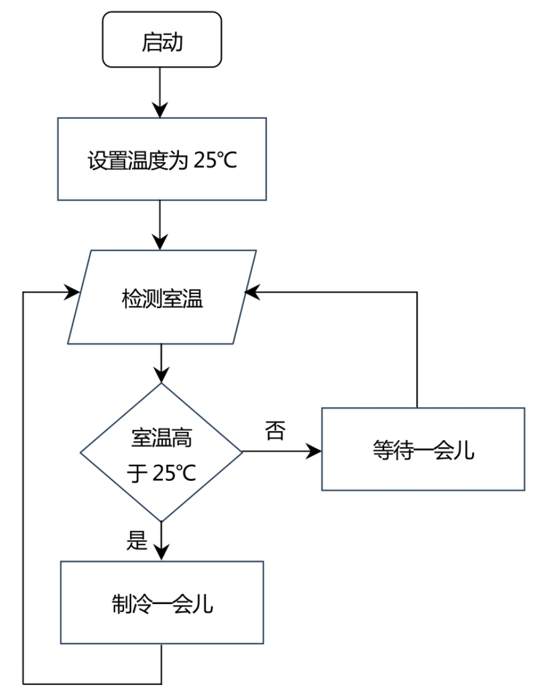
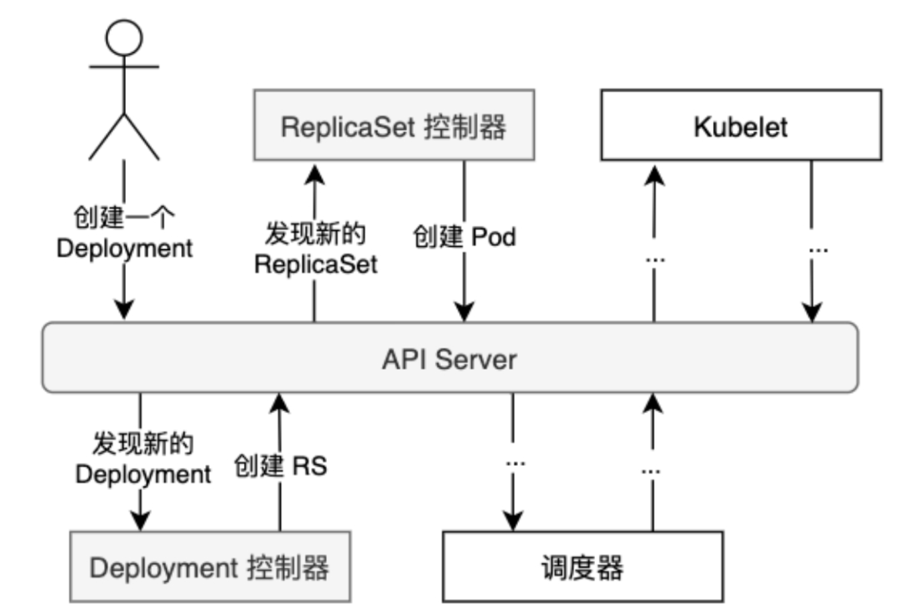
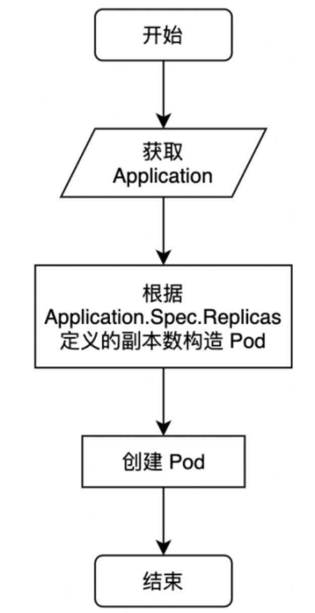

# 一.理解控制器模式

### 1.1 理解控制器模式

控制器模式广泛应用在机械自动化等领域，Kubernetes的核心能力就建立在“<u>声明式API</u>”和“<u>控制器模式”</u>之上。

思考一下夏天空调制冷时的工作流程:



空调制冷过程如下：

1. 启动后设置一个温度，比如25℃。

2. 空调检测室温，确定室温是否高于25℃。

3. 如果高于25℃，就开始制冷，过一会儿再监测室温变化。

4. 如果不高于25℃，就保持静默，直到室温超过25℃。

这其实就是控制器模式的典型工作流程，外部输入一个“期望值”​，一个“控制器”不断观测“环境状态”的“实际值”和“期望值”之间的差异，然后不断调整“实际值”向“期望值”靠拢。这个过程可以称为“<u>调谐</u>”​。

## 1.2 Kubernetes中的控制器

Kubernetes中通过“声明式API”定义了一系列的“资源对象”​，然后通过很多“控制器”来“调谐”这些资源对象的实际状态向期望状态靠拢，从而实现整个集群“尽可能”靠拢配置中声明的期望状态。

我们知道在Kubernetes的控制面组件中有一个kube-controller-manager，这个组件就是Kubernetes中的“资源大管家”​，也就是一系列的“控制器集合”​。我们以一个Deployment的创建过程为例，分析一下其中涉及的主要控制器及其工作过程



在编辑好一个Deployment的YAML配置文件，执行kubectl apply-f ×××-deployment.yaml命令之后，这个资源就被提交到了kube-apiserver。接着kube-controller-manager中的Deployment控制器会收到消息，然后根据Deployment资源的spec定义创建相应的ReplicaSet资源，同样提交给kube-apiserver。紧接着kube-controller-manager中的ReplicaSet控制器又会收到ReplicaSet资源创建的消息，于是根据ReplicaSet资源的spec定义创建相应的Pod资源。最后就是调度器完成Pod的节点绑定，至此Kubelet就完成了对应节点上的Pod创建。

这就是原生控制器的典型工作流程，在Kubernetes中通过各种各样的“资源对象”来描述集群的期望状态，然后通过相应的控制器来完成这个资源对象的调谐逻辑。

# 二. 理解Operator模式

Operator模式是Kubernetes高度可拓展性的精髓所在，官方文档对Operator模式的介绍可以在[Operator 模式 | Kubernetes](https://kubernetes.io/zh-cn/docs/concepts/extend-kubernetes/operator/)中找到。Operator模式让用户能够通过自定义资源来管理自己的应用。这种模式的本质是将一个领域运维人员的运维经验，也就是把他们所维护的应用应该怎么部署、出现异常了应该怎么恢复这一系列运维过程在Kubernetes上的操作程序化，并交给自定义控制器去实施。

我们可以先通过一个例子来了解Operator的工作过程（参考官方示例）​：

1. 定义一个名为SampleDB的Custom Resource（下文会介绍自定义资源）​。

2. 通过Deployment方式部署一个Operator的Controller部分。

3. 在Controller的代码逻辑中查询apiserver，从而获取SampleDB的具体内容。

4. Operator中的核心逻辑是告诉apiserver怎样让集群的实际状态和自定义资源中声明的状态保持一致，比如：
   
   ①如果新建了一个SampleDB，Operator就会创建一个PersistentVolumeClaim来提供持久化数据库存储，创建一个StatefulSet来运行SampleDB，并创建一个Job来完成初始化配置工作。
   
   ②如果删除了这个SampleDB，Operator相应地打一个快照，然后保证移除前面创建的StatefulSet资源和Volume资源。

5. Operator也可以管理数据库备份，对于每一个SampleDB资源，Operator可以决定在什么时候去运行一个Pod，连上对应的数据库并完成相应的备份操作。这些Pod可以通过ConfigMap或者Secret来获取数据库连接信息和认证信息等。

首先，资源是什么？一个资源是Kubernetes API的一个端点，**包含一组特定类型对象的集合**，比如Pods资源包含Pod对象的集合。在Kubernetes集群中通过kubectl get pods命令可以查询到Pod列表，同样我们常见的Service、Deployment等对象也都对应具体的资源：Services、Deployments等。资源可以增、删、改、查，对应apiserver代码中定义的某个结构体（实际已经单独拆分出来放到单独的项目里了）​，如内存中的一个对象、ETCD中的一组数据。所谓自定义资源，就是用户可以提交一个类似Deployment声明的结构定义给Kubernetes，比如上文的SampleDB，所以我们也可以通过kubectl get SampleDB之类的命令来查询SampleDB。而SampleDB中可以定义各种控制具体的数据库应用所需的字段，类似Deployment中的各种属性，比如常见的replicas控制副本数等。

然后Controller能够做的事情就类似于kube-controller-manager，可以获取自定义资源中的声明内容，通过调用apiserver来管理集群的实际状态，比如查询ConfigMap内容来获取数据库连接地址，创建一个StatefulSet来启动数据库实例等。至此，我们大致了解了Operator能做什么。这里涉及两个核心概念——Custom Resource和Controller，可以通过官方文档进一步了解这些概念：

- Custom Resource：[定制资源 | Kubernetes](https://kubernetes.io/zh-cn/docs/concepts/extend-kubernetes/api-extension/custom-resources/)

- Controller：[控制器 | Kubernetes](https://kubernetes.io/zh-cn/docs/concepts/architecture/controller/)

# 三.Kubebuilder的安装配置

Kubebuilder是一个用于Operator程序构建和发布的工具。可以直接通过以下命令安装Kubebuilder:

```shell
 curl -L -o kubebuilder https://go.kubebuilder.io/dl/latest/$(go env GOOS)/$(go env GOARCH)
 chmod +x kubebuilder
 mv kubebuilder  /usr/local/bin/
```

# 四. 从Application Operator Demo开始

本节将通过一个简单的Demo程序来快速走一遍Operator程序初始化、API定义与实现、打包、本地运行、发布等过程。类比于Deployment可以管理Pod，我们现在尝试开发一个简单的Pod管理控制器Application Operator，但是暂时只支持Pod副本数的管理。

我们要通过一个Application类型来定义一个自己的资源对象，然后在控制器中获取这个资源对象的详细配置，接着根据它的配置去创建相应数量的Pod，就像Deployment那样工作。当然，为了避免Demo项目过于复杂，这里不去考虑过多的异常处理、程序健壮性、业务逻辑完备等。



## 4.1 创建项目

在本地家目录下新建一个MyOperatorProjects目录用来存放所有的Operator相关项目，命令如下:

```shell
cd ~
mkdir MyOperatorProjects
sudo cd MyOperatorProjects/
mkdir application-operator
cd application-operator/
```

 使用 Kubebuilder 初始化一个新的项目

```shell
kubebuilder init --domain hyj.cn \
--repo=github.com/asjfoajs/MyOperatorProjects/application-operator \
--owner asjfoajs
```

## 4.2 添加API

```shell
kubebuilder create api \
--group apps --version v1 --kind Application
```

## 4.3 CRD实现

CRD的代码主要定义在api/v1/application_types.go文件中,先打开看一下现有代码是怎样的。主要看Spec结构:

```go
type ApplicationSpec struct {
    // INSERT ADDITIONAL SPEC FIELDS - desired state of cluster
    // Important: Run "make" to regenerate code after modifying this file

    // Foo is an example field of Application. Edit application_types.go to remove/update
    Foo string `json:"foo,omitempty"`
}
```

里包含一个示例字段Foo，需要删除这个字段，添加自己需要的配置:

```go
import (
    corevl "k8s.io/api/core/v1"
    metav1 "k8s.io/apimachinery/pkg/apis/meta/v1"
)
type ApplicationSpec struct {
    Replicas int32 `json:"replicas,omitempty"` //声明Pod副本数
    Teplate corevl.PodTemplateSpec `json:"template,omitempty"` //声明Pod模板的配置
}
```

## 4.4 CRD部署

可以通过make install命令来完成CRD的部署过程。

```shell
make install
```

如果报错:

```shell
make install
warning: GOPATH set to GOROOT (/usr/local/go) has no effect
/root/MyOperatorProjects/application-operator/bin/controller-gen rbac:roleName=manager-role crd webhook paths="./..." output:crd:artifacts:config=config/crd/bases
/root/MyOperatorProjects/application-operator/bin/kustomize build config/crd | kubectl apply -f -
The CustomResourceDefinition "applications.apps.danielhu.cn" is invalid: metadata.annotations: Too long: must have at most 262144 bytes
make: *** [Makefile:131：install] 错误 1
```

就在MakeFile中添加`kubectl apply --server-side=true -f`来跳过认证参考[metadata.annotations: Too long: must have at most 262144 bytes · Issue #2556 · kubernetes-sigs/kubebuilder · GitHub](https://github.com/kubernetes-sigs/kubebuilder/issues/2556)

这时可以通过kubectl命令来查看刚才创建的CRD

```shell
kubectl get crd
NAME                       CREATED AT
applications.apps.hyj.cn   2024-08-05T02:36:40Z

kubectl get application
No resources found in default namespace.
```

可以看到crd可以看到，applications.apps.hyj.cn这个CRD已经存在了。这时就像查询Deployment时可以用kubectl get deployment一样，可以通过kubectl get application来查询刚才自定义的资源。这里的报错信息是没找到资源，而不是“error:the server doesn't have a resource type"application"”​。换言之，此时kube-apiserver已经能识别这种资源了，所以接下来可以创建一个具体的Application类型的资源对象实例。

## 4.5  CR部署

在config/samples下有一个apps_v1_application.yaml，其中已经有一些默认配置项了，我们稍微修改一下，加上自定义的属性

```yaml
apiVersion: apps.hyj.cn/v1
kind: Application
metadata:
  name: application-sample
  namespace: default
  labels:
    app: nginx
#    app.kubernetes.io/name: application-operator
#    app.kubernetes.io/managed-by: kustomize
spec:
  replicas: 3
  template:
    spec:
      containers:
        - name: nginx
          image: nginx:1.14.2
          ports:
            - containerPort: 80
```

执行apply

```shell
kubectl apply -f config/samples/apps_v1_application.yaml
```

这时可以在集群中查到刚才创建的Application：

```shell
kubectl get application
NAME                 AGE
application-sample   15s
```

很和谐的输出，一个Application类型的application-sample实例创建出来了，其中包含自定义的所有字段。但是这时并不会有Pod被自动创建出来，因为还没有实现相应的控制器逻辑。

## 4.6 Controller实现

现在已经有了CR，该实现Controller逻辑去创建Pod了。在internal/controllers/application_controller.go中的Reconcile()方法内添加如下代码:

```go
func (r *ApplicationReconciler) Reconcile(ctx context.Context, req ctrl.Request) (ctrl.Result, error) {
    l := log.FromContext(ctx)

    //get the Application
    //声明一个*Application类型的实例app用来接收我们的CR
    app := &dappsv1.Application{}
    //NamespacedName在这里也就是default/application-sample
    if err := r.Get(ctx, req.NamespacedName, app); err != nil {
        //err分很多中情况，如果找不到，一般不需要进一步处理，只是说明这个CR被删了而已
        if errors.IsNotFound(err) {
            l.Info("Application resource not found. Ignoring since object must be deleted")
            //直接返回，不带错误，结束本次调谐
            return ctrl.Result{}, nil
        }
        //除了NotFound之外的错误，比如连不上apiserver等，这时需要打印错误信息，然后返回这个
        //错误以及表示1分钟后重试的Result
        l.Error(err, "Failed to get Application")
        return ctrl.Result{RequeueAfter: 1 * time.Minute}, err
    }

    //create pods
    for i := 0; i < int(app.Spec.Replicas); i++ {
        pod := &corev1.Pod{
            ObjectMeta: metav1.ObjectMeta{
                Name:      app.Name + "-" + strconv.Itoa(i),
                Namespace: app.Namespace,
                Labels:    app.Labels,
            },
            Spec: app.Spec.Teplate.Spec,
        }

        if err := r.Create(ctx, pod); err != nil {
            l.Error(err, "Failed to create pod")
            return ctrl.Result{RequeueAfter: 1 * time.Minute}, err
        }

        l.Info(fmt.Sprintf("the Pod (%s) has created", pod.Name))
    }

    l.Info("all pods has created")
    return ctrl.Result{}, nil
}
```

这时import部分大致如下:

```shell
import (
    "context"
    "fmt"
    "strconv"
    "time"

    corev1 "k8s.io/api/core/v1"
    "k8s.io/apimachinery/pkg/api/errors"
    metav1 "k8s.io/apimachinery/pkg/apis/meta/v1"
    "k8s.io/apimachinery/pkg/runtime"
    ctrl "sigs.k8s.io/controller-runtime"
    "sigs.k8s.io/controller-runtime/pkg/client"
    "sigs.k8s.io/controller-runtime/pkg/log"

    dappsv1 "github.com/asjfoajs/MyOperatorProjects/application-operator/api/v1"
)
```

## 4.7 启动Controller

```shell
#直接执行make run即可以运行代码
make run
#查看Pod是不是真的已经创建出来了
kubectl get pod
NAME                   READY   STATUS    RESTARTS       AGE
application-sample-0   1/1     Running   0              4m
application-sample-1   1/1     Running   0              4m
application-sample-2   1/1     Running   0              4m
```

## 4.8 部署Controller

前面我们部署了一个Application类型的资源对象实例，也运行Controller看到了相应副本数的Pod被创建出来。现在我们进一步模拟Operator实际使用时的部署方式，把Controller打包后用容器化方式部署到Kubernetes集群环境中：

```shell
#依赖下载失败的问题，添加代理
vim Dockerfile
ENV GOPROXY=https://goproxy.io
#构建镜像 
make docker-build IMG=application-operator:v0.0.1
#推到kind环境
kind load docker-image application-operator:v0.0.1 --name dev1m2s
#部署控制器
make deploy IMG=application-operator:v0.0.1
#查看Operator程序
kubectl get pod -n application-operator-system
NAME                                                       READY   STATUS    RESTARTS   AGE
application-operator-controller-manager-6c8c95994b-2blpx   1/1     Running   0          18s
```

## 4.9  资源清理

前面我们通过几个步骤分别部署了CRD、CR和Controller，这时环境中新增的资源不少（各种rbac相关的、部署相关的资源）​，如果这些资源都用kubectl一个一个来清理，还是很痛苦的。同样，清理的步骤也可以通过Makefile来实现:

```shell
# 卸载Controller
make undeploy
# 卸载CRD
make uninstall
```
