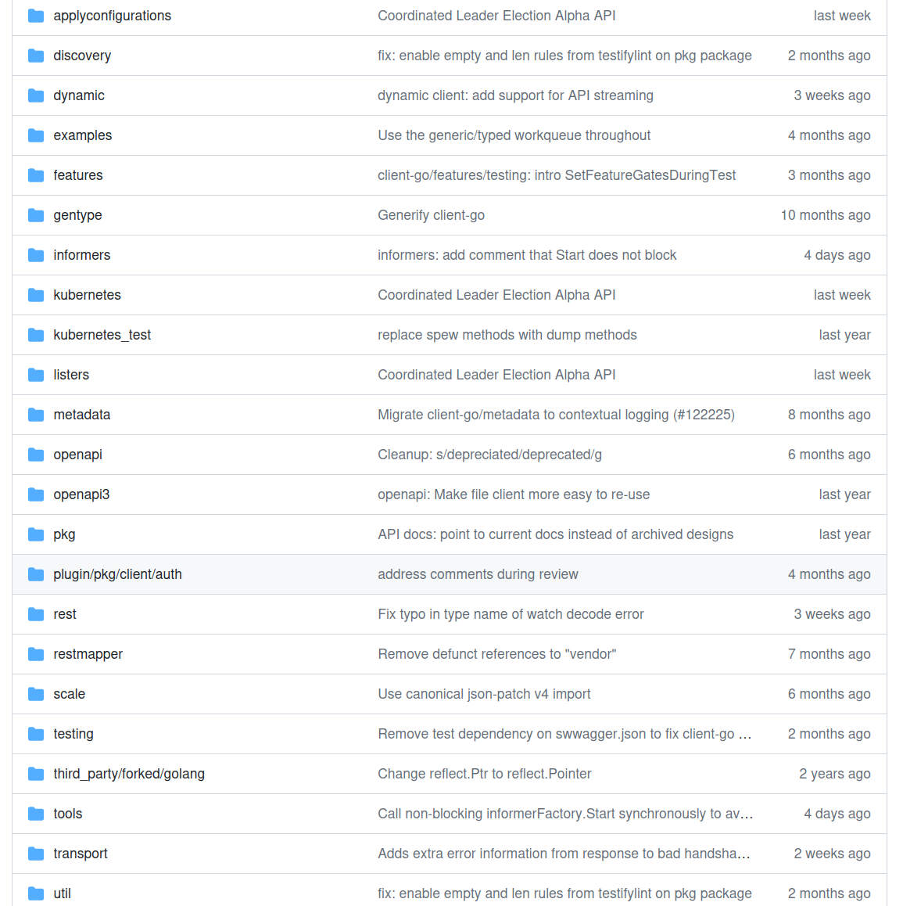

# 一.client-go项目介绍

## 1.1 client-go项目介绍

[client-go的源码](https://github.com/kubernetes/client-go)

这个库的代码是以每天一次的频率从kubernetes/kubernetes主库中自动同步过来的，所以如果大家想要给client-go提交PR，记得不能提交到这个代码库中。

包结构



- kubernetes：这个包中放的是用client-gen自动生成的用来<u>访问Kubernetes API的ClientSet</u>，后面会经常看到ClientSet这个工具。

- discovery：这个包提供了一种机制用来<u>发现API Server支持的API资源</u>。

- dynamic：这个包中包含dynamic client，用来<u>执行任意API资源对象</u>的通用操作。

- plugin/pkg/client/auth：这个包提供了可选的用于<u>获取外部源证书的认证插件</u>。

- transport：这个包用于<u>设置认证和建立连接</u>。

- tools/cache：这个包中放了很多和<u>开发控制器相关的工具集</u>。

获取client-go

```shell
#最好是和自己使用的Kubernetes集群版本完全一致
go install k8s.io/client-go@v0.28.9
```

```shell
#如果报错
 invalid version: git ls-remote -q origin in /usr/local/go/pkg/mod/cache/vcs/0f70f421526ca3bc4e6bc94515f09f932e3f03118dd2f4ef5042374d00137723: exit status 128:
    fatal: could not read Username for 'https://github.com': terminal prompts disabled
#说明访问的是私有仓库，你需要生成一个GitHub的个人访问令牌（Personal Access Token，PAT）并将其存储在Git的配置
git config --global url."https://<your-token>@github.com/".insteadOf "https://github.com/"
```

# 二.client-go使用示例

## 2.1client-go集群内认证配置

API Server是支持<mark>双向TLS认证</mark>的，换言之，我们随便编写一段代码发送HTTP请求给API Server肯定会因为认证问题而失败。下面通过client-go来编写一小段代码，完成认证后查询default命名空间下的Pod，并将其名字打印出来。

### 2.1.1 准备项目

```shell
cd ~/MyOperatorProjects
mkdir client-go-examples
cd client-go-examples
go mod init github.com/asjfoajs/MyOperatorProjects/client-go-examples
mkdir in-cluster-configuration
cd in-cluster-configuration/
touch main.go
```

### 2.1.2 实现业务逻辑

```go
package main

import (
    "context"
    "log"
    "time"

    metav1 "k8s.io/apimachinery/pkg/apis/meta/v1"
    "k8s.io/client-go/kubernetes"
    "k8s.io/client-go/rest"
)

func main() {
    //1.初始化config
    config, err := rest.InClusterConfig()
    if err != nil {
        log.Fatal(err)
    }

    //2.通过config初始化clientset
    clinetset, err := kubernetes.NewForConfig(config)
    if err != nil {
        log.Fatal(err)
    }

    for {
        //3.通过clientset来列出特定命名空间里的所有Pod
        pods, err := clinetset.CoreV1().Pods("default").
            List(context.TODO(), metav1.ListOptions{})
        if err != nil {
            log.Fatal(err)
        }

        log.Printf("There are %d pods in the cluster\n", len(pods.Items))
        for i, pod := range pods.Items {
            //4.打印信息
            log.Printf("%d -> %s/%s", i+1, pod.Namespace, pod.Name)
        }

        <-time.Tick(5 * time.Second)
    }
}
```

另外，还需要关注一下依赖的版本,要与Kubernetes版本对应

k8s.io/apimachinery v0.28.9  
k8s.io/client-go v0.28.9

1. 初始化config 
   
   ```go
   func InClusterConfig() (*Config, error) {
       const (
           tokenFile  = "/var/run/secrets/kubernetes.io/serviceaccount/token"
           rootCAFile = "/var/run/secrets/kubernetes.io/serviceaccount/ca.crt"
       )
       host, port := os.Getenv("KUBERNETES_SERVICE_HOST"), os.Getenv("KUBERNETES_SERVICE_PORT")
       if len(host) == 0 || len(port) == 0 {
           return nil, ErrNotInCluster
       }
   
       token, err := os.ReadFile(tokenFile)
       if err != nil {
           return nil, err
       }
   
       tlsClientConfig := TLSClientConfig{}
   
       if _, err := certutil.NewPool(rootCAFile); err != nil {
           klog.Errorf("Expected to load root CA config from %s, but got err: %v", rootCAFile, err)
       } else {
           tlsClientConfig.CAFile = rootCAFile
       }
   
       return &Config{
           // TODO: switch to using cluster DNS.
           Host:            "https://" + net.JoinHostPort(host, port),
           TLSClientConfig: tlsClientConfig,
           BearerToken:     string(token),
           BearerTokenFile: tokenFile,
       }, nil
   }
   ```
   
   这里的InClusterConfig()函数也是基于这个原理读取了认证所需的**token**和**ca.crt**两个文件。在Kubernetes中，Pod创建时会自动把ServiceAccount token挂载到容器内的/var/run/secrets/kubernetes.io/serviceaccount路径下。

2. 通过config初始化clientset
   
   这里NewForConfig()函数返回了一个*Clientset对象，通过clientset可以实现各种资源的CURD操作。

3. 通过clientset来列出特定命名空间里的所有Pod
   
   这里可以看到clientset提供了List Pod的能力，我们直接指定了命名空间是default，然后列出了里面的所有Pod。

4. 打印信息
   
   遍历这个Pod切片，然后打印出所有Pod的Namespace和Name。

### 2.1.3 编写Dockerfile

```dockerfile
FROM busybox
COPY ./in-cluster /in-cluster
ENTRYPOINT /in-cluster
```

### 2.1.4 编译代码

```shell
cd in-cluster-configuration/
GOOS=linux go build -o ./in-cluster .
```

### 2.1.5 容器化并加载到kind环境

```shell
docker build -t incluster:v1 .
kind load docker-image incluster:v1 --name=dev1m2s
```

### 2.1.6 创建ClusterRoleBinding

```shell
kubectl create clusterrolebinding default-view --clusterrole=view --serviceaccount=default:default
```

### 2.1.7 启动Pod

```shell
kubectl run -i in-cluster --image=incluster:v1
```

## 2.2 client-go集群外认证配置

像kubectl访问API Server一样，我们拿到kubeconfig文件后，就可以利用这个配置文件实现认证了。

### 2.2.1 准备项目

```shell
cd ~/MyOperatorProjects
cd client-go-examples
mkdir out-of-cluster-configuration
cd out-of-cluster-configuration
touch main.go
```

### 2.2.2 实现业务逻辑

```go
package main

import (
    "context"
    metav1 "k8s.io/apimachinery/pkg/apis/meta/v1"
    "k8s.io/client-go/kubernetes"
    "k8s.io/client-go/tools/clientcmd"
    "k8s.io/client-go/util/homedir"
    "log"
    "path/filepath"
    "time"
)

func main() {
    homePath := homedir.HomeDir()
    if homePath == "" {
        log.Fatal("home path not found")
    }

    kubeconfig := filepath.Join(homePath, ".kube", "config")

    config, err := clientcmd.BuildConfigFromFlags("", kubeconfig)
    if err != nil {
        log.Fatal(err)
    }

    clinetset, err := kubernetes.NewForConfig(config)
    if err != nil {
        log.Fatal(err)
    }

    pods, err := clinetset.CoreV1().Pods("default").
        List(context.TODO(), metav1.ListOptions{})
    if err != nil {
        log.Fatal(err)
    }

    log.Printf("There are %d pods in the cluster\n", len(pods.Items))
    for i, pod := range pods.Items {
        log.Printf("%d -> %s/%s", i+1, pod.Namespace, pod.Name)
    }

    <-time.Tick(5 * time.Second)
}
```

这段代码与前面的in-cluster-configuration的主要区别是获取*restclient.Config的方式不同，后面config的使用是完全一致的。所以我们只需要关注config相关逻辑就可以了。

1. 获取kubeconfig路径
   
   通过k8s.io/client-go/util/homedir包提供的HomeDir()函数获取用户home目录，然后拼接kubeconfig的地址。查看[使用 kubeconfig 文件组织集群访问 | Kubernetes](https://kubernetes.io/zh-cn/docs/concepts/configuration/organize-cluster-access-kubeconfig/)可知默认情况下，`kubectl` 在 `$HOME/.kube` 目录下查找名为 `config` 的文件。

2. 通过kubeconfig初始化config
   
   BuildConfigFromFlags()函数的两个参数分别是string类型的masterUrl和kubeconfigPath。这里我们只给了第二个参数，因为kubeconfig中已经包含API Server的连接信息。BuildConfigFromFlags()会根据kubeconfig文件中的配置来初始化Config对象，然后和InClusterConfig()函数一样会返回一个*Config对象，拿到*Config后，我们就可以进一步初始化ClientSet，接下来的事情大家应该很熟悉了。

### 2.2.3 编译运行

```shell
go build -o out-of-cluster
./out-of-cluster
```

## 2.3  client-go操作Deployment

以Deployment资源的创建、更新、删除等操作为例演示一下相关操作流程。

### 2.3.1 准备目录

```shell
cd ~/MyOperatorProjects
cd client-go-examples
mkdir handle-deployment 
cd handle-deployment
touch main.go
```

### 2.3.2 实现main函数

```go
package main

import (
    "context"
    appsv1 "k8s.io/api/apps/v1"
    corev1 "k8s.io/api/core/v1"
    metav1 "k8s.io/apimachinery/pkg/apis/meta/v1"
    "k8s.io/client-go/kubernetes"
    v1 "k8s.io/client-go/kubernetes/typed/apps/v1"
    "k8s.io/client-go/tools/clientcmd"
    "k8s.io/client-go/util/homedir"
    "k8s.io/client-go/util/retry"
    "log"
    "path/filepath"
    "time"
)

func main() {
    homePath := homedir.HomeDir()
    if homePath == "" {
        log.Fatal("home path not found")
    }

    kubeconfig := filepath.Join(homePath, ".kube", "config")

    config, err := clientcmd.BuildConfigFromFlags("", kubeconfig)
    if err != nil {
        log.Fatal(err)
    }

    clientset, err := kubernetes.NewForConfig(config)
    if err != nil {
        log.Fatal(err)
    }

    dpClient := clientset.AppsV1().Deployments(corev1.NamespaceDefault)
    log.Println("create Deployment")
    if err := createDeployment(dpClient); err != nil {
        log.Fatal(err)
    }
    <-time.Tick(1 * time.Minute)

    log.Println("update Deployment")
    if err := updateDeployment(dpClient); err != nil {
        log.Fatal(err)
    }
    <-time.Tick(1 * time.Minute)

    log.Println("delete Deployment")
    if err := deleteDeployment(dpClient); err != nil {
        log.Fatal(err)
    }
    <-time.Tick(1 * time.Minute)
    log.Println("end")
}
```

dpClient是通过clientset.AppsV1().Deployments(corev1.NamespaceDefault)调用获得的，这是一个DeploymentInterface类型，可以用来对Deployment类型进行各种操作，比如Get()、List()、Watch()、Create()、Update()、Delete()、Patch()等。

### 2.3.3 实现createDeployment()函数

```go
func createDeployment(dpClient v1.DeploymentInterface) error {
    replicas := int32(3)
    newDp := &appsv1.Deployment{
        ObjectMeta: metav1.ObjectMeta{
            Name: "nginx-deploy",
        },
        Spec: appsv1.DeploymentSpec{
            Replicas: &replicas,
            Selector: &metav1.LabelSelector{
                MatchLabels: map[string]string{
                    "app": "nginx",
                },
            },
            Template: corev1.PodTemplateSpec{
                ObjectMeta: metav1.ObjectMeta{
                    Labels: map[string]string{
                        "app": "nginx",
                    },
                },
                Spec: corev1.PodSpec{
                    Containers: []corev1.Container{
                        {
                            Name:  "nginx",
                            Image: "nginx:1.14.2",
                            Ports: []corev1.ContainerPort{
                                {
                                    Name:          "http",
                                    Protocol:      corev1.ProtocolTCP,
                                    ContainerPort: 80,
                                },
                            },
                        },
                    },
                },
            },
        },
    }

    _, err := dpClient.Create(context.TODO(), newDp, metav1.CreateOptions{})
    return err
}
```

创建一个Deployment就是这几行，先构造一个newDp，然后调用dpClient的Create()函数来创建这个Deployment。newDp中的配置内容和前面用过的nginx-deploy是完全一样的，这里镜像版本设置了nginx:1.14.2，副本数是3，等一下更新操作时会将这个镜像改为nginx:1.16。

### 2.3.4 实现updateDeployment()函数

```go
func updateDeployment(dpClient v1.DeploymentInterface) error {
    dp, err := dpClient.Get(context.TODO(), "nginx-deploy", metav1.GetOptions{})
    if err != nil {
        return err
    }

    dp.Spec.Template.Spec.Containers[0].Image = "nginx:1.16"

    return retry.RetryOnConflict(
        retry.DefaultRetry, func() error {
            _, err = dpClient.Update(context.TODO(),
                dp, metav1.UpdateOptions{})
            return err
        })
}
```

1. 获取nginx-deploy
   
   我们通过dpClient的Get()方法获取到一个*Deployment对象，然后就可以操作这个对象了。

2. 修改镜像字段
   
    我们把Image配置成nginx:1.16，这样会触发一次Pod的滚动更新。

3. 调用Update()函数完成更新
   
   这里的主要逻辑调用dpClient.Update()来完成Deployment的更新。外层包的RetryOnConflict()函数只是一种健壮性手段，如果Update过程失败了，这里能提供重试机制。

### 2.3.5 实现deleteDeployment()函数

```go
func deleteDeployment(dpClient v1.DeploymentInterface) error {
	deletePolicy := metav1.DeletePropagationForeground
	return dpClient.Delete(context.TODO(), "nginx-deploy", metav1.DeleteOptions{
		PropagationPolicy: &deletePolicy,
	})
}
```

通过dpClient的Delete()方法完成删除操作，里面的PropagationPolicy属性配置了metav1. DeletePropagationForeground，这里有三种可选特性：

- DeletePropagationOrphan：不考虑依赖资源。

- DeletePropagationBackground：后台删除依赖资源。

- DeletePropagationForeground：前台删除依赖资源。

### 2.3.6 测试运行

```shell
#运行程序
go run main.go
#查看deployment
kubectl get deployment
#查看镜像版本
describe deployment nginx-deployment | grep Image
#查看pod
kubectl get pod
```

可以看到镜像nginx:1.14.2->nginx:1.16

可以看到pod的AGE从0->60->0->60,到最后被删除掉
