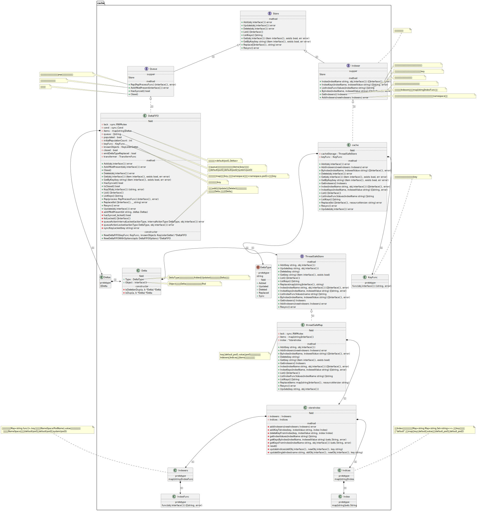
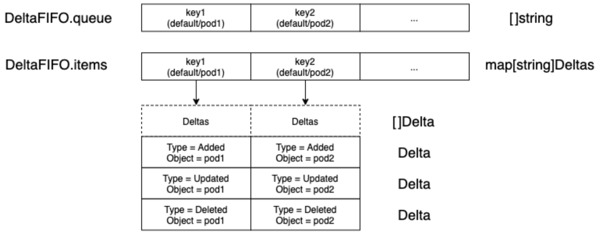
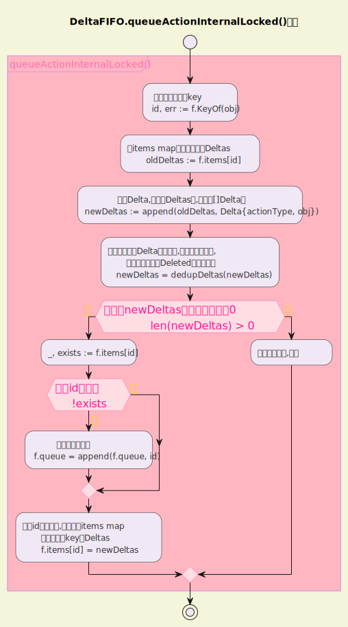
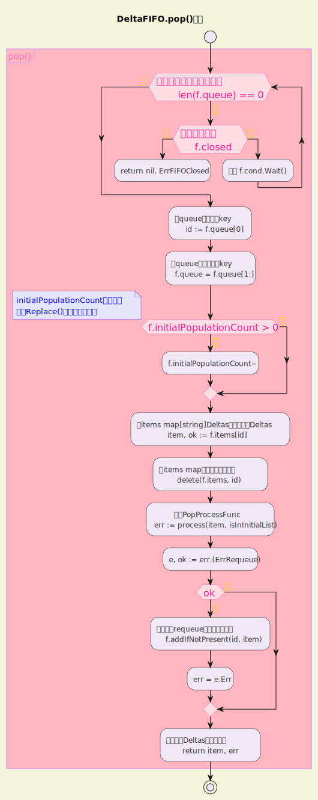
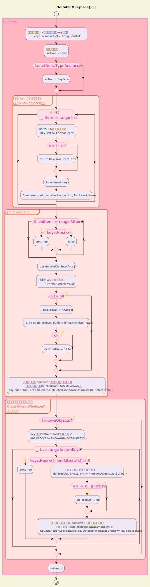
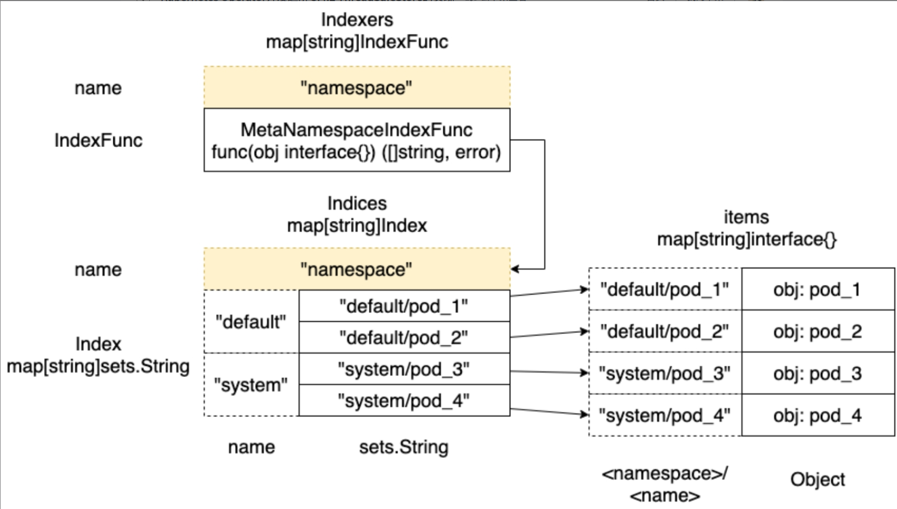
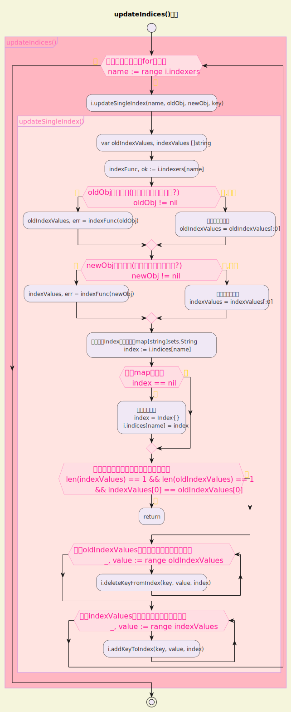
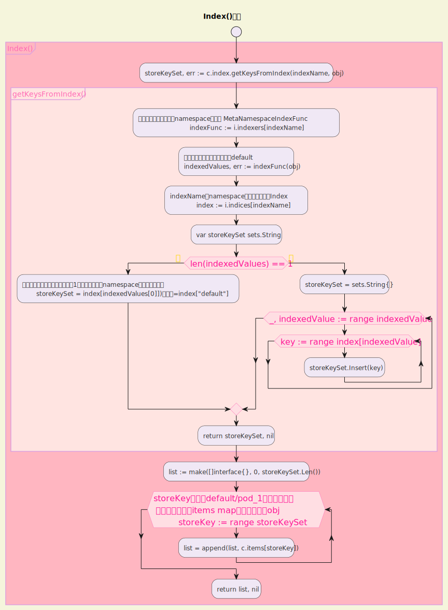
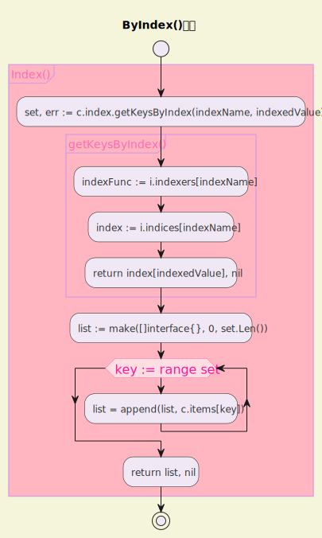

把这两个画一起了：



# 一 DeltaFIFO源码分析

DeltaFIFO也是一个重要组件，我们来继续研究client-go中DeltaFIFO的相关实现。DeltaFIFO相关代码在k8s.io/client-go/tools/cache包中，下文在不明确提到其他包名的情况下，所有源文件都指的是这个包内的源文件。

## 1.1 Queue接口与DeltaFIFO的实现

### 1.1.1 Queue和Store接口

在fifo.go中定义了一个Queue接口，本节的主角DeltaFIFO就是Queue接口的一个实现。我们先来看Queue接口的代码：

```go
// Queue extends Store with a collection of Store keys to "process".
// Every Add, Update, or Delete may put the object's key in that collection.
// A Queue has a way to derive the corresponding key given an accumulator.
// A Queue can be accessed concurrently from multiple goroutines.
// A Queue can be "closed", after which Pop operations return an error.
type Queue interface {
    Store

    // Pop blocks until there is at least one key to process or the
    // Queue is closed.  In the latter case Pop returns with an error.
    // In the former case Pop atomically picks one key to process,
    // removes that (key, accumulator) association from the Store, and
    // processes the accumulator.  Pop returns the accumulator that
    // was processed and the result of processing.  The PopProcessFunc
    // may return an ErrRequeue{inner} and in this case Pop will (a)
    // return that (key, accumulator) association to the Queue as part
    // of the atomic processing and (b) return the inner error from
    // Pop.
    Pop(PopProcessFunc) (interface{}, error) //会阻塞，直到有一个元素可以被pop出来，或者队列关闭

    // AddIfNotPresent puts the given accumulator into the Queue (in
    // association with the accumulator's key) if and only if that key
    // is not already associated with a non-empty accumulator.
    AddIfNotPresent(interface{}) error

    // HasSynced returns true if the first batch of keys have all been
    // popped.  The first batch of keys are those of the first Replace
    // operation if that happened before any Add, AddIfNotPresent,
    // Update, or Delete; otherwise the first batch is empty.
    HasSynced() bool

    // Close the queue
    Close()
}
```

Queue接口内嵌套了一个Store接口，Store定义在store.go中，代码如下：

```go
// Store is a generic object storage and processing interface.  A
// Store holds a map from string keys to accumulators, and has
// operations to add, update, and delete a given object to/from the
// accumulator currently associated with a given key.  A Store also
// knows how to extract the key from a given object, so many operations
// are given only the object.
//
// In the simplest Store implementations each accumulator is simply
// the last given object, or empty after Delete, and thus the Store's
// behavior is simple storage.
//
// Reflector knows how to watch a server and update a Store.  This
// package provides a variety of implementations of Store.
type Store interface {

    // Add adds the given object to the accumulator associated with the given object's key
    Add(obj interface{}) error

    // Update updates the given object in the accumulator associated with the given object's key
    Update(obj interface{}) error

    // Delete deletes the given object from the accumulator associated with the given object's key
    Delete(obj interface{}) error

    // List returns a list of all the currently non-empty accumulators
    List() []interface{}

    // ListKeys returns a list of all the keys currently associated with non-empty accumulators
    ListKeys() []string

    // Get returns the accumulator associated with the given object's key
    Get(obj interface{}) (item interface{}, exists bool, err error)

    // GetByKey returns the accumulator associated with the given key
    GetByKey(key string) (item interface{}, exists bool, err error)

    // Replace will delete the contents of the store, using instead the
    // given list. Store takes ownership of the list, you should not reference
    // it after calling this function.
    Replace([]interface{}, string) error

    // Resync is meaningless in the terms appearing here but has
    // meaning in some implementations that have non-trivial
    // additional behavior (e.g., DeltaFIFO).
    Resync() error
}
```

### 1.1.2 DeltaFIFO结构体

```go
type DeltaFIFO struct {
    // lock/cond protects access to 'items' and 'queue'.
    lock sync.RWMutex
    cond sync.Cond

    // `items` maps a key to a Deltas.
    // Each such Deltas has at least one Delta.
    items map[string]Deltas

    // `queue` maintains FIFO order of keys for consumption in Pop().
    // There are no duplicates in `queue`.
    // A key is in `queue` if and only if it is in `items`.
    queue []string //这个queue里是没有重复元素的，和上面items的key保持一致

    // populated is true if the first batch of items inserted by Replace() has been populated
    // or Delete/Add/Update/AddIfNotPresent was called first.
    populated bool
    // initialPopulationCount is the number of items inserted by the first call of Replace()
    initialPopulationCount int

    // keyFunc is used to make the key used for queued item
    // insertion and retrieval, and should be deterministic.
    keyFunc KeyFunc //用于构造上面map用到的key

    // knownObjects list keys that are "known" --- affecting Delete(),
    // Replace(), and Resync()
    knownObjects KeyListerGetter //用来检索所有的key

    // Used to indicate a queue is closed so a control loop can exit when a queue is empty.
    // Currently, not used to gate any of CRUD operations.
    closed bool

    // emitDeltaTypeReplaced is whether to emit the Replaced or Sync
    // DeltaType when Replace() is called (to preserve backwards compat).
    emitDeltaTypeReplaced bool

    // Called with every object if non-nil.
    transformer TransformFunc
}
```

可以看到items属性是一个map，map的value是一个Deltas类型的，我们继续了解Deltas是怎么定义的：

```go
// Delta is a member of Deltas (a list of Delta objects) which
// in its turn is the type stored by a DeltaFIFO. It tells you what
// change happened, and the object's state after* that change.
//
// [*] Unless the change is a deletion, and then you'll get the final
// state of the object before it was deleted.
type Delta struct {
    Type   DeltaType
    Object interface{}
}

// Deltas is a list of one or more 'Delta's to an individual object.
// The oldest delta is at index 0, the newest delta is the last one.
type Deltas []Delta
```

Deltas是[​]Delta类型的，Delta是一个结构体，其中的Type属性对应的DeltaType类型又是怎么定义的呢？

```go
// DeltaType is the type of a change (addition, deletion, etc)
type DeltaType string

// Change type definition
const (
    Added   DeltaType = "Added"
    Updated DeltaType = "Updated"
    Deleted DeltaType = "Deleted"
    // Replaced is emitted when we encountered watch errors and had to do a
    // relist. We don't know if the replaced object has changed.
    //
    // NOTE: Previous versions of DeltaFIFO would use Sync for Replace events
    // as well. Hence, Replaced is only emitted when the option
    // EmitDeltaTypeReplaced is true.
    Replaced DeltaType = "Replaced"
    // Sync is for synthetic events during a periodic resync.
    Sync DeltaType = "Sync"
)
```

原来DeltaType是一个字符串，对应的是用Added、Updated这种单词描述一个Delta的类型。将这些信息加在一起，我们可以尝试画出来DeltaFIFO的结构，大致如图所示:



首先DeltaFIFO结构体中有queue和items两个主要的属性，类型分别是<mark>[​]string</mark>和<mark>map[string]Deltas</mark>，然后<mark>map[string]Deltas的key也就是default/pod1这种格式的字符串</mark>，这个后面会看到，而value是类型为[​]Delta的Deltas，这个Delta的属性也就是Type和Object，Type是前面提到的Added、Updated、Deleted这类字符串表示的DeltaType，Object就是这个Delta对应的对象，比如具体的某个Pod。

我们继续来看DeltaFIFO的New函数：

```go
func NewDeltaFIFOWithOptions(opts DeltaFIFOOptions) *DeltaFIFO {
    if opts.KeyFunction == nil {
        opts.KeyFunction = MetaNamespaceKeyFunc
    }

    f := &DeltaFIFO{
        items:        map[string]Deltas{},
        queue:        []string{},
        keyFunc:      opts.KeyFunction,
        knownObjects: opts.KnownObjects,

        emitDeltaTypeReplaced: opts.EmitDeltaTypeReplaced,
        transformer:           opts.Transformer,
    }
    f.cond.L = &f.lock
    return f
}
```

这里的逻辑比较简单。从这里可以看到一个<mark>MetaNamespaceKeyFunc</mark>函数，这个函数中可以看到前面提到的map[string]Deltas的key为什么是<namespace>/<name>这种格式的default/pod1。

## 1.2  queueActionLocked()方法的逻辑

在DeltaFIFO的实现中，Add()、Update()、Delete()等方法的画风基本都是这样的：

```go
func (f *DeltaFIFO) Add(obj interface{}) error {
    f.lock.Lock()
    defer f.lock.Unlock()
    f.populated = true
    return f.queueActionLocked(Added, obj)
}
```

也就是说逻辑都落在了queueActionLocked()方法中，只是传递的参数不一样。所以我们关注的重点也就自然转移到了queueActionLocked()方法中了。

```go
/ queueActionInternalLocked appends to the delta list for the object.
// The actionType is emitted and must honor emitDeltaTypeReplaced.
// The internalActionType is only used within this function and must
// ignore emitDeltaTypeReplaced.
// Caller must lock first.
func (f *DeltaFIFO) queueActionInternalLocked(actionType, internalActionType DeltaType, obj interface{}) error {
    id, err := f.KeyOf(obj) //计算这个对象的key
    if err != nil {
        return KeyError{obj, err}
    }

    // Every object comes through this code path once, so this is a good
    // place to call the transform func.
    //
    // If obj is a DeletedFinalStateUnknown tombstone or the action is a Sync,
    // then the object have already gone through the transformer.
    //
    // If the objects already present in the cache are passed to Replace(),
    // the transformer must be idempotent to avoid re-mutating them,
    // or coordinate with all readers from the cache to avoid data races.
    // Default informers do not pass existing objects to Replace.
    if f.transformer != nil {
        _, isTombstone := obj.(DeletedFinalStateUnknown)
        if !isTombstone && internalActionType != Sync {
            var err error
            obj, err = f.transformer(obj)
            if err != nil {
                return err
            }
        }
    }

    oldDeltas := f.items[id] //从items map中获取当前的Deltas
    //构造Delta,添加到Deltas中,也就是[]Delta中
    newDeltas := append(oldDeltas, Delta{actionType, obj})
    //如果最近一个Delta是重复的,则保留最后一个,目前版本只处理Deleted的重复场景
    newDeltas = dedupDeltas(newDeltas)

    if len(newDeltas) > 0 { //理论上newDeltas的长度一定大于0
        if _, exists := f.items[id]; !exists { //如果id不存在
            f.queue = append(f.queue, id) //则在队列中添加
        }
        //如果id已经存在,就只更新items map中对应这个key的Deltas
        f.items[id] = newDeltas
        f.cond.Broadcast()
    } else { //理论执行不到,省略
        // This never happens, because dedupDeltas never returns an empty list
        // when given a non-empty list (as it is here).
        // If somehow it happens anyway, deal with it but complain.
        if oldDeltas == nil {
            klog.Errorf("Impossible dedupDeltas for id=%q: oldDeltas=%#+v, obj=%#+v; ignoring", id, oldDeltas, obj)
            return nil
        }
        klog.Errorf("Impossible dedupDeltas for id=%q: oldDeltas=%#+v, obj=%#+v; breaking invariant by storing empty Deltas", id, oldDeltas, obj)
        f.items[id] = newDeltas
        return fmt.Errorf("Impossible dedupDeltas for id=%q: oldDeltas=%#+v, obj=%#+v; broke DeltaFIFO invariant by storing empty Deltas", id, oldDeltas, obj)
    }
    return nil
}
```



现在再回头看Add()、Delete()、Update()、Get()等函数，就很简单了，它们只是将对应变化类型的obj添加到队列中而已。

## 1.3 Pop()方法和Replace()方法的逻辑

### 1.3.1 Pop()方法的实现

Pop()会按照元素的添加或更新顺序<mark>有序地返回一个元素(Deltas)</mark>，<mark>在队列为空时会阻塞</mark>。另外，<mark>Pop过程会先从队列中删除一个元素后返回，所以如果处理失败了，则需要通过AddIfNotPresent()方法将这个元素加回到队列中。</mark>

Pop()的参数是type PopProcessFunc func(interface{}) error类型的process，在Pop()函数中，直接<mark>将队列中的第一个元素出队，然后丢给process处理，如果处理失败会重新入队，但是这个Deltas和对应的错误信息会被返回。</mark>

```go
// Pop blocks until the queue has some items, and then returns one.  If
// multiple items are ready, they are returned in the order in which they were
// added/updated. The item is removed from the queue (and the store) before it
// is returned, so if you don't successfully process it, you need to add it back
// with AddIfNotPresent().
// process function is called under lock, so it is safe to update data structures
// in it that need to be in sync with the queue (e.g. knownKeys). The PopProcessFunc
// may return an instance of ErrRequeue with a nested error to indicate the current
// item should be requeued (equivalent to calling AddIfNotPresent under the lock).
// process should avoid expensive I/O operation so that other queue operations, i.e.
// Add() and Get(), won't be blocked for too long.
//
// Pop returns a 'Deltas', which has a complete list of all the things
// that happened to the object (deltas) while it was sitting in the queue.
func (f *DeltaFIFO) Pop(process PopProcessFunc) (interface{}, error) {
    f.lock.Lock()
    defer f.lock.Unlock()
    for { //这个循环其实没有意义,和下面的!ok一起解决了一个不会发生的问题
        for len(f.queue) == 0 { //如果为空则进入这个循环
            // When the queue is empty, invocation of Pop() is blocked until new item is enqueued.
            // When Close() is called, the f.closed is set and the condition is broadcasted.
            // Which causes this loop to continue and return from the Pop().
            if f.closed { //如果队列关闭则直接返回
                return nil, ErrFIFOClosed
            }

            f.cond.Wait() //等待
        }
        isInInitialList := !f.hasSynced_locked()
        id := f.queue[0]      //在queue中放的是key
        f.queue = f.queue[1:] //在queue中删除这个key
        depth := len(f.queue)
        if f.initialPopulationCount > 0 { //initialPopulationCount是第一次调用Replace()插入的元素数量
            f.initialPopulationCount--
        }
        item, ok := f.items[id] //从items map[string]Deltas中获取一个Deltas
        if !ok {                //理论上不可能找不到,为此引入了上面的for嵌套
            // This should never happen
            klog.Errorf("Inconceivable! %q was in f.queue but not f.items; ignoring.", id)
            continue
        }
        delete(f.items, id) //在items map中也删除这个元素
        // Only log traces if the queue depth is greater than 10 and it takes more than
        // 100 milliseconds to process one item from the queue.
        // Queue depth never goes high because processing an item is locking the queue,
        // and new items can't be added until processing finish.
        // https://github.com/kubernetes/kubernetes/issues/103789
        if depth > 10 { //当队列长度超过10并且处理一个元素的时间超过0.1s则打印日志
            //队列长度理论上不会变长,因为处理一个元素时是阻塞的,这时新的元素加不进来
            trace := utiltrace.New("DeltaFIFO Pop Process",
                utiltrace.Field{Key: "ID", Value: id},
                utiltrace.Field{Key: "Depth", Value: depth},
                utiltrace.Field{Key: "Reason", Value: "slow event handlers blocking the queue"})
            defer trace.LogIfLong(100 * time.Millisecond)
        }
        err := process(item, isInInitialList) //丢给PopProcessFunc
        if e, ok := err.(ErrRequeue); ok {    //如果需要requeue则加回到队列中
            f.addIfNotPresent(id, item)
            err = e.Err
        }
        // Don't need to copyDeltas here, because we're transferring
        // ownership to the caller.
        return item, err //返回这个Deltas和错误信息
    }
}
```



可以查看Pop()方法是如何被调用的，比如在当前包的controller.go中有这样一个方法：

```go
func (c *controller) processLoop() {
    for {
        obj, err := c.config.Queue.Pop(PopProcessFunc(c.config.Process))
        if err != nil {
            if err == ErrFIFOClosed {
                return
            }
            if c.config.RetryOnError {
                //其实pop内部已经调用了AddIfNotPresent,这里重复调用一次并没有功能上的
                //帮助,不过可靠性提高了一点
                // This is the safe way to re-enqueue.
                c.config.Queue.AddIfNotPresent(obj)
            }
        }
    }
}
```

看到这里，大家可能还有一个疑问，就是关于这里的process函数的实现逻辑是什么？我们在后面介绍Informer的时候会详细讲解sharedIndexInformer中如何实现process函数，所以暂时保留这个疑问。

### 1.3.2 Replace()方法的实现

先看看chatGpt如何说的：

`DeltaFIFO` 中的 `Replace()` 方法的主要作用是用一组新对象替换当前队列中的所有对象，并将这些新对象标记为“替换”（`Replaced`）类型的增量。

 具体含义：

1. **全量替换**：
   
   - 当控制器的缓存失效或失去与 API 服务器的连接时，需要重新获取资源对象的完整列表。`Replace()` 方法就是为了这种场景而设计的。它接收一个新的对象列表，然后清空当前 `DeltaFIFO` 中的所有对象，用新的对象列表替换它们。

2. **标记为 `Replaced`**：
   
   - 每个替换的对象都会被打上一个 `Replaced` 类型的增量标记，表明这些对象可能已经改变，或者由于无法追踪的原因（如重新连接后失去了一些中间的事件），需要重新处理它们。

3. **区别于其他增量操作**：
   
   - 与 `Add()`, `Update()`, `Delete()` 等方法不同，`Replace()` 不是处理单个对象的增量变化，而是处理整个对象列表的同步替换。这通常是由于一些异常情况导致的（例如重新列出对象或失去与 API 服务器的连接）。

使用场景：

`Replace()` 方法通常在以下场景中使用：

- **Watch 重建**：当 `DeltaFIFO` 失去与 Kubernetes API 服务器的 watch 连接时，它会重新列出所有资源，并通过 `Replace()` 方法更新队列。这确保了在重新连接后，控制循环能够正确地继续处理资源状态。

- **缓存失效**：如果因为某些原因缓存中的数据不再可靠，控制器会使用 `Replace()` 方法重新获取所有资源对象并重建缓存。

总结:

`DeltaFIFO` 中的 `Replace()` 方法用于在异常情况下（如重新列出对象或连接丢失后）重新同步资源对象。它用一个新的对象列表替换当前队列中的所有对象，并标记为 `Replaced` 类型，以确保控制器能够正确处理这些对象。

接下来再看书上的内容会更加方便理解。

Replace()方法简单地做了两件事：

1. 给传入的对象列表添加一个Sync/Replace DeltaType的Delta。

2. 执行一些与删除相关的程序逻辑。

这里的Replace()过程可以简单理解成传递一个新的[​]Deltas过来，如果当前DeltaFIFO中已经有这些元素，则追加一个Sync/Replace动作，反之DeltaFIFO中多出来的Deltas可能与apiserver失联导致实际被删除掉，但是删除事件并没有被监听(watch)到，所以直接追加一个类型为Deleted的Delta：

```go
// Replace atomically does two things: (1) it adds the given objects
// using the Sync or Replace DeltaType and then (2) it does some deletions.
// In particular: for every pre-existing key K that is not the key of
// an object in `list` there is the effect of
// `Delete(DeletedFinalStateUnknown{K, O})` where O is the latest known
// object of K. The pre-existing keys are those in the union set of the keys in
// `f.items` and `f.knownObjects` (if not nil). The last known object for key K is
// the one present in the last delta in `f.items`. If there is no delta for K
// in `f.items`, it is the object in `f.knownObjects`
func (f *DeltaFIFO) Replace(list []interface{}, _ string) error {
    f.lock.Lock()
    defer f.lock.Unlock()
    keys := make(sets.String, len(list)) //用来保存列表（list）中，每个元素的key（键）

    // keep backwards compat for old clients
    action := Sync //老代码兼容逻辑
    if f.emitDeltaTypeReplaced {
        action = Replaced
    }

    // Add Sync/Replaced action for each new item.
    // 在每个item（元素）后面添加一个Sync/Replaced动作
    for _, item := range list {
        key, err := f.KeyOf(item)
        if err != nil {
            return KeyError{item, err}
        }
        keys.Insert(key)
        if err := f.queueActionInternalLocked(action, Replaced, item); err != nil {
            return fmt.Errorf("couldn't enqueue object: %v", err)
        }
    }

    // Do deletion detection against objects in the queue
    queuedDeletions := 0
    for k, oldItem := range f.items { //删除f.items中的旧元素
        if keys.Has(k) {
            continue
        }
        // Delete pre-existing items not in the new list.
        // This could happen if watch deletion event was missed while
        // disconnected from apiserver.
        var deletedObj interface{}
        if n := oldItem.Newest(); n != nil { //如果Deltas不为空则有返回值（Deltas中最后一个）
            deletedObj = n.Object

            // if the previous object is a DeletedFinalStateUnknown, we have to extract the actual Object
            if d, ok := deletedObj.(DeletedFinalStateUnknown); ok {
                deletedObj = d.Obj
            }
        }
        queuedDeletions++
        //标记删除，因为和apiserver失联引起的删除状态没有及时获取到，所以这里是DeletedFinalStateUnknown类型
        if err := f.queueActionLocked(Deleted, DeletedFinalStateUnknown{k, deletedObj}); err != nil {
            return err
        }
    }

    if f.knownObjects != nil {
        // Detect deletions for objects not present in the queue, but present in KnownObjects
        //key就是如"default/pod1"这种字符串
        knownKeys := f.knownObjects.ListKeys()
        for _, k := range knownKeys {
            if keys.Has(k) {
                continue
            }
            if len(f.items[k]) > 0 {
                continue
            }

            //新列表中不存在的旧元素标记为将要删除
            deletedObj, exists, err := f.knownObjects.GetByKey(k)
            if err != nil {
                deletedObj = nil
                klog.Errorf("Unexpected error %v during lookup of key %v, placing DeleteFinalStateUnknown marker without object", err, k)
            } else if !exists {
                deletedObj = nil
                klog.Infof("Key %v does not exist in known objects store, placing DeleteFinalStateUnknown marker without object", k)
            }
            queuedDeletions++
            //添加一个删除动作，因为与apiserver失联等场景会引起删除时间没有监听到，所以是DeletedFinalStateUnknown类型
            if err := f.queueActionLocked(Deleted, DeletedFinalStateUnknown{k, deletedObj}); err != nil {
                return err
            }
        }
    }

    if !f.populated {
        f.populated = true
        f.initialPopulationCount = keys.Len() + queuedDeletions
    }

    return nil
}
```


要完整理解Replace()的代码逻辑，还得看knownObjects的实现逻辑。如果继续去查看knownObjects属性的初始化逻辑，就可以看到其引用的是cache类型实现的Store，就是实现Indexer接口的一个实例，knownObjects通过cache类型的实例使用了和Indexer类似的机制，由内部ThreadSafeStore来实现检索队列所有元素的keys的能力。我们后面会详细介绍Indexer，到时大家回过头来看这里的代码逻辑应该就很清晰了。

# 二 Indexer和ThreadSafeStore

我们在前面讲过Indexer主要为对象<mark>提供根据一定条件进行检索的能力</mark>，典型的实现是通过<mark>namespace/name来构造key</mark>，<mark>通过ThreadSafeStore来存储对象</mark>。换言之，Indexer主要依赖于ThreadSafeStore实现，是<mark>client-go提供的一种缓存机制，通过检索本地缓存可以有效降低apiserver的压力。</mark>（存储+快速查找资源）本节详细研究Indexer和对应的ThreadSafeStore的实现。

## 2.1 Indexer接口和cache的实现

<mark>Indexer接口主要是在Store接口的基础上拓展了对象的检索功能</mark>，代码在`k8s.io/client-go/tools/cache`包下。后文在不做特殊说明的情况下，提到的所有源文件都指的是这个包内的源文件。Indexer接口定义在index.go中：

```go
// Indexer extends Store with multiple indices and restricts each
// accumulator to simply hold the current object (and be empty after
// Delete).
//
// There are three kinds of strings here:
//  1. a storage key, as defined in the Store interface,
//  2. a name of an index, and
//  3. an "indexed value", which is produced by an IndexFunc and
//     can be a field value or any other string computed from the object.
type Indexer interface {
    Store
    // Index returns the stored objects whose set of indexed values
    // intersects the set of indexed values of the given object, for
    // the named index
    //根据索引名和给定的对象返回符合条件的所有对象
    Index(indexName string, obj interface{}) ([]interface{}, error)
    // IndexKeys returns the storage keys of the stored objects whose
    // set of indexed values for the named index includes the given
    // indexed value
    //根据索引名和索引值返回符合条件的所有对象的key
    IndexKeys(indexName, indexedValue string) ([]string, error)
    // ListIndexFuncValues returns all the indexed values of the given index
    //列出索引函数计算出来的索引值
    ListIndexFuncValues(indexName string) []string
    // ByIndex returns the stored objects whose set of indexed values
    // for the named index includes the given indexed value
    //根据索引名和索引值返回符合条件的所有对象
    ByIndex(indexName, indexedValue string) ([]interface{}, error)
    // GetIndexers return the indexers
    //获取所有的Indexers，对应map[stirng]IndexFunc类型
    GetIndexers() Indexers

    // AddIndexers adds more indexers to this store. This supports adding indexes after the store already has items.
    //这个方法要在数据加入存储前调用，添加更多的索引方法，默认只通过namespace检索
    AddIndexers(newIndexers Indexers) error
}
```

Indexer的默认实现是cache，cache定义在store.go中：

```go
// `*cache` implements Indexer in terms of a ThreadSafeStore and an
// associated KeyFunc.
type cache struct {
    // cacheStorage bears the burden of thread safety for the cache
    cacheStorage ThreadSafeStore
    // keyFunc is used to make the key for objects stored in and retrieved from items, and
    // should be deterministic.
    keyFunc KeyFunc
}
```

这里涉及两个类型：

- KeyFunc。

- ThreadSafeStore。

可以看到这里的逻辑就是调用keyFunc()方法获取key，然后调用cacheStorage.Xxx()方法完成对应的增删改查过程。KeyFunc类型是这样定义的：

```go
// Add inserts an item into the cache.
func (c *cache) Add(obj interface{}) error {
    key, err := c.keyFunc(obj)
    if err != nil {
        return KeyError{obj, err}
    }
    c.cacheStorage.Add(key, obj)
    return nil
}

// Update sets an item in the cache to its updated state.
func (c *cache) Update(obj interface{}) error {
    key, err := c.keyFunc(obj)
    if err != nil {
        return KeyError{obj, err}
    }
    c.cacheStorage.Update(key, obj)
    return nil
}
```

可以看到这里的逻辑就是调用keyFunc()方法获取key，然后调用cacheStorage.Xxx()方法完成对应的增删改查过程。KeyFunc类型是这样定义的：

```go
// KeyFunc knows how to make a key from an object. Implementations should be deterministic.
type KeyFunc func(obj interface{}) (string, error)
```

也就是给一个对象返回一个字符串类型的key。KeyFunc的一个默认实现如下：

```go
func MetaNamespaceKeyFunc(obj interface{}) (string, error) {
    if key, ok := obj.(ExplicitKey); ok {
        return string(key), nil
    }
    objName, err := ObjectToName(obj)
    if err != nil {
        return "", err
    }
    return objName.String(), nil
}


func ObjectToName(obj interface{}) (ObjectName, error) {
    meta, err := meta.Accessor(obj)
    if err != nil {
        return ObjectName{}, fmt.Errorf("object has no meta: %v", err)
    }
    return MetaObjectToName(meta), nil
}


func MetaObjectToName(obj metav1.Object) ObjectName {
    if len(obj.GetNamespace()) > 0 {
        return ObjectName{Namespace: obj.GetNamespace(), Name: obj.GetName()}
    }
    return ObjectName{Namespace: "", Name: obj.GetName()}
}
```

可以看到一般情况下返回值是<namespace><name>，如果namespace为空，则直接返回name。

## 2.2 ThreadSafeStore的实现

### 2.2.1 接口与实现

ThreadSafeStore是Indexer的核心逻辑所在，Indexer的多数方法是直接调用内部cacheStorage属性的方法实现的，接口定义在thread_safe_store.go中：

```go
type ThreadSafeStore interface {
    Add(key string, obj interface{})
    Update(key string, obj interface{})
    Delete(key string)
    Get(key string) (item interface{}, exists bool)
    List() []interface{}
    ListKeys() []string
    Replace(map[string]interface{}, string)
    Index(indexName string, obj interface{}) ([]interface{}, error)
    IndexKeys(indexName, indexedValue string) ([]string, error)
    ListIndexFuncValues(name string) []string
    ByIndex(indexName, indexedValue string) ([]interface{}, error)
    GetIndexers() Indexers

    // AddIndexers adds more indexers to this store. This supports adding indexes after the store already has items.
    AddIndexers(newIndexers Indexers) error
    // Resync is a no-op and is deprecated
    Resync() error
}
```

ThreadSafeStore对应的实现是threadSafeMap：

```go
type threadSafeMap struct {
    lock  sync.RWMutex
    items map[string]interface{}

    // index implements the indexing functionality
    index *storeIndex
}
```

```go
type storeIndex struct {
    // indexers maps a name to an IndexFunc
    indexers Indexers
    // indices maps a name to an Index
    indices Indices
}
```

这里有一个Indexers和Indices，这两个类型分别是这样定义的：

```go
// Index maps the indexed value to a set of keys in the store that match on that value
type Index map[string]sets.String

// Indexers maps a name to an IndexFunc
type Indexers map[string]IndexFunc

// Indices maps a name to an Index
type Indices map[string]Index
```

我们对照图5-4来理解这里的几个对象。



Indexers中保存的是Index函数map，一个典型的实现是字符串namespace作为key，IndexFunc类型的实现MetaNamespaceIndexFunc函数作为value，也就是我们希望通过namespace来检索时，借助Indexers可以拿到对应的计算Index的函数，接着调用这个函数把对象传进去，就可以计算出这个对象对应的key，就是具体的namespace值，比如default、kube-system这种格式的字符串。然后在Indices中保存的也是一个map，key是上面计算出来的default这种格式的namespace值，value是一个set，而set表示的是这个default namespace下的一些具体pod的<namespace>/<name>这类格式字符串。最后拿着这个key，就可以在items中检索到对应的对象了。

书上看到这里我不是很理解，自己做点补充，我理解的图应该是这样的：



### 2.2.2 Add()、Update()等方法的实现

Add()、Update()等方法的实现我们继续看threadSafeMap如何实现添加元素，从Add()、Update()方法开始：

```go
func (c *threadSafeMap) Add(key string, obj interface{}) {
    c.Update(key, obj) //Add的实现就是直接调用Update
}

func (c *threadSafeMap) Update(key string, obj interface{}) {
    c.lock.Lock()
    defer c.lock.Unlock()
    oldObject := c.items[key]                  //c.items是map[string]interface{}类型
    c.items[key] = obj                         //在items map中添加这个对象
    c.index.updateIndices(oldObject, obj, key) //下面分析这行代码
}
```

就是先将iems的值改好了。

可以看到更复杂的逻辑在updateIndices()方法中，这个方法还是在thread_safe_store.go源文件中，我们继续查看：

```go
// 创建、更新、删除的入口都是这个方法，差异点在于create场景下的参数只传递 newObj，
// update场景下需要传递oldObj和newObj，而delete场景只传递oldobj
func (i *storeIndex) updateIndices(oldObj interface{}, newObj interface{}, key string) {
    //所有逻辑都在这个for循环中
    for name := range i.indexers {
        i.updateSingleIndex(name, oldObj, newObj, key)
    }
}


func (i *storeIndex) updateSingleIndex(name string, oldObj interface{}, newObj interface{}, key string) {
    var oldIndexValues, indexValues []string
    indexFunc, ok := i.indexers[name]
    if !ok {
        // Should never happen. Caller is responsible for ensuring this exists, and should call with lock
        // held to avoid any races.
        panic(fmt.Errorf("indexer %q does not exist", name))
    }
    if oldObj != nil { //oldObj是否存在
        var err error
        oldIndexValues, err = indexFunc(oldObj)
        if err != nil {
            panic(fmt.Errorf("unable to calculate an index entry for key %q on index %q: %v", key, name, err))
        }
    } else {
        //相当于置空操作
        oldIndexValues = oldIndexValues[:0]
    }

    if newObj != nil { //newObj是否存在
        var err error
        indexValues, err = indexFunc(newObj)
        if err != nil {
            panic(fmt.Errorf("unable to calculate an index entry for key %q on index %q: %v", key, name, err))
        }
    } else { //置空操作
        indexValues = indexValues[:0]
    }

    //拿到一个Index，对应类型map[string]sets.String
    index := i.indices[name]
    if index == nil {
        index = Index{} //如果map不存在，则初始化一个
        i.indices[name] = index
    }

    //小优化：要修改新值的与原来旧值一样，直接返回
    if len(indexValues) == 1 && len(oldIndexValues) == 1 && indexValues[0] == oldIndexValues[0] {
        // We optimize for the most common case where indexFunc returns a single value which has not been changed
        return
    }

    //处理oldIndexValues，也即是需要删除的索引值
    for _, value := range oldIndexValues {
        i.deleteKeyFromIndex(key, value, index)
    }

    //处理indexValues，也就是需要添加的索引值
    for _, value := range indexValues {
        i.addKeyToIndex(key, value, index)
    }
}
```

ps:如果是删除，就删除，如果是添加，就添加，那修改呢？就是先删除再添加啊。



### 2.3.3 各种Index方法的实现

#### 2.3.3.1 Index()方法

继续来看Index()方法的实现，其作用是给定一个obj和indexName，比如pod1和namespace，然后返回pod1所在namespace下的所有pod。同样在thread_safe_store.go源文件中：

```go
func (c *threadSafeMap) Index(indexName string, obj interface{}) ([]interface{}, error) {
	c.lock.RLock()
	defer c.lock.RUnlock()

	storeKeySet, err := c.index.getKeysFromIndex(indexName, obj)
	if err != nil {
		return nil, err
	}

	list := make([]interface{}, 0, storeKeySet.Len())
	// storeKey也就是default/pod_1这种字符串，
	// 通过其就可以到items map中提取需要的obj了
	for storeKey := range storeKeySet {
		list = append(list, c.items[storeKey])
	}
	return list, nil
}


func (i *storeIndex) getKeysFromIndex(indexName string, obj interface{}) (sets.String, error) {
	//提取索引函数，比如同namespace提取到 MetaNamespaceIndexFunc
	indexFunc := i.indexers[indexName]
	if indexFunc == nil {
		return nil, fmt.Errorf("Index with name %s does not exist", indexName)
	}

	//对象丢进去拿到索引值，比如default
	indexedValues, err := indexFunc(obj)
	if err != nil {
		return nil, err
	}
	//indexName如namespace，这里可以查到Index
	index := i.indices[indexName]

	var storeKeySet sets.String
	if len(indexedValues) == 1 { //优化：大多数情况对应索引值为1的场景，比如用namespace时值就是唯一的
		// In majority of cases, there is exactly one value matching.
		// Optimize the most common path - deduping is not needed here.
		storeKeySet = index[indexedValues[0]]
	} else { //对应索引值不为1的场景
		// Need to de-dupe the return list.
		// Since multiple keys are allowed, this can happen.
		storeKeySet = sets.String{}
		for _, indexedValue := range indexedValues {
			for key := range index[indexedValue] {
				storeKeySet.Insert(key)
			}
		}
	}

	return storeKeySet, nil
}

```



#### 2.3.3.2 ByIndex()方法

相较于Index()，ByIndex()函数要简单得多，直接传递indexedValue，也就不需要通过obj去计算key了，例如indexName==namespace&indexValue==default就是直接检索default下的资源对象。相当于Induces[namespace][default]

```go
func (c *threadSafeMap) ByIndex(indexName, indexedValue string) ([]interface{}, error) {
	c.lock.RLock()
	defer c.lock.RUnlock()

	set, err := c.index.getKeysByIndex(indexName, indexedValue)
	if err != nil {
		return nil, err
	}
	list := make([]interface{}, 0, set.Len())
	for key := range set {
		list = append(list, c.items[key])
	}

	return list, nil
}

func (i *storeIndex) getKeysByIndex(indexName, indexedValue string) (sets.String, error) {
	indexFunc := i.indexers[indexName]
	if indexFunc == nil {
		return nil, fmt.Errorf("Index with name %s does not exist", indexName)
	}

	index := i.indices[indexName]
	return index[indexedValue], nil
}


```



#### 2.3.3.2 IndexKeys()方法

和上面的方法返回obj列表的方式不同，这里只返回key列表，就是[​]string{"default/pod_1"}这种格式的数据：

```go
func (c *threadSafeMap) IndexKeys(indexName, indexedValue string) ([]string, error) {
	c.lock.RLock()
	defer c.lock.RUnlock()

	set, err := c.index.getKeysByIndex(indexName, indexedValue)
	if err != nil {
		return nil, err
	}
	return set.List(), nil
}
```

ps：偷个懒不不画了，就是比上面少一步，上面是拿到 所有key之后在items中拿value，也就是说这次少了这段代码

```go
	list := make([]interface{}, 0, set.Len())
	for key := range set {
		list = append(list, c.items[key])
	}
```
