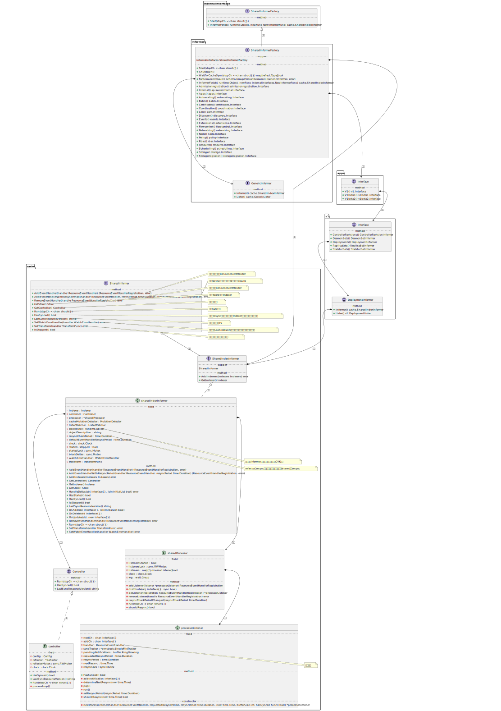
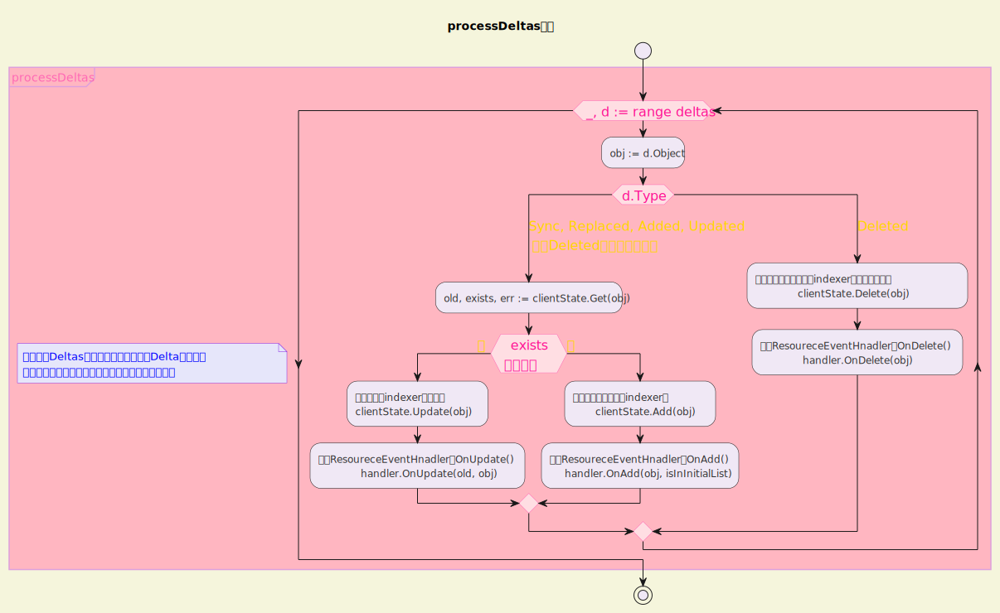
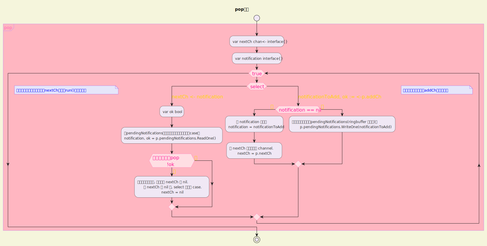

# 一 Informer

在client-go源码分析的最后一节中，我们准备分析Informer。Informer这个词的出镜率很高，我们在很多文章中都可以看到Informer的身影，在源码中真的去找一个叫作Informer的对象，却又发现找不到一个单纯的Informer，但是有很多结构体或者接口中包含Informer这个词。

与Reflector、WorkQueue等组件不同，Informer相对来说更加模糊，让人初读源码时感觉迷惑。今天我们一起来揭开Informer的面纱，看一下它到底是什么。

我们在一开始提到过Informer<mark>从DeltaFIFO中Pop相应的对象，然后通过Indexer将对象和索引丢到本地cache中，再触发相应的事件处理函数(Resource Event Handlers)的运行</mark>。接下来我们通过源码来理解一下整个过程。



## 1.1 Informer就是Controller

### 1.1.1 Controller结构体与Controller接口

Informer通过一个Controller对象来定义，本身结构很简单，我们在k8s.io/client-go/tools/cache包中的controller.go源文件中可以看到Controller的定义：

```go
type controller struct {
    config         Config
    reflector      *Reflector
    reflectorMutex sync.RWMutex
    clock          clock.Clock
}
```

这里有我们熟悉的Reflector，可以猜到Informer启动时会去运行Reflector，从而通过Reflector实现list-watch apiserver，<mark>更新“事件”到DeltaFIFO中用于进一步处理</mark>。我们继续了解controller对应的Controller接口：

```go
// Controller is a low-level controller that is parameterized by a
// Config and used in sharedIndexInformer.
type Controller interface {
    // Run does two things.  One is to construct and run a Reflector
    // to pump objects/notifications from the Config's ListerWatcher
    // to the Config's Queue and possibly invoke the occasional Resync
    // on that Queue.  The other is to repeatedly Pop from the Queue
    // and process with the Config's ProcessFunc.  Both of these
    // continue until `stopCh` is closed.
    Run(stopCh <-chan struct{})

    // HasSynced delegates to the Config's Queue
    HasSynced() bool

    // LastSyncResourceVersion delegates to the Reflector when there
    // is one, otherwise returns the empty string
    LastSyncResourceVersion() string
}
```

这里的核心方法很明显是Run(stopCh<-chan struct{})，Run负责两件事情：

1. 构造Reflector利用ListerWatcher的能力将对象事件更新到DeltaFIFO。

2. 从DeltaFIFO中Pop对象后调用ProcessFunc来处理。

### 1.1.2 Controller的初始化

同样，在controller.go文件中有如下代码：

```go
// New makes a new Controller from the given Config.
func New(c *Config) Controller {
    ctlr := &controller{
        config: *c,
        clock:  &clock.RealClock{},
    }
    return ctlr
}
```

这里没有太多的逻辑，主要是传递了一个Config进来，可以猜到核心逻辑是Config从何而来以及后面如何使用。我们先向上跟踪Config从哪里来，New()的调用有几个地方，我们不去看newInformer()分支的代码，因为实际开发中主要是使用SharedIndexInformer，两个入口初始化Controller的逻辑类似，直接跟踪更实用的一个分支，查看func (s *sharedIndexInformer) Run(stopCh<-chan struct{})方法中如何调用New()，代码位于shared_informer.go中：

```go
func (s *sharedIndexInformer) Run(stopCh <-chan struct{}) {
    //...
    func() {
        s.startedLock.Lock()
        defer s.startedLock.Unlock()

        fifo := NewDeltaFIFOWithOptions(DeltaFIFOOptions{
            KnownObjects:          s.indexer,
            EmitDeltaTypeReplaced: true,
            Transformer:           s.transform,
        })

        cfg := &Config{
            Queue:             fifo,
            ListerWatcher:     s.listerWatcher,
            ObjectType:        s.objectType,
            ObjectDescription: s.objectDescription,
            FullResyncPeriod:  s.resyncCheckPeriod,
            RetryOnError:      false,
            ShouldResync:      s.processor.shouldResync,

            Process:           s.HandleDeltas, //注意一下这个
            WatchErrorHandler: s.watchErrorHandler,
        }

        s.controller = New(cfg) //->
        s.controller.(*controller).clock = s.clock
        s.started = true
    }()
    //...
    s.controller.Run(stopCh)
}
```

这里只保留了主要代码，后面会分析SharedIndexInformer，所以先不纠结SharedIndexInformer的细节，我们从这里可以看到SharedIndexInformer的Run()过程中会<mark>构造一个Config，然后创建Controller，最后调用Controller的Run()方法</mark>。另外，这里也可以看到前面分析过的DeltaFIFO、ListerWatcher等，其中的Process:s.HandleDeltas这一行也比较重要，Process属性的类型是ProcessFunc，可以看到具体的ProcessFunc是HandleDeltas方法。

### 1.1.3 Controller的启动

上面提到Controller的初始化本身没有太多的逻辑，主要是构造了一个Config对象传递进来，所以Controller启动时肯定会有这个Config的使用逻辑。我们回到controller.go文件具体查看：

```go
// Run begins processing items, and will continue until a value is sent down stopCh or it is closed.
// It's an error to call Run more than once.
// Run blocks; call via go.
func (c *controller) Run(stopCh <-chan struct{}) {
    defer utilruntime.HandleCrash()
    go func() {
        <-stopCh
        c.config.Queue.Close()
    }()
    //利用Config中的配置构造Reflector
    r := NewReflectorWithOptions(
        c.config.ListerWatcher,
        c.config.ObjectType,
        c.config.Queue,
        ReflectorOptions{
            ResyncPeriod:    c.config.FullResyncPeriod,
            MinWatchTimeout: c.config.MinWatchTimeout,
            TypeDescription: c.config.ObjectDescription,
            Clock:           c.clock,
        },
    )
    r.ShouldResync = c.config.ShouldResync
    r.WatchListPageSize = c.config.WatchListPageSize
    if c.config.WatchErrorHandler != nil {
        r.watchErrorHandler = c.config.WatchErrorHandler
    }

    c.reflectorMutex.Lock()
    c.reflector = r
    c.reflectorMutex.Unlock()

    var wg wait.Group
    //启动Reflector
    wg.StartWithChannel(stopCh, r.Run)
    //执行Controller的ProcessLoop
    wait.Until(c.processLoop, time.Second, stopCh)
    wg.Wait()
}
```

这里的代码逻辑很简单，构造Reflector后运行起来，然后执行c.processLoop，显然Controller的业务逻辑隐藏在processLoop方法中。我们继续来看processLoop的代码逻辑。

### 1.1.4 processLoop

```go
func (c *controller) processLoop() {
    for {
        obj, err := c.config.Queue.Pop(PopProcessFunc(c.config.Process))
        if err != nil {
            if err == ErrFIFOClosed {
                return
            }
            if c.config.RetryOnError {
                //其实pop内部已经调用了AddIfNotPresent,这里重复调用一次并没有功能上的
                //帮助,不过可靠性提高了一点
                // This is the safe way to re-enqueue.
                c.config.Queue.AddIfNotPresent(obj)
            }
        }
    }
}
```

这里的代码逻辑是从DeltaFIFO中Pop出一个对象丢给PopProcessFunc处理，如果失败了就re-enqueue到DeltaFIFO中。我们前面提到过这里的PopProcessFunc由HandleDeltas()方法来实现，所以这里的主要逻辑就转到了HandleDeltas()是如何实现的。

### 1.1.5 HandleDeltas()

如果大家记不清DeltaFIFO的存储结构，可以回到前面相关章节看一下DeltaFIFO的结构图，然后回到这里查看源码。代码位于shared_informer.go文件中：

```go
func (s *sharedIndexInformer) HandleDeltas(obj interface{}, isInInitialList bool) error {
    s.blockDeltas.Lock()
    defer s.blockDeltas.Unlock()

    if deltas, ok := obj.(Deltas); ok {
        return processDeltas(s, s.indexer, deltas, isInInitialList)
    }
    return errors.New("object given as Process argument is not Deltas")
}
```

代码逻辑都落在processDeltas()函数的调用上，我们继续看下面的代码：

```go
// Multiplexes updates in the form of a list of Deltas into a Store, and informs
// a given handler of events OnUpdate, OnAdd, OnDelete
func processDeltas(
    // Object which receives event notifications from the given deltas
    handler ResourceEventHandler,
    clientState Store,
    deltas Deltas,
    isInInitialList bool,
) error {
    // from oldest to newest
    //对于每个Deltas来说，其中保存了很多Delta，也就是对应不同类型的多个对象，这里的遍历会从旧往新走
    for _, d := range deltas {

        obj := d.Object

        switch d.Type {
        case Sync, Replaced, Added, Updated: //除了Deleted之外的所有情况
            //通过indexer从cache中查询当前object
            if old, exists, err := clientState.Get(obj); err == nil && exists {
                //存在则更新indexer中的对象
                if err := clientState.Update(obj); err != nil {
                    return err
                }
                //调用ResoureceEventHnadler的OnUpdate()
                handler.OnUpdate(old, obj)
            } else {
                //不存在将对象添加到indexer中
                if err := clientState.Add(obj); err != nil {
                    return err
                }
                //调用ResoureceEventHnadler的OnAdd()
                handler.OnAdd(obj, isInInitialList)
            }
        case Deleted:
            //如果是删除操作，则从indexer中删除这个对象
            if err := clientState.Delete(obj); err != nil {
                return err
            }
            //调用ResoureceEventHnadler的OnDelete()
            handler.OnDelete(obj)
        }
    }
    return nil
}
```



这里的代码逻辑主要是<mark>遍历一个Deltas中的所有Delta，然后根据Delta的类型来决定如何操作Indexer，也就是更新本地cache，同时分发相应的通知</mark>。

## 1.2 SharedIndexInformer对象

### 1.2.1 SharedIndexInformer是什么

在Operator开发中，如果不使用controller-runtime库，也就是不通过Kubebuilder等工具来生成脚手架，经常会用到SharedInformerFactory，比如典型的sample-controller中的main()函数：[sample-controller](https://github.com/kubernetes/sample-controller/blob/master/main.go)

我摘了一点：

```go
    controller := NewController(ctx, kubeClient, exampleClient,
        kubeInformerFactory.Apps().V1().Deployments(),
        exampleInformerFactory.Samplecontroller().V1alpha1().Foos())
```

这里可以看到我们依赖于kubeInformerFactory.Apps().V1().Deployments()提供一个Informer，其中的Deployments()方法返回的是DeploymentInformer类型，DeploymentInformer又是什么呢？我们继续往下看，在client-go的informers/apps/v1包的deployment.go文件中有相关定义：

```go
// DeploymentInformer provides access to a shared informer and lister for
// Deployments.
type DeploymentInformer interface {
    Informer() cache.SharedIndexInformer
    Lister() v1beta1.DeploymentLister
}
```

可以看到所谓的DeploymentInformer是由Informer和Lister组成的，也就是说平时编码时用到的Informer本质就是一个SharedIndexInformer。

### 1.2.2 SharedIndexInformer接口的定义

回到shared_informer.go文件中，可以看到SharedIndexInformer接口的定义：

```go
// SharedIndexInformer provides add and get Indexers ability based on SharedInformer.
type SharedIndexInformer interface {
    SharedInformer
    // AddIndexers add indexers to the informer before it starts.
    AddIndexers(indexers Indexers) error
    GetIndexer() Indexer
}
```

这里的Indexer就很熟悉了，SharedInformer又是什么呢？我们继续往下看：

```go
type SharedInformer interface {
    // AddEventHandler adds an event handler to the shared informer using
    // the shared informer's resync period.  Events to a single handler are
    // delivered sequentially, but there is no coordination between
    // different handlers.
    // It returns a registration handle for the handler that can be used to
    // remove the handler again, or to tell if the handler is synced (has
    // seen every item in the initial list).
    //可以添加自定义的ResourceEventHandler
    AddEventHandler(handler ResourceEventHandler) (ResourceEventHandlerRegistration, error)
    // AddEventHandlerWithResyncPeriod adds an event handler to the
    // shared informer with the requested resync period; zero means
    // this handler does not care about resyncs.  The resync operation
    // consists of delivering to the handler an update notification
    // for every object in the informer's local cache; it does not add
    // any interactions with the authoritative storage.  Some
    // informers do no resyncs at all, not even for handlers added
    // with a non-zero resyncPeriod.  For an informer that does
    // resyncs, and for each handler that requests resyncs, that
    // informer develops a nominal resync period that is no shorter
    // than the requested period but may be longer.  The actual time
    // between any two resyncs may be longer than the nominal period
    // because the implementation takes time to do work and there may
    // be competing load and scheduling noise.
    // It returns a registration handle for the handler that can be used to remove
    // the handler again and an error if the handler cannot be added.
    //附带resync间隔配置，设置为0表示不关心resync
    AddEventHandlerWithResyncPeriod(handler ResourceEventHandler, resyncPeriod time.Duration) (ResourceEventHandlerRegistration, error)
    // RemoveEventHandler removes a formerly added event handler given by
    // its registration handle.
    // This function is guaranteed to be idempotent, and thread-safe.
    //删除添加的ResourceEventHandler
    RemoveEventHandler(handle ResourceEventHandlerRegistration) error
    // GetStore returns the informer's local cache as a Store.
    //这里的Store指的是Indexer
    GetStore() Store
    // GetController is deprecated, it does nothing useful
    //过时了没有用
    GetController() Controller
    // Run starts and runs the shared informer, returning after it stops.
    // The informer will be stopped when stopCh is closed.
    //通过Run来启动
    Run(stopCh <-chan struct{})
    // HasSynced returns true if the shared informer's store has been
    // informed by at least one full LIST of the authoritative state
    // of the informer's object collection.  This is unrelated to "resync".
    //
    // Note that this doesn't tell you if an individual handler is synced!!
    // For that, please call HasSynced on the handle returned by
    // AddEventHandler.
    //这里和resync逻辑没有关系，表示Indexer至少更新过一次全量的对象
    HasSynced() bool
    // LastSyncResourceVersion is the resource version observed when last synced with the underlying
    // store. The value returned is not synchronized with access to the underlying store and is not
    // thread-safe.
    //最后一次拿到的RV
    LastSyncResourceVersion() string

    // The WatchErrorHandler is called whenever ListAndWatch drops the
    // connection with an error. After calling this handler, the informer
    // will backoff and retry.
    //
    // The default implementation looks at the error type and tries to log
    // the error message at an appropriate level.
    //
    // There's only one handler, so if you call this multiple times, last one
    // wins; calling after the informer has been started returns an error.
    //
    // The handler is intended for visibility, not to e.g. pause the consumers.
    // The handler should return quickly - any expensive processing should be
    // offloaded.
    //用于每次ListAndWatch断开连接时回调，主要是日志记录的作用
    SetWatchErrorHandler(handler WatchErrorHandler) error

    // The TransformFunc is called for each object which is about to be stored.
    //
    // This function is intended for you to take the opportunity to
    // remove, transform, or normalize fields. One use case is to strip unused
    // metadata fields out of objects to save on RAM cost.
    //
    // Must be set before starting the informer.
    //
    // Please see the comment on TransformFunc for more details.
    //用于在对象存储前执行一些操作
    SetTransform(handler TransformFunc) error

    // IsStopped reports whether the informer has already been stopped.
    // Adding event handlers to already stopped informers is not possible.
    // An informer already stopped will never be started again.
    IsStopped() bool
}
```

### 1.2.3 sharedIndexInformer结构体的定义

继续来看SharedIndexInformer接口的实现sharedIndexerInformer是如何定义的，同样在shared_informer.go文件中查看代码：

```go
type sharedIndexInformer struct {
    indexer    Indexer
    controller Controller

    processor             *sharedProcessor
    cacheMutationDetector MutationDetector

    listerWatcher ListerWatcher

    // objectType is an example object of the type this informer is expected to handle. If set, an event
    // with an object with a mismatching type is dropped instead of being delivered to listeners.
    //表示当前Informer期望关注的类型，主要是GVK信息
    objectType runtime.Object

    // objectDescription is the description of this informer's objects. This typically defaults to
    objectDescription string

    // resyncCheckPeriod is how often we want the reflector's resync timer to fire so it can call
    // shouldResync to check if any of our listeners need a resync.
    //reflector的resync计时器计时间隔，通知所有的listener执行resync
    resyncCheckPeriod time.Duration
    // defaultEventHandlerResyncPeriod is the default resync period for any handlers added via
    // AddEventHandler (i.e. they don't specify one and just want to use the shared informer's default
    // value).
    defaultEventHandlerResyncPeriod time.Duration
    // clock allows for testability
    clock clock.Clock

    started, stopped bool
    startedLock      sync.Mutex

    // blockDeltas gives a way to stop all event distribution so that a late event handler
    // can safely join the shared informer.
    blockDeltas sync.Mutex

    // Called whenever the ListAndWatch drops the connection with an error.
    watchErrorHandler WatchErrorHandler

    transform TransformFunc
}
```

这里的Indexer、Controller、ListerWatcher等都是熟悉的组件，sharedProcessor在前面已经遇到过，这也是一个需要关注的重点逻辑，5.7.3节专门来分析sharedProcessor的实现逻辑。

### 1.2.4 sharedIndexInformer的启动

继续来看sharedIndexInformer的Run()方法，其代码在shared_informer.go文件中，这里除了将在5.7.3节介绍的sharedProcessor外，几乎已经没有陌生的内容了：

```go
func (s *sharedIndexInformer) Run(stopCh <-chan struct{}) {
    defer utilruntime.HandleCrash()

    if s.HasStarted() {
        klog.Warningf("The sharedIndexInformer has started, run more than once is not allowed")
        return
    }

    func() {
        s.startedLock.Lock()
        defer s.startedLock.Unlock()

        //DeltaFIFO我们很熟悉了
        fifo := NewDeltaFIFOWithOptions(DeltaFIFOOptions{
            KnownObjects:          s.indexer,
            EmitDeltaTypeReplaced: true,
            Transformer:           s.transform,
        })

        //Config的逻辑也在上面遇到过了
        cfg := &Config{
            Queue:             fifo,
            ListerWatcher:     s.listerWatcher,
            ObjectType:        s.objectType,
            ObjectDescription: s.objectDescription,
            FullResyncPeriod:  s.resyncCheckPeriod,
            RetryOnError:      false,
            ShouldResync:      s.processor.shouldResync,

            Process:           s.HandleDeltas,
            WatchErrorHandler: s.watchErrorHandler,
        }

        //前文分析过这个New()函数逻辑了
        s.controller = New(cfg)
        s.controller.(*controller).clock = s.clock
        s.started = true
    }()

    // Separate stop channel because Processor should be stopped strictly after controller
    processorStopCh := make(chan struct{})
    var wg wait.Group
    //等待Processor结束
    defer wg.Wait() // Wait for Processor to stop
    //告诉Processor可以结束了
    defer close(processorStopCh) // Tell Processor to stop
    //processor的run方法
    wg.StartWithChannel(processorStopCh, s.cacheMutationDetector.Run)
    wg.StartWithChannel(processorStopCh, s.processor.run)

    defer func() {
        s.startedLock.Lock()
        defer s.startedLock.Unlock()
        //从而拒绝新的listener
        s.stopped = true // Don't want any new listeners
    }()
    //controller的Run()
    s.controller.Run(stopCh)
}
```

## 1.3 sharedProcessor对象

sharedProcessor中维护了processorListener集合，然后分发通知对象到listeners，先研究结构定义，其代码在shared_informer.go中：

```go
type sharedProcessor struct {
    listenersStarted bool
    listenersLock    sync.RWMutex
    // Map from listeners to whether or not they are currently syncing
    listeners map[*processorListener]bool
    clock     clock.Clock
    wg        wait.Group
}
```

这里可以看到一个processorListener类型，下面看一下这个类型是怎么定义的：

```go
type processorListener struct {
    nextCh chan interface{}
    addCh  chan interface{}
    //核心属性
    handler ResourceEventHandler

    syncTracker *synctrack.SingleFileTracker

    // pendingNotifications is an unbounded ring buffer that holds all notifications not yet distributed.
    // There is one per listener, but a failing/stalled listener will have infinite pendingNotifications
    // added until we OOM.
    // TODO: This is no worse than before, since reflectors were backed by unbounded DeltaFIFOs, but
    // we should try to do something better.
    pendingNotifications buffer.RingGrowing

    // requestedResyncPeriod is how frequently the listener wants a
    // full resync from the shared informer, but modified by two
    // adjustments.  One is imposing a lower bound,
    // `minimumResyncPeriod`.  The other is another lower bound, the
    // sharedIndexInformer's `resyncCheckPeriod`, that is imposed (a) only
    // in AddEventHandlerWithResyncPeriod invocations made after the
    // sharedIndexInformer starts and (b) only if the informer does
    // resyncs at all.
    requestedResyncPeriod time.Duration
    // resyncPeriod is the threshold that will be used in the logic
    // for this listener.  This value differs from
    // requestedResyncPeriod only when the sharedIndexInformer does
    // not do resyncs, in which case the value here is zero.  The
    // actual time between resyncs depends on when the
    // sharedProcessor's `shouldResync` function is invoked and when
    // the sharedIndexInformer processes `Sync` type Delta objects.
    resyncPeriod time.Duration
    // nextResync is the earliest time the listener should get a full resync
    nextResync time.Time
    // resyncLock guards access to resyncPeriod and nextResync
    resyncLock sync.Mutex
}
```

可以看到processorListener中有一个ResourceEventHandler，这是我们认识的组件。

ps:可以跳转到1.1.5

processorListener有三个主要方法：

- run()。

- add(notification interface{})。

- pop()。

我们逐一来看这三个方法的实现：

```go
func (p *processorListener) run() {
    // this call blocks until the channel is closed.  When a panic happens during the notification
    // we will catch it, **the offending item will be skipped!**, and after a short delay (one second)
    // the next notification will be attempted.  This is usually better than the alternative of never
    // delivering again.
    stopCh := make(chan struct{})
    wait.Until(func() {
        for next := range p.nextCh {
            switch notification := next.(type) {
            case updateNotification:
                p.handler.OnUpdate(notification.oldObj, notification.newObj)
            case addNotification:
                p.handler.OnAdd(notification.newObj, notification.isInInitialList)
                if notification.isInInitialList {
                    p.syncTracker.Finished()
                }
            case deleteNotification:
                p.handler.OnDelete(notification.oldObj)
            default:
                utilruntime.HandleError(fmt.Errorf("unrecognized notification: %T", next))
            }
        }
        // the only way to get here is if the p.nextCh is empty and closed
        close(stopCh)
    }, 1*time.Second, stopCh)
}
```

这里的逻辑很清晰，从nextCh中拿通知，然后根据其类型去调用ResourceEventHandler相应的OnAdd()/OnUpdate()/OnDelete()方法。

```go
func (p *processorListener) add(notification interface{}) {
    if a, ok := notification.(addNotification); ok && a.isInInitialList {
        p.syncTracker.Start()
    }
    //将通知放到addCh中,所以下面的pop()方法中先执行到的case是第二个
    p.addCh <- notification
}
```

```go
func (p *processorListener) pop() {
    defer utilruntime.HandleCrash()
    //通知run 结束运行
    defer close(p.nextCh) // Tell .run() to stop

    var nextCh chan<- interface{}
    var notification interface{}
    for {
        select {
        //下面将获取到的通知添加到nextCh中，供run()方法中消费
        case nextCh <- notification:
            // Notification dispatched
            //分发通知
            var ok bool
            //从pendingNotifications中消费通知，生产者在下面的case中
            notification, ok = p.pendingNotifications.ReadOne()
            //没有内容可以pop
            if !ok { // Nothing to pop
                nextCh = nil // Disable this select case
            }
        //逻辑从这里开始，从addCh中提取通知
        case notificationToAdd, ok := <-p.addCh:
            if !ok {
                return
            }
            if notification == nil { // No notification to pop (and pendingNotifications is empty)
                // Optimize the case - skip adding to pendingNotifications
                //当 notification 为空时
                notification = notificationToAdd
                //给 nextCh 一个能用的 channel.
                nextCh = p.nextCh
            } else {
                // There is already a notification waiting to be dispatched
                //将新添加的通知丢到pendingNotifications(ringbuffer 缓冲里)中
                p.pendingNotifications.WriteOne(notificationToAdd)
            }
        }
    }
}
```



ps:总结以下add()将notification添加到p.addCh-> 拿到p.addCh放入notificationToAdd->

将notificationToAdd放入p.next()->run()拿到p.nextCh。

前面有说在添加 listener 监听器时, 启动两个协程去执行 pop() 和 run().

- `pop()` 监听 addCh 队列把 notification 对象扔到 nextCh 管道里.
- `run()` 对 nextCh 进行监听, 然后根据不同类型调用不同的 `ResourceEventHandler` 方法.

让人值得注意的是 `pop()` 方法, 该方法里对数据的搬运有些绕. 你需要细心推敲下代码, 其过程也只是 `addCh -> pendingNotifications -> nextCh` 而已.

addCh 和 nextCh 都是无缓冲的管道, 在这里只是用来做通知, 因为不好预设 channel 应该配置多大, 大了浪费, 小了则出现概率阻塞.

那么如果解决 channel 不定长的问题? k8s 里很多组件都是使用一个 ringbuffer 来实现的元素暂存。

回到正文

可以看到processorListener提供了一定的缓冲机制来接收notification，然后去消费这些notification调用<mark>ResourceEventHandler</mark>相关方法。接下来我们继续看sharedProcessor的几种主要方法：

- addListener()。

- distribute()。

- run()。

addListener()方法会直接调用前面讲过的listener的run()和pop()方法，我们来看具体的代码：

```go
func (p *sharedProcessor) addListener(listener *processorListener) ResourceEventHandlerRegistration {
    p.listenersLock.Lock()
    defer p.listenersLock.Unlock()

    if p.listeners == nil {
        p.listeners = make(map[*processorListener]bool)
    }

    p.listeners[listener] = true

    if p.listenersStarted {
        p.wg.Start(listener.run)
        p.wg.Start(listener.pop)
    }

    return listener
}
```

而distribute()方法的逻辑就是调用sharedProcessor内部维护的所有listener的add()方法：

```go
func (p *sharedProcessor) distribute(obj interface{}, sync bool) {
    p.listenersLock.RLock()
    defer p.listenersLock.RUnlock()

    //遍历所有的 listeners 集合, 并为每个 listener 添加事件.
    for listener, isSyncing := range p.listeners {
        switch {
        case !sync:
            // non-sync messages are delivered to every listener
            listener.add(obj)
        case isSyncing:
            // sync messages are delivered to every syncing listener
            listener.add(obj)
        default:
            // skipping a sync obj for a non-syncing listener
        }
    }
}
```

最后查看run()方法的逻辑，这个方法和前面的addListener()方法类似，也就是调用listener的run()和pop()方法：

```go
func (p *sharedProcessor) run(stopCh <-chan struct{}) {
    func() {
        p.listenersLock.RLock()
        defer p.listenersLock.RUnlock()
        for listener := range p.listeners {
            p.wg.Start(listener.run)
            p.wg.Start(listener.pop)
        }
        p.listenersStarted = true
    }()
    <-stopCh

    p.listenersLock.Lock()
    defer p.listenersLock.Unlock()
    for listener := range p.listeners {
        //通知pop()结束运行；
        //pop方法会通知run()结束运行;
        close(listener.addCh) // Tell .pop() to stop. .pop() will tell .run() to stop
    }

    // Wipe out list of listeners since they are now closed
    // (processorListener cannot be re-used)
    p.listeners = nil

    // Reset to false since no listeners are running
    p.listenersStarted = false
    //等待所有pop()和run()方法运行结束
    p.wg.Wait() // Wait for all .pop() and .run() to stop
}
```

至此，我们基本就知道sharedProcessor的能力了。另外，SharedIndexInformer的逻辑也就基本讲完了，再往上层看这套代码逻辑，就剩下一个SharedInformerFactory了，5.7.4节继续来了解它。

## 1.4 关于SharedInformerFactory

SharedInformerFactory是在开发Operator的过程中经常会接触到的一个比较<mark>高层的抽象对象</mark>，接下来开始详细分析这个对象的源码。SharedInformerFactory定义在k8s.io/client-go/tools/cache包下。下文在不做特殊说明的情况下，提到的所有源文件都指的是这个包内的源文件。

### 1.4.1 SharedInformerFactory的定义

SharedInformerFactory接口定义在factory.go文件中：在/informers下

```go
type SharedInformerFactory interface {
    internalinterfaces.SharedInformerFactory

    // Start initializes all requested informers. They are handled in goroutines
    // which run until the stop channel gets closed.
    // Warning: Start does not block. When run in a go-routine, it will race with a later WaitForCacheSync.
    Start(stopCh <-chan struct{})

    // Shutdown marks a factory as shutting down. At that point no new
    // informers can be started anymore and Start will return without
    // doing anything.
    //
    // In addition, Shutdown blocks until all goroutines have terminated. For that
    // to happen, the close channel(s) that they were started with must be closed,
    // either before Shutdown gets called or while it is waiting.
    //
    // Shutdown may be called multiple times, even concurrently. All such calls will
    // block until all goroutines have terminated.
    Shutdown()

    // WaitForCacheSync blocks until all started informers' caches were synced
    // or the stop channel gets closed.
    WaitForCacheSync(stopCh <-chan struct{}) map[reflect.Type]bool

    // ForResource gives generic access to a shared informer of the matching type.
    ForResource(resource schema.GroupVersionResource) (GenericInformer, error)

    // InformerFor returns the SharedIndexInformer for obj using an internal
    // client.
    InformerFor(obj runtime.Object, newFunc internalinterfaces.NewInformerFunc) cache.SharedIndexInformer

    Admissionregistration() admissionregistration.Interface
    Internal() apiserverinternal.Interface
    Apps() apps.Interface
    Autoscaling() autoscaling.Interface
    Batch() batch.Interface
    Certificates() certificates.Interface
    Coordination() coordination.Interface
    Core() core.Interface
    Discovery() discovery.Interface
    Events() events.Interface
    Extensions() extensions.Interface
    Flowcontrol() flowcontrol.Interface
    Networking() networking.Interface
    Node() node.Interface
    Policy() policy.Interface
    Rbac() rbac.Interface
    Resource() resource.Interface
    Scheduling() scheduling.Interface
    Storage() storage.Interface
    Storagemigration() storagemigration.Interface
}
```

这里可以看到一个internalinterfaces.SharedInformerFactory接口，我们看一下这个接口的定义，代码在internalinterfaces/factory_interfaces.go中：

```go
type SharedInformerFactory interface {
    Start(stopCh <-chan struct{})
    InformerFor(obj runtime.Object, newFunc NewInformerFunc) cache.SharedIndexInformer
}
```

这里可以看到熟悉的SharedIndexInformer。

然后了解ForResource(resource schema.GroupVersionResource)(GenericInformer,error)这行代码的逻辑，这里接收一个GVR，返回了一个GenericInformer。什么是GenericInformer呢？我们在generic.go中可以看到相应的定义：

```go
type GenericInformer interface {
    Informer() cache.SharedIndexInformer
    Lister() cache.GenericLister
}
```

接着看SharedInformerFactory接口剩下的一大堆相似的方法，我们以Apps()apps.Interface为例，这个Interface定义在apps/interface.go中：

```go
type Interface interface {
    // V1 provides access to shared informers for resources in V1.
    V1() v1.Interface
    // V1beta1 provides access to shared informers for resources in V1beta1.
    V1beta1() v1beta1.Interface
    // V1beta2 provides access to shared informers for resources in V1beta2.
    V1beta2() v1beta2.Interface
}
```

这时大家的关注点肯定是这里的v1.Interface类型是怎么定义的，继续到apps/v1/interface.go文件中查看：

```go
// Interface provides access to all the informers in this group version.
type Interface interface {
    // ControllerRevisions returns a ControllerRevisionInformer.
    ControllerRevisions() ControllerRevisionInformer
    // DaemonSets returns a DaemonSetInformer.
    DaemonSets() DaemonSetInformer
    // Deployments returns a DeploymentInformer.
    Deployments() DeploymentInformer
    // ReplicaSets returns a ReplicaSetInformer.
    ReplicaSets() ReplicaSetInformer
    // StatefulSets returns a StatefulSetInformer.
    StatefulSets() StatefulSetInformer
}
```

到这里已经有看着很眼熟的Deployments() DeploymentInformer之类的代码了，前面看过DeploymentInformer的定义：

```go
type DeploymentInformer interface {
    Informer() cache.SharedIndexInformer
    Lister() v1.DeploymentLister
}
```

现在也就不难理解SharedInformerFactory的作用了，它提供了所有API group-version的资源对应的SharedIndexInformer，也就不难理解前面引用的sample-controller中的这行代码：

```go
kubeInformerFactory.Apps().V1().Deployments()
```

通过其可以拿到一个<mark>Deployment资源对应的SharedIndexInformer</mark>。

### 1.4.2 SharedInformerFactory的初始化

继续来看SharedInformerFactory的New()逻辑，其代码在factory.go中：

```go
// NewSharedInformerFactoryWithOptions constructs a new instance of a SharedInformerFactory with additional options.
func NewSharedInformerFactoryWithOptions(client kubernetes.Interface, defaultResync time.Duration, options ...SharedInformerOption) SharedInformerFactory {
    factory := &sharedInformerFactory{
        client:           client,
        namespace:        v1.NamespaceAll,//空字符串“”
        defaultResync:    defaultResync,
        //可以存放不同类型的SharedIndexInformer
        informers:        make(map[reflect.Type]cache.SharedIndexInformer),
        startedInformers: make(map[reflect.Type]bool),
        customResync:     make(map[reflect.Type]time.Duration),
    }

    // Apply all options
    for _, opt := range options {
        factory = opt(factory)
    }

    return factory
}
```

### 1.4.3 SharedInformerFactory的启动过程

最后查看SharedInformerFactory是如何启动的，Start()方法同样位于factory.go源文件中：

```go
func (f *sharedInformerFactory) Start(stopCh <-chan struct{}) {
    f.lock.Lock()
    defer f.lock.Unlock()

    if f.shuttingDown {
        return
    }

    for informerType, informer := range f.informers {
        //类型智慧调用一次，Run的代码逻辑前面介绍过了
        if !f.startedInformers[informerType] {
            f.wg.Add(1)
            // We need a new variable in each loop iteration,
            // otherwise the goroutine would use the loop variable
            // and that keeps changing.
            informer := informer
            go func() {
                defer f.wg.Done()
                informer.Run(stopCh)
            }()
            f.startedInformers[informerType] = true
        }
    }
}
```

ps：就是启动当前 informers 里的所有 informer.

## 1.5 小结

我们从一个基础Informer-Controller开始介绍，先分析了Controller的能力，其通过构造Reflector并启动从而能够获取指定类型资源的“更新”事件，然后通过事件构造Delta放到DeltaFIFO中，进而在processLoop中从DeltaFIFO里pop Deltas来处理，一方面将对象通过Indexer同步到本地cache（也就是一个ThreadSafeStore）​，另一方面调用ProcessFunc来处理这些Delta。

然后SharedIndexInformer提供了构造Controller的能力，通过HandleDeltas()方法实现上面提到的ProcessFunc，同时还引入了sharedProcessor在HandleDeltas()中用于事件通知的处理。sharedProcessor分发事件通知时，接收方是内部继续抽象出来的processorListener，在processorListener中完成了ResourceEventHandler回调函数的具体调用。

最后SharedInformerFactory又进一步封装了提供所有API资源对应的SharedIndexInformer的能力。也就是说一个SharedIndexInformer可以处理一种类型的资源，比如Deployment或者Pod等，而通过SharedInformerFactory可以轻松构造任意已知类型的SharedIndexInformer。另外，这里用到了ClientSet提供的访问所有API资源的能力，通过它也就能够完整实现整套Informer程序逻辑了。
