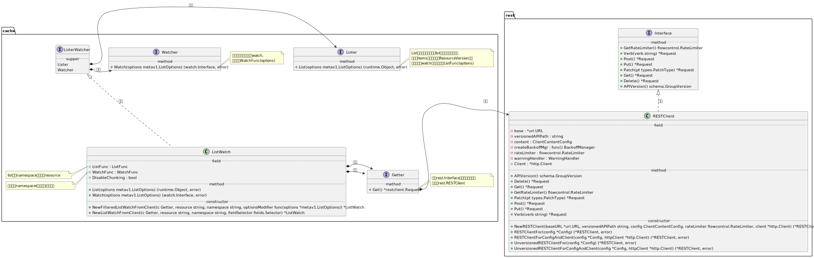
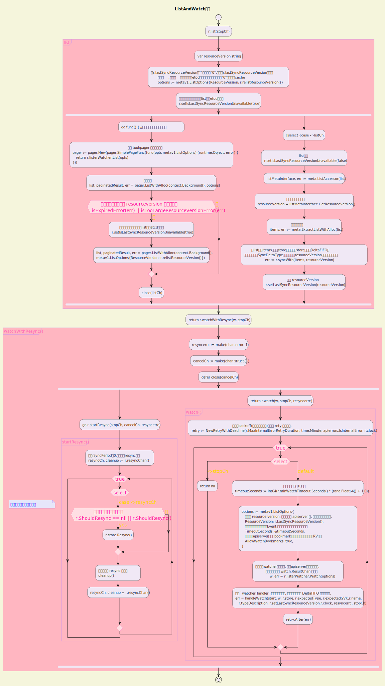
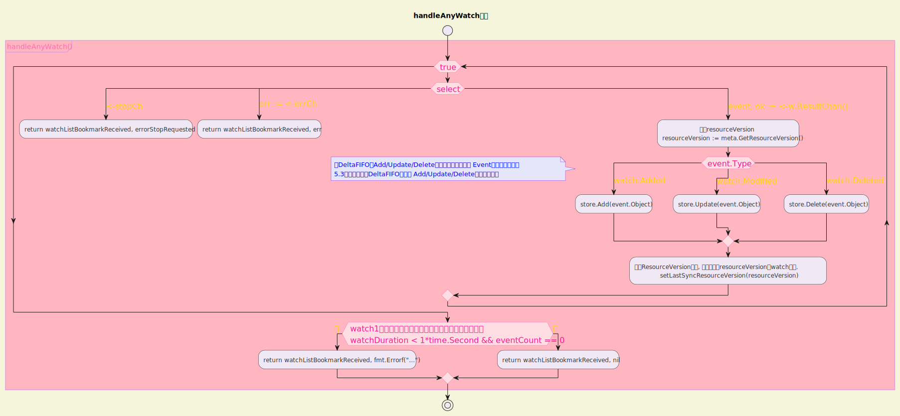

# 一 ListerWatcher

ListerWatcher是Reflector的一个主要能力提供者，本节我们具体看一下ListerWatcher是如何实现List()和Watch()过程的。ListerWatcher的代码还是在k8s.io/client-go/tools/cache包中，后文在不明确提到其他包名的情况下，所有源文件都指的是这个包内的源文件。



## 1.1 ListWatch对象的初始化

ListWatch对象和其创建过程都在listwatch.go中，我们先看一下ListWatch对象的定义：

```go
type ListWatch struct {
    ListFunc  ListFunc
    WatchFunc WatchFunc
    // DisableChunking requests no chunking for this list watcher.
    DisableChunking bool
}
```

可以看到这个结构体属性很简单，主要是ListFunc和WatchFunc。继续来看这个对象是怎么被初始化的：

```go
// 这里Getter类型的c对应一个RESTClient
func NewListWatchFromClient(c Getter, resource string, namespace string, fieldSelector fields.Selector) *ListWatch {
    optionsModifier := func(options *metav1.ListOptions) {
        options.FieldSelector = fieldSelector.String() //序列化成字符串
    }
    //调用下面这个NewFilteredListWatchFromClient()函数
    return NewFilteredListWatchFromClient(c, resource, namespace, optionsModifier)
}
```

可以看到主要逻辑在NewFilteredListWatchFromClient()函数中，list和watch能力都是通过RESTClient提供的：

```go
func NewFilteredListWatchFromClient(c Getter, resource string, namespace string, optionsModifier func(options *metav1.ListOptions)) *ListWatch {
    //list某个namespace下的某个resource
    listFunc := func(options metav1.ListOptions) (runtime.Object, error) {
        optionsModifier(&options)
        return c.Get().
            Namespace(namespace).
            Resource(resource).
            VersionedParams(&options, metav1.ParameterCodec).
            Do(context.TODO()).
            Get()
    }
    //监听某个namespace(命名空间)下的资源
    watchFunc := func(options metav1.ListOptions) (watch.Interface, error) {
        options.Watch = true
        optionsModifier(&options)
        return c.Get().
            Namespace(namespace).
            Resource(resource).
            VersionedParams(&options, metav1.ParameterCodec).
            Watch(context.TODO())
    }
    return &ListWatch{ListFunc: listFunc, WatchFunc: watchFunc}
}
```

上面涉及一个Getter接口，我们继续看Getter的定义：

```go
type Getter interface {
    Get() *restclient.Request
}
```

这里需要一个能够获得*restclient.Request的方式，我们实际使用时会用rest.Interface接口类型的实例，这是一个相对底层的工具，封装的是Kubernetes REST APIS相应的动作，可以在client-go的rest包内的client.go源文件中看到：

```go
type Interface interface {
    GetRateLimiter() flowcontrol.RateLimiter
    Verb(verb string) *Request
    Post() *Request
    Put() *Request
    Patch(pt types.PatchType) *Request
    Get() *Request
    Delete() *Request
    APIVersion() schema.GroupVersion
}
```

这个接口对应的实现也在client.go源文件中：

```go
// RESTClient imposes common Kubernetes API conventions on a set of resource paths.
// The baseURL is expected to point to an HTTP or HTTPS path that is the parent
// of one or more resources.  The server should return a decodable API resource
// object, or an api.Status object which contains information about the reason for
// any failure.
//
// Most consumers should use client.New() to get a Kubernetes API client.
type RESTClient struct {
    // base is the root URL for all invocations of the client
    base *url.URL
    // versionedAPIPath is a path segment connecting the base URL to the resource root
    versionedAPIPath string

    // content describes how a RESTClient encodes and decodes responses.
    content ClientContentConfig

    // creates BackoffManager that is passed to requests.
    createBackoffMgr func() BackoffManager

    // rateLimiter is shared among all requests created by this client unless specifically
    // overridden.
    rateLimiter flowcontrol.RateLimiter

    // warningHandler is shared among all requests created by this client.
    // If not set, defaultWarningHandler is used.
    warningHandler WarningHandler

    // Set specific behavior of the client.  If not set http.DefaultClient will be used.
    Client *http.Client
}
```

这里的RESTClient和平时Operator代码中常用的ClientSet的关系，可以通过这个简单的例子了解一下：我们在用ClientSet去Get一个指定名字的DaemonSet的时候，调用过程类似这样：

```go
clinetset.AppsV1().Deployments("default").Get(context.TODO(), "test-ds", getOpt)
```

这里的Get其实就是利用了RESTClient提供的能力，方法实现如下：

```go
// Get takes name of the resource, and returns the corresponding object, and an error if there is any.
func (c *Client[T]) Get(ctx context.Context, name string, options metav1.GetOptions) (T, error) {
    result := c.newObject()
    err := c.client.Get(). //其实就是RestClient.Get(),返回的是*rest.Request对象
                NamespaceIfScoped(c.namespace, c.namespace != "").
                Resource(c.resource).
                Name(name).
                VersionedParams(&options, c.parameterCodec).
                Do(ctx).
                Into(result)
    return result, err
}
```

ps:其实就是前面的.get()->c.Get()->Interface.Get()

## 1.2 ListerWatcher接口

上面提到的ListWatch对象其实实现的是ListerWatcher接口，这个接口当然也在listwatch.go中定义

```go
// ListerWatcher is any object that knows how to perform an initial list and start a watch on a resource.
type ListerWatcher interface {
    Lister
    Watcher
}
```

这里内嵌了两个接口，分别是Lister和Watcher：

```go
// Lister is any object that knows how to perform an initial list.
type Lister interface {
    // List should return a list type object; the Items field will be extracted, and the
    // ResourceVersion field will be used to start the watch in the right place.
    //List的返回值应该是一个list类型的对象，也就是其中有Items字段，里面的ResourceVersion可以用来监听（watch）
    List(options metav1.ListOptions) (runtime.Object, error)
}

// Watcher is any object that knows how to start a watch on a resource.
type Watcher interface {
    // Watch should begin a watch at the specified version.
    //
    // If Watch returns an error, it should handle its own cleanup, including
    // but not limited to calling Stop() on the watch, if one was constructed.
    // This allows the caller to ignore the watch, if the error is non-nil.
    //从指定的资源版本开始watch
    Watch(options metav1.ListOptions) (watch.Interface, error)
}
```

ListWatch对象的List()和Watch()的实现就比较简短了：

```go
func (lw *ListWatch) List(options metav1.ListOptions) (runtime.Object, error) {
    // ListWatch is used in Reflector, which already supports pagination.
    // Don't paginate here to avoid duplication.
    return lw.ListFunc(options)
}

// Watch a set of apiserver resources
func (lw *ListWatch) Watch(options metav1.ListOptions) (watch.Interface, error) {
    return lw.WatchFunc(options)
}
```

## 1.3 List-Watch与HTTP chunked

### 1.3.1 HTTP中的chunked

Kubernetes中主要通过List-Watch机制实现组件间的<mark>异步消息通信</mark>，List-Watch机制的实现原理值得深入分析。我们继续从HTTP层面来分析watch的实现机制，抓包试一下调用watch接口时数据包流向是怎样的。

Kubernetes中的监听(watch)长链接是通过HTTP的chunked机制实现的，在响应头中加一个Transfer-Encoding: chunked就可以实现分段响应。

chunked类型的response由一个个chunk（块）组成，每个chunk的格式都是“Chunk size+Chunk data+Chunk boundary”​，也就是块大小+数据+边界标识。chunk的结尾是一个大小为0的块，也就是“0\r\n”​。

### 1.3.2 watch API中的chunked

现在多数Kubernetes集群都是以HTTPS方式暴露API，而且开启了双向TLS，所以我们需要先通过kubectl代理kube-apiserver提供HTTP的API，从而方便调用和抓包：

```shell
hyj@localhost:~$ kubectl proxy
Starting to serve on 127.0.0.1:8001
```

然后开始watch一个资源，比如这里选择coredns的configmap：

```shell
curl 127.0.0.1:8001/api/v1/watch/namespaces/kube-system/configmaps/coredns
```

```json
{
    "type": "ADDED",
    "object": {
        "kind": "ConfigMap",
        "apiVersion": "v1",
        "metadata": {
            "name": "coredns",
            "namespace": "kube-system",
            "uid": "504a2097-2923-4092-be7b-ec69d80be29c",
            "resourceVersion": "250",
            "creationTimestamp": "2024-08-24T08:05:52Z",
            "managedFields": [{
                "manager": "kubeadm",
                "operation": "Update",
                "apiVersion": "v1",
                "time": "2024-08-24T08:05:52Z",
                "fieldsType": "FieldsV1",
                "fieldsV1": {
                    "f:data": {
                        ".": {},
                        "f:Corefile": {}
                    }
                }
            }]
        },
        "data": {
            "Corefile": ".:53 {\n    errors\n    health {\n       lameduck 5s\n    }\n    ready\n    kubernetes cluster.local in-addr.arpa ip6.arpa {\n       pods insecure\n       fallthrough in-addr.arpa ip6.arpa\n       ttl 30\n    }\n    prometheus :9153\n    forward . /etc/resolv.conf {\n       max_concurrent 1000\n    }\n    cache 30\n    loop\n    reload\n    loadbalance\n}\n"
        }
    }
}
```

这时可以马上拿到一个响应，然后我们通过kubectl命令去编辑一下这个configmap，可以看到监听端继续收到一条消息：

```shell
kubectl edit configmap coredns -n kube-system
```

```json
{
    "type": "MODIFIED",
    "object": {
        "kind": "ConfigMap",
        "apiVersion": "v1",
        "metadata": {
            "name": "coredns",
            "namespace": "kube-system",
            "uid": "504a2097-2923-4092-be7b-ec69d80be29c",
            "resourceVersion": "2987",
            "creationTimestamp": "2024-08-24T08:05:52Z",
            "managedFields": [{
                "manager": "kubeadm",
                "operation": "Update",
                "apiVersion": "v1",
                "time": "2024-08-24T08:05:52Z",
                "fieldsType": "FieldsV1",
                "fieldsV1": {
                    "f:data": {}
                }
            }, {
                "manager": "kubectl-edit",
                "operation": "Update",
                "apiVersion": "v1",
                "time": "2024-08-24T08:38:29Z",
                "fieldsType": "FieldsV1",
                "fieldsV1": {
                    "f:data": {
                        "f:Corefile": {}
                    }
                }
            }]
        },
        "data": {
            "Corefile": ".:53 {\n    errors\n    health {\n       lameduck 6s\n    }\n    ready\n    kubernetes cluster.local in-addr.arpa ip6.arpa {\n       pods insecure\n       fallthrough in-addr.arpa ip6.arpa\n       ttl 30\n    }\n    prometheus :9153\n    forward . /etc/resolv.conf {\n       max_concurrent 1000\n    }\n    cache 30\n    loop\n    reload\n    loadbalance\n}\n"
        }
    }
}
```

所以apiserver就是通过这样的方式将资源变更通知到各个watcher（监听器）的。这时如果我们去抓包，依旧可以看到这两个响应信息的具体数据包格式，第一个响应体如图5-6所示（截取了中间关键信息）​。

作者抓了一下包我这里就不抓了，结论就是:

第一次可以看到这里的HTTP头有一个Transfer-Encoding:chunked，下面的内容是{"type":"ADDED…。

继续看第二个包，这个包简单很多，少了HTTP头信息，只是简单地返回第二个chunk。

# 二 Reflector

我们前面提到过Reflector的任务就是<mark>从apiserver监听(watch)特定类型的资源，拿到变更通知后，将其丢到DeltaFIFO队列中</mark>，也介绍了ListerWatcher是如何从apiserver中列选-监听(List-Watch)资源的，本节我们继续来看Reflector的实现。

## 2.1 Reflector的启动过程

Reflector定义在k8s.io/client-go/tools/cache包下。下文在不做特殊说明的情况下，提到的所有源文件都指的是这个包内的源文件。代表Reflector的结构体属性比较多，我们在不知道其工作原理的情况下去逐个看这些属性意义不大，所以这里先不去具体看这个结构体的定义，而是直接找到Run()方法，从Reflector的启动切入，源码在reflector.go中：

```go
// Run repeatedly uses the reflector's ListAndWatch to fetch all the
// objects and subsequent deltas.
// Run will exit when stopCh is closed.
func (r *Reflector) Run(stopCh <-chan struct{}) {
    klog.V(3).Infof("Starting reflector %s (%s) from %s", r.typeDescription, r.resyncPeriod, r.name)
    wait.BackoffUntil(func() {
        if err := r.ListAndWatch(stopCh); err != nil {
            r.watchErrorHandler(r, err)
        }
    }, r.backoffManager, true, stopCh)
    klog.V(3).Infof("Stopping reflector %s (%s) from %s", r.typeDescription, r.resyncPeriod, r.name)
}
```

这里有一些健壮性机制，用于处理apiserver短暂失联的场景，可以看到主要逻辑在Reflector.ListAndWatch()方法中。

## 2.2 核心方法：Reflector.ListAndWatch()

Reflector.ListAndWatch()方法有将近200行，是Reflector的核心逻辑之一。ListAndWatch()方法是<mark>先列出特定资源的所有对象</mark>，<mark>然后获取其资源版本</mark>，接着<mark>使用这个资源版本来开始监听流程</mark>。<mark>监听到新版本资源后，将其加入DeltaFIFO的动作是在watchHandler()方法中具体实现的</mark>。在此之前list（列选）到的最新元素会通过syncWith()方法添加一个Sync类型的DeltaType到DeltaFIFO中，所以list操作本身也会触发后面的调谐逻辑。具体代码如下：

```go
func (r *Reflector) ListAndWatch(stopCh <-chan struct{}) error {
	klog.V(3).Infof("Listing and watching %v from %s", r.typeDescription, r.name)
	var err error
	var w watch.Interface

	useWatchList := ptr.Deref(r.UseWatchList, false)
	fallbackToList := !useWatchList

	if useWatchList {
		w, err = r.watchList(stopCh) //->
		if w == nil && err == nil {
			// stopCh was closed
			return nil
		}
		if err != nil {
			klog.Warningf("The watchlist request ended with an error, falling back to the standard LIST/WATCH semantics because making progress is better than deadlocking, err = %v", err)
			fallbackToList = true
			// ensure that we won't accidentally pass some garbage down the watch.
			w = nil
		}
	}

	if fallbackToList {
		err = r.list(stopCh) //->
		if err != nil {
			return err
		}
	}

	klog.V(2).Infof("Caches populated for %v from %s", r.typeDescription, r.name)
	return r.watchWithResync(w, stopCh) //->
}


```

```go
func (r *Reflector) list(stopCh <-chan struct{}) error {
	var resourceVersion string
	//当r.lastSyncResourceVersion为""时这里是"0",当使用r.lastSyncResourceVersion失败时
	//这里为"",区别是""会直接请求到etcd，获取一个新的版本，而"0"访问的是cache
	options := metav1.ListOptions{ResourceVersion: r.relistResourceVersion()}

	//trace用于记录操作耗时，这里的逻辑是把超过10s的步骤打印出来
	initTrace := trace.New("Reflector ListAndWatch", trace.Field{Key: "name", Value: r.name})
	defer initTrace.LogIfLong(10 * time.Second)
	var list runtime.Object
	var paginatedResult bool
	var err error
	listCh := make(chan struct{}, 1)
	panicCh := make(chan interface{}, 1)
	go func() { //内嵌一个函数这里直接调用
		defer func() {
			if r := recover(); r != nil {
				panicCh <- r // 收集这个goroutine的panic信息
			}
		}()
		// Attempt to gather list in chunks, if supported by listerWatcher, if not, the first
		// list request will return the full response.
		//使用 tool/pager 组装分页逻辑
		pager := pager.New(pager.SimplePageFunc(func(opts metav1.ListOptions) (runtime.Object, error) {
			return r.listerWatcher.List(opts)
		}))
		switch {
		case r.WatchListPageSize != 0:
			pager.PageSize = r.WatchListPageSize
		case r.paginatedResult:
			// We got a paginated result initially. Assume this resource and server honor
			// paging requests (i.e. watch cache is probably disabled) and leave the default
			// pager size set.
		case options.ResourceVersion != "" && options.ResourceVersion != "0":
			// User didn't explicitly request pagination.
			//
			// With ResourceVersion != "", we have a possibility to list from watch cache,
			// but we do that (for ResourceVersion != "0") only if Limit is unset.
			// To avoid thundering herd on etcd (e.g. on master upgrades), we explicitly
			// switch off pagination to force listing from watch cache (if enabled).
			// With the existing semantic of RV (result is at least as fresh as provided RV),
			// this is correct and doesn't lead to going back in time.
			//
			// We also don't turn off pagination for ResourceVersion="0", since watch cache
			// is ignoring Limit in that case anyway, and if watch cache is not enabled
			// we don't introduce regression.
			pager.PageSize = 0
		}

		//获取数据
		list, paginatedResult, err = pager.ListWithAlloc(context.Background(), options)
		//如果过期或者不合法 resourceversion 则进行重试.
		if isExpiredError(err) || isTooLargeResourceVersionError(err) {
			//设置这个属性后，下一次list会从etcd中获取
			r.setIsLastSyncResourceVersionUnavailable(true)
			// Retry immediately if the resource version used to list is unavailable.
			// The pager already falls back to full list if paginated list calls fail due to an "Expired" error on
			// continuation pages, but the pager might not be enabled, the full list might fail because the
			// resource version it is listing at is expired or the cache may not yet be synced to the provided
			// resource version. So we need to fallback to resourceVersion="" in all to recover and ensure
			// the reflector makes forward progress.
			list, paginatedResult, err = pager.ListWithAlloc(context.Background(), metav1.ListOptions{ResourceVersion: r.relistResourceVersion()})
		}
		close(listCh)
	}()
	select {
	case <-stopCh:
		return nil
	case r := <-panicCh:
		panic(r)
	case <-listCh:
	}
	initTrace.Step("Objects listed", trace.Field{Key: "error", Value: err})
	if err != nil {
		klog.Warningf("%s: failed to list %v: %v", r.name, r.typeDescription, err)
		return fmt.Errorf("failed to list %v: %w", r.typeDescription, err)
	}

	// We check if the list was paginated and if so set the paginatedResult based on that.
	// However, we want to do that only for the initial list (which is the only case
	// when we set ResourceVersion="0"). The reasoning behind it is that later, in some
	// situations we may force listing directly from etcd (by setting ResourceVersion="")
	// which will return paginated result, even if watch cache is enabled. However, in
	// that case, we still want to prefer sending requests to watch cache if possible.
	//
	// Paginated result returned for request with ResourceVersion="0" mean that watch
	// cache is disabled and there are a lot of objects of a given type. In such case,
	// there is no need to prefer listing from watch cache.
	if options.ResourceVersion == "0" && paginatedResult {
		r.paginatedResult = true
	}

	//list成功
	r.setIsLastSyncResourceVersionUnavailable(false) // list was successful
	//获取当前最新的版本
	listMetaInterface, err := meta.ListAccessor(list)
	if err != nil {
		return fmt.Errorf("unable to understand list result %#v: %v", list, err)
	}
	resourceVersion = listMetaInterface.GetResourceVersion()
	initTrace.Step("Resource version extracted")
	//转换数据结构
	items, err := meta.ExtractListWithAlloc(list)
	if err != nil {
		return fmt.Errorf("unable to understand list result %#v (%v)", list, err)
	}
	initTrace.Step("Objects extracted")
	//将list到的items添加到store中，这里的store也就是DeltaFIFO，
	//也就是添加一个SyncDeltaType，不过这里的resourceVersion值并没有实际用到
	if err := r.syncWith(items, resourceVersion); err != nil {
		return fmt.Errorf("unable to sync list result: %v", err)
	}
	initTrace.Step("SyncWith done")
	// 更新 resourceVersion
	r.setLastSyncResourceVersion(resourceVersion)
	initTrace.Step("Resource version updated")
	return nil
}
```

```go
func (r *Reflector) watchWithResync(w watch.Interface, stopCh <-chan struct{}) error {
	resyncerrc := make(chan error, 1)
	cancelCh := make(chan struct{})
	defer close(cancelCh)
	go r.startResync(stopCh, cancelCh, resyncerrc) //->
	return r.watch(w, stopCh, resyncerrc)          //->
}
```

```go
func (r *Reflector) startResync(stopCh <-chan struct{}, cancelCh <-chan struct{}, resyncerrc chan error) {
	//通常 rsyncPeriod 为 0 , 不会触犯 resync 操作
	resyncCh, cleanup := r.resyncChan()
	defer func() {
		//退出时关闭 resync 定时器
		cleanup() // Call the last one written into cleanup
	}()
	for {
		select {
		case <-resyncCh: //触发 resync 定时器
		case <-stopCh:
			return
		case <-cancelCh:
			return
		}
		// 符合条件时进行重新同步
		if r.ShouldResync == nil || r.ShouldResync() {
			klog.V(4).Infof("%s: forcing resync", r.name)

			if err := r.store.Resync(); err != nil {
				resyncerrc <- err
				return
			}
		}
		//退出时关闭 resync 定时器
		cleanup()
		resyncCh, cleanup = r.resyncChan()
	}
}
```

```go
func (r *Reflector) watch(w watch.Interface, stopCh <-chan struct{}, resyncerrc chan error) error {
	var err error
	//配置带backoff(下次重试会等待)退避的 rety 重试对象.
	retry := NewRetryWithDeadline(r.MaxInternalErrorRetryDuration, time.Minute, apierrors.IsInternalError, r.clock)

	for {
		// give the stopCh a chance to stop the loop, even in case of continue statements further down on errors
		select {
		case <-stopCh:
			// we can only end up here when the stopCh
			// was closed after a successful watchlist or list request
			if w != nil {
				w.Stop()
			}
			return nil
		default:
		}

		// start the clock before sending the request, since some proxies won't flush headers until after the first watch event is sent
		start := r.clock.Now()

		if w == nil {
			//超时时间是5～10分钟
			timeoutSeconds := int64(r.minWatchTimeout.Seconds() * (rand.Float64() + 1.0))
			options := metav1.ListOptions{
				//上次的 resource version, 这样订阅到 apiserver 后, 可以拿到增量的数据.
				ResourceVersion: r.LastSyncResourceVersion(),
				// We want to avoid situations of hanging watchers. Stop any watchers that do not
				// receive any events within the timeout window.
				//如果超时没有接收到任何Event,这里需要停止监听，避免一直阻塞
				TimeoutSeconds: &timeoutSeconds,
				// To reduce load on kube-apiserver on watch restarts, you may enable watch bookmarks.
				// Reflector doesn't assume bookmarks are returned at all (if the server do not support
				// watch bookmarks, it will ignore this field).
				//用于降低apiserver压力，bookmark类型响应的对象主要只有RV信息
				AllowWatchBookmarks: true,
			}

			//调用watch开始监听
			//创建一个watcher监听对象, 监听apiserver获取变更事件,
			//把新增事件扔到 watch.ResultChan 队列中.
			w, err = r.listerWatcher.Watch(options)
			if err != nil {
				//这时直接re-list已经没有用了，apiserver暂时拒绝服务
				if canRetry := isWatchErrorRetriable(err); canRetry {
					klog.V(4).Infof("%s: watch of %v returned %v - backing off", r.name, r.typeDescription, err)
					select {
					case <-stopCh:
						return nil
					case <-r.backoffManager.Backoff().C():
						continue
					}
				}
				return err
			}
		}

		//核心逻辑之一，后面会单独讲到handleWatch()
		//调用 `watcherHandler` 监听新增的事件, 然后把新增加到 DeltaFIFO 增量队列里.
		err = handleWatch(start, w, r.store, r.expectedType, r.expectedGVK, r.name, r.typeDescription, r.setLastSyncResourceVersion,
			r.clock, resyncerrc, stopCh)
		// Ensure that watch will not be reused across iterations.
		w.Stop()
		w = nil
		retry.After(err)
		if err != nil {
			if !errors.Is(err, errorStopRequested) {
				switch {
				case isExpiredError(err):
					// Don't set LastSyncResourceVersionUnavailable - LIST call with ResourceVersion=RV already
					// has a semantic that it returns data at least as fresh as provided RV.
					// So first try to LIST with setting RV to resource version of last observed object.
					klog.V(4).Infof("%s: watch of %v closed with: %v", r.name, r.typeDescription, err)
				case apierrors.IsTooManyRequests(err):
					klog.V(2).Infof("%s: watch of %v returned 429 - backing off", r.name, r.typeDescription)
					select {
					case <-stopCh:
						return nil
					case <-r.backoffManager.Backoff().C():
						continue
					}
				case apierrors.IsInternalError(err) && retry.ShouldRetry():
					klog.V(2).Infof("%s: retrying watch of %v internal error: %v", r.name, r.typeDescription, err)
					continue
				default:
					klog.Warningf("%s: watch of %v ended with: %v", r.name, r.typeDescription, err)
				}
			}
			return nil
		}
	}
}
```



## 2.3 核心方法：Reflector.watchHandler()

前面分析ListAndWatch()方法时提到了会单独分析watchHandler()方法。在watchHandler()方法中完成了<mark>将监听到的Event（事件）根据其EventType（事件类型）分别调用DeltaFIFO的Add()/Update/Delete()等方法</mark>，完成对象追加到DeltaFIFO队列的过程。watchHandler()方法的调用在一个for循环中，所以一轮调用watchHandler()工作流程完成后函数退出，新一轮的调用会传递进来新的watch.Interface和resourceVersion等。我们来看watchHander()方法的实现，同样在reflector.go中：

```go
func handleWatch(
	start time.Time,
	w watch.Interface,
	store Store,
	expectedType reflect.Type,
	expectedGVK *schema.GroupVersionKind,
	name string,
	expectedTypeName string,
	setLastSyncResourceVersion func(string),
	clock clock.Clock,
	errCh chan error,
	stopCh <-chan struct{},
) error {
	exitOnWatchListBookmarkReceived := false
	_, err := handleAnyWatch(start, w, store, expectedType, expectedGVK, name, expectedTypeName,
		setLastSyncResourceVersion, exitOnWatchListBookmarkReceived, clock, errCh, stopCh)
	return err
}
```

```go
func handleAnyWatch(start time.Time,
	w watch.Interface,
	store Store,
	expectedType reflect.Type,
	expectedGVK *schema.GroupVersionKind,
	name string,
	expectedTypeName string,
	setLastSyncResourceVersion func(string),
	exitOnWatchListBookmarkReceived bool,
	clock clock.Clock,
	errCh chan error,
	stopCh <-chan struct{},
) (bool, error) {
	watchListBookmarkReceived := false
	eventCount := 0
	initialEventsEndBookmarkWarningTicker := newInitialEventsEndBookmarkTicker(name, clock, start, exitOnWatchListBookmarkReceived)
	//当前函数返回时需要关闭watch.
	defer initialEventsEndBookmarkWarningTicker.Stop()

loop:
	for {
		select {
		case <-stopCh:
			return watchListBookmarkReceived, errorStopRequested
		case err := <-errCh:
			return watchListBookmarkReceived, err
		//接收event（事件）
		case event, ok := <-w.ResultChan():
			if !ok {
				break loop // 退出 loop
			}
			if event.Type == watch.Error { //如果Error（错误）
				return watchListBookmarkReceived, apierrors.FromObject(event.Object)
			}
			//创建Reflector时绘制定一个expectedType
			if expectedType != nil {
				//类型不匹配
				if e, a := expectedType, reflect.TypeOf(event.Object); e != a {
					utilruntime.HandleError(fmt.Errorf("%s: expected type %v, but watch event object had type %v", name, e, a))
					continue
				}
			}
			//没有对应Go语言结构体的对象可以通过这种方式来指定期望类型
			if expectedGVK != nil {
				if e, a := *expectedGVK, event.Object.GetObjectKind().GroupVersionKind(); e != a {
					utilruntime.HandleError(fmt.Errorf("%s: expected gvk %v, but watch event object had gvk %v", name, e, a))
					continue
				}
			}
			meta, err := meta.Accessor(event.Object)
			if err != nil {
				utilruntime.HandleError(fmt.Errorf("%s: unable to understand watch event %#v", name, event))
				continue
			}
			//新的resourceVersion
			resourceVersion := meta.GetResourceVersion()

			switch event.Type {
			//调用DeltaFIFO的Add/Update/Delete等方法完成不同类型 Event的处理，我们在
			//5.3节详细介绍国DeltaFIFO对应的 Add/Update/Delete是如何实现的
			case watch.Added:
				err := store.Add(event.Object)
				if err != nil {
					utilruntime.HandleError(fmt.Errorf("%s: unable to add watch event object (%#v) to store: %v", name, event.Object, err))
				}
			case watch.Modified:
				err := store.Update(event.Object)
				if err != nil {
					utilruntime.HandleError(fmt.Errorf("%s: unable to update watch event object (%#v) to store: %v", name, event.Object, err))
				}
			case watch.Deleted:
				// TODO: Will any consumers need access to the "last known
				// state", which is passed in event.Object? If so, may need
				// to change this.
				err := store.Delete(event.Object)
				if err != nil {
					utilruntime.HandleError(fmt.Errorf("%s: unable to delete watch event object (%#v) from store: %v", name, event.Object, err))
				}
			case watch.Bookmark:
				// A `Bookmark` means watch has synced here, just update the resourceVersion
				if meta.GetAnnotations()[metav1.InitialEventsAnnotationKey] == "true" {
					watchListBookmarkReceived = true
				}
			default:
				utilruntime.HandleError(fmt.Errorf("%s: unable to understand watch event %#v", name, event))
			}
			//更新ResourceVersion版本, 下次使用该resourceVersion来watch监听.
			setLastSyncResourceVersion(resourceVersion)
			if rvu, ok := store.(ResourceVersionUpdater); ok {
				rvu.UpdateResourceVersion(resourceVersion)
			}
			eventCount++
			if exitOnWatchListBookmarkReceived && watchListBookmarkReceived {
				watchDuration := clock.Since(start)
				klog.V(4).Infof("exiting %v Watch because received the bookmark that marks the end of initial events stream, total %v items received in %v", name, eventCount, watchDuration)
				return watchListBookmarkReceived, nil
			}
			initialEventsEndBookmarkWarningTicker.observeLastEventTimeStamp(clock.Now())
		case <-initialEventsEndBookmarkWarningTicker.C():
			initialEventsEndBookmarkWarningTicker.warnIfExpired()
		}
	}

	watchDuration := clock.Since(start) //耗时
	//watch1秒就结束了，而且没有收到事件，属于异常情况
	if watchDuration < 1*time.Second && eventCount == 0 {
		return watchListBookmarkReceived, fmt.Errorf("very short watch: %s: Unexpected watch close - watch lasted less than a second and no items received", name)
	}
	klog.V(4).Infof("%s: Watch close - %v total %v items received", name, expectedTypeName, eventCount)
	return watchListBookmarkReceived, nil
}
```



## 2.4 Reflector的初始化

继续来看Reflector的初始化。NewReflector()的参数中有一个ListerWatcher类型的lw，还有一个expectedType和store，lw就是在ListerWatcher，expectedType指定期望关注的类型，而store是一个DeltaFIFO，加在一起大致可以预想到<mark>Reflector通过ListWatcher提供的能力去list-watch apiserver，然后完成将Event加到DeltaFIFO中</mark>。还是在reflector.go中，我们查看相关的代码：

```go
func NewReflector(lw ListerWatcher, expectedType interface{}, store Store, resyncPeriod time.Duration) *Reflector {
	return NewReflectorWithOptions(lw, expectedType, store, ReflectorOptions{ResyncPeriod: resyncPeriod})
}

func NewReflectorWithOptions(lw ListerWatcher, expectedType interface{}, store Store, options ReflectorOptions) *Reflector {
	reflectorClock := options.Clock
	if reflectorClock == nil {
		reflectorClock = clock.RealClock{}
	}
	minWatchTimeout := defaultMinWatchTimeout
	if options.MinWatchTimeout > defaultMinWatchTimeout {
		minWatchTimeout = options.MinWatchTimeout
	}
	r := &Reflector{
		name:            options.Name,
		resyncPeriod:    options.ResyncPeriod,
		minWatchTimeout: minWatchTimeout,
		typeDescription: options.TypeDescription,
		listerWatcher:   lw,
		store:           store,
		// We used to make the call every 1sec (1 QPS), the goal here is to achieve ~98% traffic reduction when
		// API server is not healthy. With these parameters, backoff will stop at [30,60) sec interval which is
		// 0.22 QPS. If we don't backoff for 2min, assume API server is healthy and we reset the backoff.
		//重试机制，这里可以有效降低apiserver的负载，也就是重试间隔会越来越长
		backoffManager:    wait.NewExponentialBackoffManager(800*time.Millisecond, 30*time.Second, 2*time.Minute, 2.0, 1.0, reflectorClock),
		clock:             reflectorClock,
		watchErrorHandler: WatchErrorHandler(DefaultWatchErrorHandler),
		expectedType:      reflect.TypeOf(expectedType),
	}

	if r.name == "" {
		r.name = naming.GetNameFromCallsite(internalPackages...)
	}

	if r.typeDescription == "" {
		r.typeDescription = getTypeDescriptionFromObject(expectedType)
	}

	if r.expectedGVK == nil {
		r.expectedGVK = getExpectedGVKFromObject(expectedType)
	}

	// don't overwrite UseWatchList if already set
	// because the higher layers (e.g. storage/cacher) disabled it on purpose
	if r.UseWatchList == nil {
		r.UseWatchList = ptr.To(clientfeatures.FeatureGates().Enabled(clientfeatures.WatchListClient))
	}

	return r
}
```

## 2.5 小结

Reflector的职责很清晰，要做的事情是保持DeltaFIFO中的items持续更新，具体实现是通过ListerWatcher提供的list-watch（列选-监听）能力来列选指定类型的资源，这时会产生一系列Sync事件，然后通过列选到的ResourceVersion来开启监听过程，而监听到新的事件后，会和前面提到的Sync事件一样，都通过DeltaFIFO提供的方法构造相应的DeltaType添加到DeltaFIFO中。当然，前面提到的更新也并不是直接修改DeltaFIFO中已经存在的元素，而是添加一个新的DeltaType到队列中。另外，DeltaFIFO中添加新DeltaType时也会有一定的去重机制，我们在5.3节和5.5节中分别介绍过ListerWatcher和DeltaFIFO组件的工作逻辑，有了这个基础后再看Reflector的工作流就相对轻松很多了。

这里还有一个细节就是监听过程不是一劳永逸的，监听到新的事件后，会拿着对象的新ResourceVersion重新开启一轮新的监听过程。当然，这里的watch调用也有超时机制，一系列的健壮性措施，所以我们脱离Reflector(Informer)直接使用list-watch还是很难直接写出一套健壮的代码逻辑。
