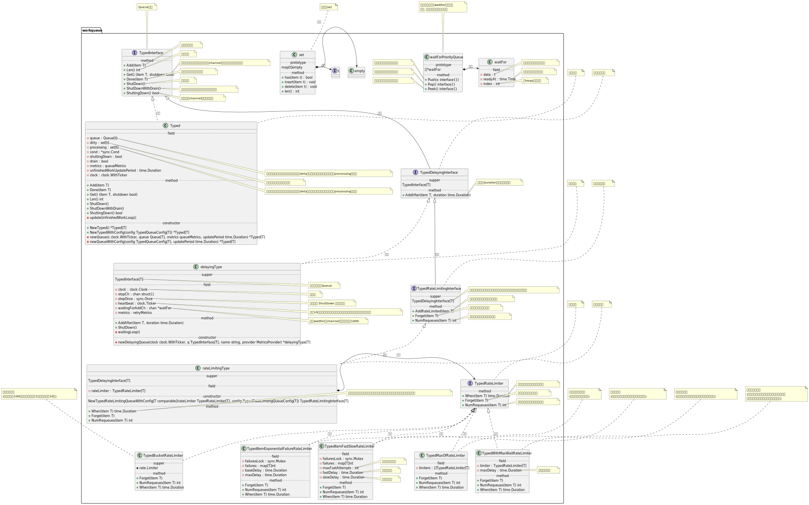
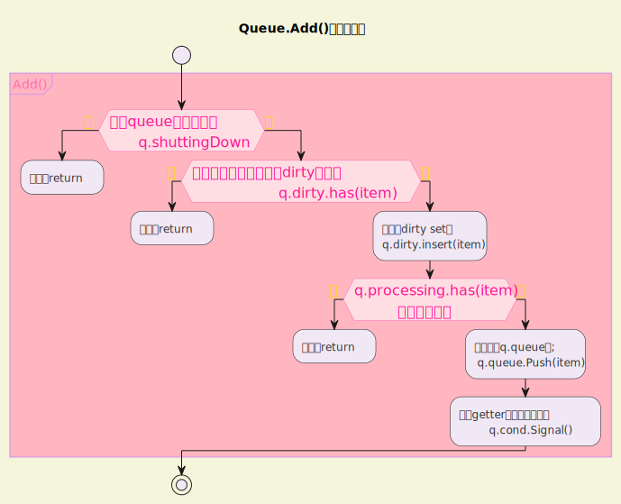

# 一 client-go源码概览

## 1.1 关于client-go源码版本

在Kubernetes本地代码库根目录下执行相应git命令来更新代码

```shell
git fetch upstream
```

然后rebase本地master分支

```shell
git rebase upstream/master
```

这时本地分支状态

```gitignore
commit 71959c526d543a5e4c3ca6fb808f535c2726483f (HEAD -> master, origin/master, origin/HEAD)
Author: Kubernetes Publisher <k8s-publishing-bot@users.noreply.github.com>
Date:   Sat Jul 27 10:50:48 2024 -0700

    Merge pull request #126405 from sttts/sttts-sync-informerfactory-start

    Call non-blocking informerFactory.Start synchronously to avoid races

    Kubernetes-commit: ba6141a1457cf8dad08fb08724b390f9dfd84489
```

## 1.2 client-go模块概览

<u>client-go</u>项目是与<u>kube-apiserver</u>通信的<u>clients</u>的具体实现，其中包含很多相关工具包，例如kubernetes包就包含与Kubernetes API通信的各种ClientSet，而tools/cache包则包含很多强大的编写控制器相关的组件。所以接下来我们会以自定义控制器的底层实现原理为线索，来分析client-go中相关模块的源码实现。

如图所示，我们在编写自定义控制器的过程中大致依赖于如下组件，其中<u>圆形的是自定义控制器中需要编码的部分</u>，<u>其他椭圆和圆角矩形的是client-go提供的一些“工具”​</u>。


- Reflector：Reflector从apiserver监听(watch)特定类型的资源，拿到变更通知后，将其丢到DeltaFIFO队列中。

- Informer：Informer从DeltaFIFO中弹出(pop)相应对象，然后通过Indexer将对象和索引丢到本地cache中，再触发相应的事件处理函数(Resource Event Handlers)

- Indexer：Indexer主要提供一个对象根据一定条件检索的能力，典型的实现是通过namespace/name来构造key，通过Thread Safe Store来存储对象。

- WorkQueue：WorkQueue一般使用的是延时队列实现，在Resource Event Handlers中会完成将对象的key放入WorkQueue的过程，然后在自己的逻辑代码里从WorkQueue中消费这些key。

- ClientSet：ClientSet提供的是资源的CURD能力，与apiserver交互。

- Resource Event Handlers：我们一般在Resource Event Handlers中添加一些简单的过滤功能，判断哪些对象需要加到WorkQueue中进一步处理，对于需要加到WorkQueue中的对象，就提取其key，然后入队。

- Worker：Worker指的是我们自己的业务代码处理过程，在这里可以直接收到WorkQueue中的任务，可以通过Indexer从本地缓存检索对象，通过ClientSet实现对象的增、删、改、查逻辑。

# 二 WorkQueue源码分析

我们前面提到了WorkQueue一般使用延时队列实现，在Resource Event Handlers中会完成将对象的key放入WorkQueue的过程，然后在自己的逻辑代码里从WorkQueue中消费这些key。

client-go的util/workqueue包里主要有三个队列，分别是<u>普通队列</u>、<u>延时队列</u>和<u>限速队列</u>，后一个队列以前一个队列的实现为基础，层层添加新功能，我们按照Queue、DelayingQueue、RateLimitingQueue的顺序层层拨开来看各种队列是如何实现的。在k8s.io/client-go/util/workqueue包下可以看到这样三个Go源文件：

- queue.go

- delaying_queue.go

- rate_limiting_queue.go

为了方便理解我画了一个图：



## 2.1 普通队列Queue的实现

### 2.1.1 表示Queue的接口和相应的实现结构体

定义Queue的接口在queue.go中直接叫作Interface

```go
type TypedInterface[T comparable] interface {
    Add(item T)                   //添加一个元素
    Len() int                     //元素个数
    Get() (item T, shutdown bool) //获取一个元素，第二个返回值和channel类似标记队列是否关闭了
    Done(item T)                  //标记一个元素已经处理完
    ShutDown()                    //关闭队列
    ShutDownWithDrain()           //关闭队列，但是等待队列汇总元素处理完
    ShuttingDown() bool           //标记当前channel是否正在关闭
}
```

从接口定义中，我们可以很清晰地看到Queue提供了哪些能力，接着我们继续看是哪个结构体实现了这个接口。Interface的实现类型是Type，这个名字延续了用Interface表示interface的风格，源码还是在queue.go中:

```go
type Typed[t comparable] struct {
    // queue defines the order in which we will work on items. Every
    // element of queue should be in the dirty set and not in the
    // processing set.
    queue Queue[t] //定义元素的处理顺序，里面所有元素在dirty集合中应该都有，而不能出现在processing集合中

    // dirty defines all of the items that need to be processed.
    dirty set[t] //标记所有需要被处理的元素

    // Things that are currently being processed are in the processing set.
    // These things may be simultaneously in the dirty set. When we finish
    // processing something and remove it from this set, we'll check if
    // it's in the dirty set, and if so, add it to the queue.
    processing set[t] //当前正在被处理的元素，当处理完后，需要检查该元素是否在dirty集合中，如果在，则添加到queue中

    cond *sync.Cond

    shuttingDown bool
    drain        bool

    metrics queueMetrics

    unfinishedWorkUpdatePeriod time.Duration
    clock                      clock.WithTicker
}
```

这个Queue的工作逻辑大致是这样的，里面的三个属性queue、dirty、processing都保存有元素(items)，但是含义有所不同：

- queue：这是一个[ ]t类型，也就是一个切片，因为其有序，所以这里当作一个列表来<mark>存储元素的处理顺序</mark>。

- dirty：属于set类型，dirty就是一个集合，其中存储的是<mark>所有需要处理的元素</mark>，这些元素也会保存在queue中，但是集合中的元素是无序的，且集合的特性是其里面的元素具有唯一性。

- processing：也是一个集合，存放的是<mark>当前正在处理的元素</mark>，也就是说这个元素来自queue出队的元素，同时这个元素会被从dirty中删除。

紧接着大家好奇的问题肯定是这里的set类型是怎么定义的：

```go
type empty struct{}
type t interface{}
type set[t comparable] map[t]empty

func (s set[t]) has(item t) bool {
    _, exists := s[item]
    return exists
}

func (s set[t]) insert(item t) {
    s[item] = empty{}
}

func (s set[t]) delete(item t) {
    delete(s, item)
}

func (s set[t]) len() int {
    return len(s)
}
```

可以看到上述的set其实是一个map（映射）​，利用map key的唯一性来当作set使用，这里的key是t类型，和属性queue的类型[ ]t中的t是同一个类型。set类型实现了has()、insert()、delete()、len()几个方法，用于支持集合类型的基本操作。

### 2.1.2 Queue.Add()方法的实现

Add()方法用于标记一个新的元素需要被处理，代码也在queue.go内

```go
func (q *Typed[T]) Add(item T) {
    q.cond.L.Lock()
    defer q.cond.L.Unlock()
    if q.shuttingDown { // 如果queue正在被关闭，则返回
        return
    }
    if q.dirty.has(item) { //如果该元素已经存在于dirty集合中，则直接返回
        // the same item is added again before it is processed, call the Touch
        // function if the queue cares about it (for e.g, reset its priority)
        if !q.processing.has(item) {
            q.queue.Touch(item)
        }
        return
    }

    q.metrics.add(item)

    q.dirty.insert(item) //添加到dirty set中
    if q.processing.has(item) {
        return
    }

    q.queue.Push(item) //如果没有正在处理，则添加到q.queue中
    q.cond.Signal()    //通知getter有新的元素到来
}
```

我简单画了一下,后面我就省略这句话了：



### 2.1.3 Queue.Get()方法的实现

<mark>Get()方法在获取不到元素的时候会阻塞，直到有一个元素可以被返回</mark>。这个方法同样在queue.go文件中实现:

```go
// Get blocks until it can return an item to be processed. If shutdown = true,
// the caller should end their goroutine. You must call Done with item when you
// have finished processing it.
func (q *Typed[T]) Get() (item T, shutdown bool) {
    q.cond.L.Lock()
    defer q.cond.L.Unlock()
    //如果q.queue为空，并且没有正在关闭，则等待下一个元素的到来
    for q.queue.Len() == 0 && !q.shuttingDown {
        q.cond.Wait()
    }
    //这时如果q.queue长度还是0，则说明q.shuttingDown为true，所以直接返回
    if q.queue.Len() == 0 {
        // We must be shutting down.
        return *new(T), true
    }

    item = q.queue.Pop() //获取q.queue中的第一个元素

    q.metrics.get(item)

    //刚才获取到的q.queue第一个元素放到processing集合中
    q.processing.insert(item)
    //在dirty集合中删除该元素
    q.dirty.delete(item)

    return item, false //返回元素
}

func (q *queue[T]) Pop() (item T) {
    item = (*q)[0] //获取q.queue第一个元素

    // The underlying array still exists and reference this object, so the object will not be garbage collected.
    //这里的nil复制是为了让底层数组不再
    //引用元素对象，从而能够实现垃圾回收
    (*q)[0] = *new(T)
    //更新q.queue
    *q = (*q)[1:]

    return item
}
```


### 2.1.4 Queue.Done()方法的实现

Done()方法的作用是标记一个元素已经处理完成，代码还是在queue.go中:

```go
// Done marks item as done processing, and if it has been marked as dirty again
// while it was being processed, it will be re-added to the queue for
// re-processing.
func (q *Typed[T]) Done(item T) {
    q.cond.L.Lock()
    defer q.cond.L.Unlock()

    q.metrics.done(item)

    //在processing集合中删除该元素
    q.processing.delete(item)
    //如果dirty中还有，则说明还需要再次处理，放到q.queue中
    if q.dirty.has(item) {
        q.queue.Push(item)
        q.cond.Signal()//通知getter有新的元素
    } else if q.processing.len() == 0 {
        q.cond.Signal()
    }
}
```


## 2.2 延时队列DelayingQueue的实现

### 2.2.1 表示DelayingQueue的接口和相应的实现结构体

定义DelayingQueue的接口在delaying_queue.go源文件中，名字和Queue所使用的Interface很对称，叫作DelayingInterfac:

```go
// TypedDelayingInterface is an Interface that can Add an item at a later time. This makes it easier to
// requeue items after failures without ending up in a hot-loop.
type TypedDelayingInterface[T comparable] interface {
    TypedInterface[T]
    // AddAfter adds an item to the workqueue after the indicated duration has passed
    AddAfter(item T, duration time.Duration)
}
```

可以看到DelayingInterface接口中嵌套了一个表示Queue的Interface，也就是说DelayingInterface接口包含Interface接口的所有方法声明。另外相比于Queue，这里只是多了一个AddAfter()方法，顾名思义，也就是延时添加元素的意思。

我们继续看对应实现这个接口的结构体:

```go
// delayingType wraps an Interface and provides delayed re-enquing
type delayingType[T comparable] struct {
    TypedInterface[T] //嵌套普通队列Queue

    // clock tracks time for delayed firing
    clock clock.Clock //计时器

    // stopCh lets us signal a shutdown to the waiting loop
    stopCh chan struct{}
    // stopOnce guarantees we only signal shutdown a single time
    stopOnce sync.Once //用来确保 ShutDown 只执行一次

    // heartbeat ensures we wait no more than maxWait before firing
    //默认10秒心跳，后面用在一个大循环里，避免没有新元素时一直阻塞
    heartbeat clock.Ticker

    // waitingForAddCh is a buffered channel that feeds waitingForAdd
    //传递waitFor的channel，默认大小为1000
    waitingForAddCh chan *waitFor

    // metrics counts the number of retries
    metrics retryMetrics
}
```

对于延时队列，我们关注的入口方法肯定就是新增的AddAfter()，在查看这个方法的具体逻辑前，先了解上面delayingType中涉及的waitFor类型。

### 2.2.4 waitFor对象

waitFor的实现也在delaying_queue.go中，其结构体定义如下：

```go
// waitFor holds the data to add and the time it should be added
type waitFor struct {
    data    t         //准备添加到队列中的数据
    readyAt time.Time //应该被加入队列的时间
    // index in the priority queue (heap)
    index int //在heap中的索引
}
```

在waitFor结构体下面有这样一行代码：

```go
// waitForPriorityQueue implements a priority queue for waitFor items.
//
// waitForPriorityQueue implements heap.Interface. The item occurring next in
// time (i.e., the item with the smallest readyAt) is at the root (index 0).
// Peek returns this minimum item at index 0. Pop returns the minimum item after
// it has been removed from the queue and placed at index Len()-1 by
// container/heap. Push adds an item at index Len(), and container/heap
// percolates it into the correct location.
type waitForPriorityQueue []*waitFor
```

这里定义了一个<mark>waitFor的优先级队列</mark>，用<mark>最小堆</mark>的方式来实现，这个类型实现了heap.Interface接口。我们具体看一下源码：

这里定义了一个waitFor的优先级队列，用最小堆的方式来实现，这个类型实现了heap.Interface接口。我们具体看一下源码：

```go
func (pq waitForPriorityQueue) Len() int {
    return len(pq)
}
func (pq waitForPriorityQueue) Less(i, j int) bool {
    return pq[i].readyAt.Before(pq[j].readyAt)
}
func (pq waitForPriorityQueue) Swap(i, j int) {
    pq[i], pq[j] = pq[j], pq[i]
    pq[i].index = i
    pq[j].index = j
}

// Push adds an item to the queue. Push should not be called directly; instead,
// use `heap.Push`.
// 添加一个元素到队列中
func (pq *waitForPriorityQueue) Push(x interface{}) {
    n := len(*pq)
    item := x.(*waitFor)
    item.index = n
    *pq = append(*pq, item)
}

// Pop removes an item from the queue. Pop should not be called directly;
// instead, use `heap.Pop`.
// 从队列中尾巴移除一个元素
func (pq *waitForPriorityQueue) Pop() interface{} {
    n := len(*pq)
    item := (*pq)[n-1]
    item.index = -1
    *pq = (*pq)[0:(n - 1)]
    return item
}

// Peek returns the item at the beginning of the queue, without removing the
// item or otherwise mutating the queue. It is safe to call directly.
// 获取队列第一个元素
func (pq waitForPriorityQueue) Peek() interface{} {
    return pq[0]
}
```

### 2.2.3 NewDelayingQueue

在分析AddAfter()方法的实现之前，我们先了解DelayingQueue的几个New函数：

```go
// NewTypedDelayingQueueWithConfig constructs a new workqueue with options to
// customize different properties.
func NewTypedDelayingQueueWithConfig[T comparable](config TypedDelayingQueueConfig[T]) TypedDelayingInterface[T] {
    if config.Clock == nil {
        config.Clock = clock.RealClock{}
    }

    if config.Queue == nil {
        config.Queue = NewTypedWithConfig[T](TypedQueueConfig[T]{
            Name:            config.Name,
            MetricsProvider: config.MetricsProvider,
            Clock:           config.Clock,
        })
    }

    return newDelayingQueue(config.Clock, config.Queue, config.Name, config.MetricsProvider)
}


func newDelayingQueue[T comparable](clock clock.WithTicker, q TypedInterface[T], name string, provider MetricsProvider) *delayingType[T] {
    ret := &delayingType[T]{
        TypedInterface:  q,
        clock:           clock,
        heartbeat:       clock.NewTicker(maxWait), //10秒一次心跳
        stopCh:          make(chan struct{}),
        waitingForAddCh: make(chan *waitFor, 1000),
        metrics:         newRetryMetrics(name, provider),
    }

    go ret.waitingLoop() //留意这里的函数调用,后面还会分析到
    return ret
}
```

### 2.2.4 waitingLoop()方法

waitingLoop()方法是延时队列实现的核心逻辑所在。

```go
// waitingLoop runs until the workqueue is shutdown and keeps a check on the list of items to be added.
func (q *delayingType[T]) waitingLoop() {
    defer utilruntime.HandleCrash()

    // Make a placeholder channel to use when there are no items in our list
    //队列里没有元素时等待
    never := make(<-chan time.Time)

    // Make a timer that expires when the item at the head of the waiting queue is ready
    var nextReadyAtTimer clock.Timer

    //构造一个优先级队列
    waitingForQueue := &waitForPriorityQueue{}
    //这一行其实功能上没有什么作用，不过在可读性上有点帮助
    heap.Init(waitingForQueue)

    //这个map用来处理重复添加逻辑，下面会讲到
    waitingEntryByData := map[t]*waitFor{}

    //无限循环
    for {
        //这个地方Interface从语法上来看可有可无，不过放在这里能够强调
        //调用了内部Queue的shuttingDown()方法
        if q.TypedInterface.ShuttingDown() {
            return
        }

        now := q.clock.Now()

        // Add ready entries
        //队列里有有元素就开始循环
        for waitingForQueue.Len() > 0 {
            //获取第一个元素
            entry := waitingForQueue.Peek().(*waitFor)
            //时间还没到，先不作处理
            if entry.readyAt.After(now) {
                break
            }

            //时间到了，pop出第一个元素。注意waitingForQueue.Pop（）是最后一个元素,
            //heap.Pop()是第一个元素
            entry = heap.Pop(waitingForQueue).(*waitFor)
            //将数据加到延时队列
            q.Add(entry.data.(T))
            //在map中删除已经加到延时队列的元素
            delete(waitingEntryByData, entry.data)
        }

        // Set up a wait for the first item's readyAt (if one exists)
        //如果队列中有元素，就用第一个元素的等待时间初始化计时器，如果为空则一直等待
        nextReadyAt := never
        if waitingForQueue.Len() > 0 {
            if nextReadyAtTimer != nil {
                nextReadyAtTimer.Stop()
            }
            entry := waitingForQueue.Peek().(*waitFor)
            nextReadyAtTimer = q.clock.NewTimer(entry.readyAt.Sub(now))
            nextReadyAt = nextReadyAtTimer.C()
        }

        select {
        case <-q.stopCh:
            return

        case <-q.heartbeat.C(): //心跳时间是10秒。到了就继续下一轮循环
            // continue the loop, which will add ready items

        case <-nextReadyAt: //第一个元素的等待时间到了，继续下一轮循环
            // continue the loop, which will add ready items

        case waitEntry := <-q.waitingForAddCh: //waitingForAddCh受到了新的元素
            //如果时间每到，就加到优先级队列里；
            if waitEntry.readyAt.After(q.clock.Now()) {
                insert(waitingForQueue, waitingEntryByData, waitEntry)
            } else { //如果时间到了就加到延时队列
                q.Add(waitEntry.data.(T))
            }

            //下面的逻辑就是将waitingForAddCh中的数据处理完
            drained := false
            for !drained {
                select {
                case waitEntry := <-q.waitingForAddCh:
                    if waitEntry.readyAt.After(q.clock.Now()) {
                        insert(waitingForQueue, waitingEntryByData, waitEntry)
                    } else {
                        q.Add(waitEntry.data.(T))
                    }
                default:
                    drained = true
                }
            }
        }
    }
}
```


这个方法还有一个insert()函数调用，我们再来研究插入函数的逻辑：

```go
// insert adds the entry to the priority queue, or updates the readyAt if it already exists in the queue
func insert(q *waitForPriorityQueue, knownEntries map[t]*waitFor, entry *waitFor) {
    // if the entry already exists, update the time only if it would cause the item to be queued sooner
    //这里的主要逻辑是看一个entry（表项）是否存在，如果已经存在，则新的entry的就绪时间更短，就更新时间
    existing, exists := knownEntries[entry.data]
    if exists {
        if existing.readyAt.After(entry.readyAt) {
            existing.readyAt = entry.readyAt //如果存在就只更新时间
            heap.Fix(q, existing.index)
        }

        return
    }

    //如果不存在就丢到q里，同时在map中记录以下，用于查重
    heap.Push(q, entry)
    knownEntries[entry.data] = entry
}
```


### 2.2.5 AddAfter()方法

AddAfter()方法的作用是在指定的延时时长到达之后，在work queue中添加一个元素。有了前面的铺垫后，这个方法的实现就很简单了，源码依旧在delaying_queue.go文件中：

```go
// AddAfter adds the given item to the work queue after the given delay
func (q *delayingType[T]) AddAfter(item T, duration time.Duration) {
    // don't add if we're already shutting down
    // 已经在关闭中就直接返回
    if q.ShuttingDown() {
        return
    }

    q.metrics.retry()

    // immediately add things with no delay
    //如果时间到了，就直接添加
    if duration <= 0 {
        q.Add(item)
        return
    }

    select {
    case <-q.stopCh:
        // unblock if ShutDown() is called
        //构造一个waitFor{}，丢到waitingForAddCh
    case q.waitingForAddCh <- &waitFor{data: item, readyAt: q.clock.Now().Add(duration)}:
    }
}
```


## 2.3 限速队列RateLimitingQueue的实现

### 2.3.1 表示RateLimitingQueue的接口和相应的实现结构体

不难猜到RateLimitingQueue对应的接口肯定叫作RateLimitingInterface，源码当然是在rate_limiting_queue.go中

```go
// TypedRateLimitingInterface is an interface that rate limits items being added to the queue.
type TypedRateLimitingInterface[T comparable] interface {
    TypedDelayingInterface[T] //和延时队列里内嵌了普通对立一样，限速队列汇总内嵌了延时队列

    // AddRateLimited adds an item to the workqueue after the rate limiter says it's ok
    AddRateLimited(item T) //限速方式往队列中加入一个元素

    // Forget indicates that an item is finished being retried.  Doesn't matter whether it's for perm failing
    // or for success, we'll stop the rate limiter from tracking it.  This only clears the `rateLimiter`, you
    // still have to call `Done` on the queue.
    Forget(item T) //标识一个元素结束重试

    // NumRequeues returns back how many times the item was requeued
    NumRequeues(item T) int //标识这个元素被处理多少次了
}
```

实现RateLimitingInterface的结构体是rateLimitingType：

```go
// rateLimitingType wraps an Interface and provides rateLimited re-enquing
type rateLimitingType[T comparable] struct {
    TypedDelayingInterface[T]

    rateLimiter TypedRateLimiter[T]
}
```

这里出现了一个叫作RateLimiter的限速器，在看这个限速器之前，我们先分析这里的几个New函数。

### 2.3.2 RateLimitingQueue的New函数

```go
// NewTypedRateLimitingQueueWithConfig constructs a new workqueue with rateLimited queuing ability
// with options to customize different properties.
// Remember to call Forget!  If you don't, you may end up tracking failures forever.
func NewTypedRateLimitingQueueWithConfig[T comparable](rateLimiter TypedRateLimiter[T], config TypedRateLimitingQueueConfig[T]) TypedRateLimitingInterface[T] {
    if config.Clock == nil {
        config.Clock = clock.RealClock{}
    }

    if config.DelayingQueue == nil {
        config.DelayingQueue = NewTypedDelayingQueueWithConfig(TypedDelayingQueueConfig[T]{
            Name:            config.Name,
            MetricsProvider: config.MetricsProvider,
            Clock:           config.Clock,
        })
    }

    return &rateLimitingType[T]{
        TypedDelayingInterface: config.DelayingQueue,
        rateLimiter:            rateLimiter,
    }
}
```

### 2.3.3 RateLimiter

RateLimiter表示一个限速器，我们看一下限速器是什么意思。RateLimiter定义在同一个包的default_rate_limiters.go源文件中，接口代码如下：

```go
type TypedRateLimiter[T comparable] interface {
    // When gets an item and gets to decide how long that item should wait
    When(item T) time.Duration //返回一个元素需要等待的时长
    // Forget indicates that an item is finished being retried.  Doesn't matter whether it's for failing
    // or for success, we'll stop tracking it
    Forget(item T) //标识一个元素结束重试
    // NumRequeues returns back how many failures the item has had
    NumRequeues(item T) int //标识这个元素被处理多少次了
}
```

这个接口有5个实现，分别是：

- TypedBucketRateLimiter

- TypedItemExponentialFailureRateLimiter

- TypedItemFastSlowRateLimiter

- TypedMaxOfRateLimiter

- TypedWithMaxWaitRateLimiter

#### 2.3.3.1 TypedBucketRateLimiter

TypedBucketRateLimiter用了Go语言标准库的golang.org/x/time/rate.Limiter包实现。TypedBucketRateLimiter实例化的时候，比如传递一个rate.NewLimiter(rate.Limit(10),100)进去，表示令牌桶里最多有100个令牌，每秒发放10个令牌。（学过限流的应该知道令牌桶思）

```go
// TypedBucketRateLimiter adapts a standard bucket to the workqueue ratelimiter API
type TypedBucketRateLimiter[T comparable] struct {
    *rate.Limiter
}

var _ RateLimiter = &BucketRateLimiter{}

func (r *TypedBucketRateLimiter[T]) When(item T) time.Duration {
    //过多久后给当前元素发放一个令牌
    return r.Limiter.Reserve().Delay()
}

func (r *TypedBucketRateLimiter[T]) NumRequeues(item T) int {
    return 0
}

func (r *TypedBucketRateLimiter[T]) Forget(item T) {
}
```

#### 2.3.3.2 TypedItemExponentialFailureRateLimiter

TypedItemExponentialFailureRateLimiter这个限速器从名字上大概就能猜到是失败次数越多，限速越长，而且是呈指数级增长的一种限速器。TypedItemExponentialFailureRateLimiter的属性很简单，基本可以望文生义：

```go
// TypedItemExponentialFailureRateLimiter does a simple baseDelay*2^<num-failures> limit
// dealing with max failures and expiration are up to the caller
type TypedItemExponentialFailureRateLimiter[T comparable] struct {
    failuresLock sync.Mutex
    failures     map[T]int

    baseDelay time.Duration
    maxDelay  time.Duration
}
```

核心逻辑是When()方法实现的：

```go
func (r *TypedItemExponentialFailureRateLimiter[T]) When(item T) time.Duration {
    r.failuresLock.Lock()
    defer r.failuresLock.Unlock()

    exp := r.failures[item]
    r.failures[item] = r.failures[item] + 1 //失败次数加1

    // The backoff is capped such that 'calculated' value never overflows.
    //每调用一次，exp也就加1，对应到这里时2^n指数爆炸
    backoff := float64(r.baseDelay.Nanoseconds()) * math.Pow(2, float64(exp))
    //如果超过了最大整型，就返回最大延时，不然后面的时间转换就会溢出
    if backoff > math.MaxInt64 {
        //如果超过了最大延时，就范会最大延时
        return r.maxDelay
    }

    calculated := time.Duration(backoff)
    if calculated > r.maxDelay {
        return r.maxDelay
    }

    return calculated
}
```


#### 2.3.3.3 TypedItemFastSlowRateLimiter

ItemFastSlowRateLimiter顾名思义也就是“<mark>快慢限速器</mark>”的意思，快慢指的是定义一个阈值，达到阈值之前快速重试，超过了就慢慢重试。这个结构体也不复杂：

```go
type TypedItemFastSlowRateLimiter[T comparable] struct {
    failuresLock sync.Mutex
    failures     map[T]int

    maxFastAttempts int//快速重试的次数
    fastDelay       time.Duration//快重试间隔
    slowDelay       time.Duration//慢重试间隔
}
```

它的When()方法是这样实现的：

```go
func (r *TypedItemFastSlowRateLimiter[T]) When(item T) time.Duration {
    r.failuresLock.Lock()
    defer r.failuresLock.Unlock()

    r.failures[item] = r.failures[item] + 1 //标识重试次数 + 1

    //如果快重试次数没有用完，则返回fastDelay
    if r.failures[item] <= r.maxFastAttempts {
        return r.fastDelay
    }

    //反之返回slowDelay
    return r.slowDelay
}
```


#### 2.3.3.4  TypedMaxOfRateLimiter

TypedMaxOfRateLimiter是通过维护多个限速器列表，然后返回其中限速最严格的一个延时：

```go
// TypedMaxOfRateLimiter calls every RateLimiter and returns the worst case response
// When used with a token bucket limiter, the burst could be apparently exceeded in cases where particular items
// were separately delayed a longer time.
type TypedMaxOfRateLimiter[T comparable] struct {
    limiters []TypedRateLimiter[T]
}

func (r *TypedMaxOfRateLimiter[T]) When(item T) time.Duration {
    ret := time.Duration(0)
    for _, limiter := range r.limiters {
        curr := limiter.When(item)
        if curr > ret {
            ret = curr
        }
    }

    return ret
}
```


#### 2.3.3.5 TypedWithMaxWaitRateLimiter

TypedWithMaxWaitRateLimiter就是在其他限速器上包装一个最大延迟的属性，如果到了最大延时，则直接返回：

```go
// TypedWithMaxWaitRateLimiter have maxDelay which avoids waiting too long
type TypedWithMaxWaitRateLimiter[T comparable] struct {
    limiter  TypedRateLimiter[T]
    maxDelay time.Duration
}
```

When()方法：

```go
func (w TypedWithMaxWaitRateLimiter[T]) When(item T) time.Duration {
    delay := w.limiter.When(item)
    if delay > w.maxDelay {
        return w.maxDelay
    }

    return delay
}
```


### 2.3.4 RateLimitingQueue的限速实现

```go
// AddRateLimited AddAfter's the item based on the time when the rate limiter says it's ok
func (q *rateLimitingType[T]) AddRateLimited(item T) {
    // 内部存了一个延时队列，通过限速器计算出一个等待时间，然后传给延时队列
    q.TypedDelayingInterface.AddAfter(item, q.rateLimiter.When(item))
}

func (q *rateLimitingType[T]) NumRequeues(item T) int {
    return q.rateLimiter.NumRequeues(item)
}

func (q *rateLimitingType[T]) Forget(item T) {
    q.rateLimiter.Forget(item)
}
```

## 2.4小结

我们在开发自定义控制器的时候，用到的WorkQueue就是使用这里的延时队列实现的，在Resource Event Handlers中会完成将对象的key（键）放入WorkQueue的过程，然后我们在自己的逻辑代码里从WorkQueue中消费这些key。一个延时队列也就是实现了item（元素）的延时入队效果，内部是一个“优先级队列”​，用了“最小堆”​（有序完全二叉树）​，所以“在requeueAfter中指定一个调谐过程1分钟后重试”的实现原理也就清晰了。
