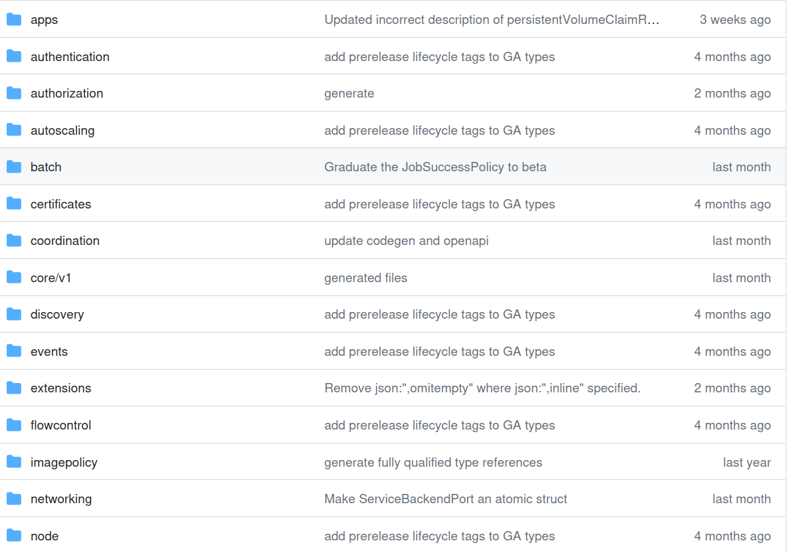
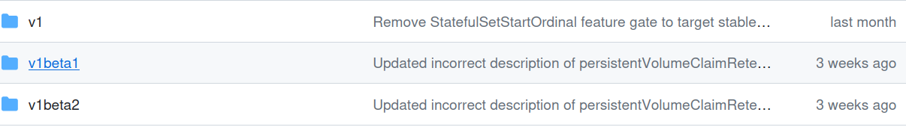

我们在开发Operator项目时，除了用到client-go外，还会依赖很多k8s.io下的项目。本章将说明几个主要依赖项目分别都用于解决什么问题。

## 一 API项目

API项目的GitHub地址是[GitHub - kubernetes/api: The canonical location of the Kubernetes API definition.](https://github.com/kubernetes/api)。从项目名称上我们大概就可以猜到这个项目中存放的是Kubernetes的API定义。

API的定义单独放到一个项目中是为了解决<mark>循环依赖</mark>问题。需要使用到API定义的项目主要是k8s.io/client-go、k8s.io/apimachinery和k8s.io/apiserver，当然我们自己开发的Operator项目中也不可避免地需要引用一些API对象。

从API项目的目录结构可以很容易找到熟悉的内容：

这里只列出了一部分目录，可以看到这些都是API Group的名字。我们以apps为线索继续查看其中的内容：

没错，Group里面不出所料是按照Version来划分的目录。那么v1目录中应该就是apps/v1对应的所有Kind的定义了。这里有很多我们平时经常见的类型定义，比如StatefulSet、Deployment、DaemonSet、ReplicaSet等。所以以后我们在Operator开发的过程中想要操作某个API，但是又不清楚这个API资源定义去哪里引用，记住到k8s.io/api项目中查看。

另外，k8s.io/api项目和k8s.io/client-go同样是从k8s.io/kubernetes项目的staging下同步过来的，也就是说给k8s.io/api项目贡献代码同样需要提交到Kubernetes主库。

# 二 apimachinery项目

apimachinery项目的GitHub地址是[GitHub - kubernetes/apimachinery](https://github.com/kubernetes/apimachinery)。machinery是“机械、组织、体制、系统”的意思，从项目名称上大致可以猜到这个项目实现的是各种和API相关操作的封装。

apimachinery项目的作用是为了解耦用到Kubernetes API的服务端和客户端，实现了很多公共类型依赖，主要包含<mark>Scheme、类型转换、编码解码</mark>等逻辑。依赖apimachinery的项目主要是k8s.io/kubernetes、k8s.io/client-go和k8s.io/apiserver等，当然同样我们自己开发的Operator项目中也不可避免地需要用到这个项目的一些代码。

k8s.io/apimachinery项目同样也是从k8s.io/kubernetes项目的staging下同步过来的，给k8s.io/apimachinery项目贡献代码同样需要提交到Kubernetes主库。

# 三 controller-runtime项目

controller-runtime包对应的项目地址在https://github.com/kubernetes-sigs/controller-runtime。与前面介绍的k8s.io/api和k8s.io/apimachinery等项目不同，controller-runtime是kubernetes-sigs组织下的一个独立项目，而不是一个Kubernetes项目的staging项目。这个项目主要包含用于构建Kubernetes风格控制器的Go语言包集合，主要在Kubebuilder和Operator SDK中被使用。简单地说，controller-runtime是用来引导用户编写最佳实践的Kubernetes Controllers的。

我们在使用Kubebuilder的时候，其实已经有意无意地在使用controller-runtime了，只是Kubebuilder自动生成了很多代码，所以我们不太能感知到其实用的很多能力都是controller-runtime提供的。

## 3.1 Managers

所有的Controller和Webhook最终都是由Managers来运行的，Managers<mark>负责Controllers和Webhooks的运行、公共依赖项的设置(pkg/runtime/inject)</mark>，比如shared caches和clients、管理leader选举(pkg/leaderelection)等。另外，Managers还通过signal handler实现了Pod运行终止时的优雅退出功能(pkg/manager/signals)。

## 3.2 Controllers

Controllers(pkg/controller)使用<mark>events(pkg/event)来触发调谐请求</mark>，可以手动创建Controllers，但是一般都是通过Builder(pkg/builder)来创建的，这样可以简化event源码(pkg/handler)，比如Kubernetes资源对象的变更消息，到event处理器之间的关联逻辑编码，或者将一个调谐请求加入所属的队列。Predicates(pkg/predicate)可以被用来过滤哪些event最后会触发调谐过程，其中有一些预置公用代码逻辑用于实现一些进阶场景。

## 3.3 Reconcilers

Controllers的逻辑是在Reconcilers中实现的，Reconciler函数的核心逻辑是拿到一个包含name和namespace的对象的调谐请求，然后调谐这个对象，最终返回一个响应或者一个表明是否需要二次调谐的错误。

## 3.4 Clients and Caches

Reconcilers<mark>使用Clients(pkg/client)来访问API对象，Managers提供的默认Client从本地共享缓存(pkg/cache)中读取数据</mark>，直接写到API Server，但是Clients也可以配置成不经过缓存直接和API Server交互。当其他结构化的数据被请求时，缓存中会自动更新监听到的对象。默认单独的Client并不保证缓存的写安全，也不保证创建、查询的一致性。代码不应该假设创建、更新成功的资源能够马上得到更新后的资源。Caches也许有对应的Indexes，它可以通过FieldIndexer(pkg/client)从Managers中获取。Indexes可以被用来快速且简单地通过特定字段检索所有的对象。

## 3.5 Schemes

Schemes(pkg/scheme)用来关联Go类型和对应的Kubernetes API类型(Group-Version-Kinds)的。

## 3.6 Webhooks

Webhooks(pkg/webhook/admission)也许会被直接实现，但是一般还是使用builder(pkg/webhook/admission/builder)来创建。它们通过被Managers管理的server(pkg/webhook)来运行。

## 3.7 Logging and Metrics

Logging(pkg/log)是通过[logr](https://pkg.go.dev/github.com/go-logr/logr?utm_source=godoc)日志接口实现的结构化数据，使用Zap[zap](https://pkg.go.dev/go.uber.org/zap),[log/zap](https://pkg.go.dev/sigs.k8s.io/controller-runtime/pkg/log/zap)

提供了简单的日志配置。也可以使用其他基于logr实现的日志工具作为controller-runtime的日志实现。Metrics(pkg/metrics)注册到了controller-runtime-specific Prometheus metrics registry中，Manager可以通过HTTP Endpoint来提供Metrics服务。

## 3.8 Testing

通过test环境(pkg/envtest)可以简单地给Controllers与Webhooks构建单元测试和集成测试。envtest会自动复制一份ETCD和kube-apiserver到合适的地方，然后提供一个正确的方式来自动连接到API Server。envtest通过一些设计也可以和Ginkgo测试框架一起工作。

# 四 本章小结

本章主要介绍了Operator开发过程中经常会遇到的k8s.io下的依赖项目，希望通过本章的学习能够让读者更熟悉Operator项目的依赖关系，知道自己平时经常使用的一些“工具”是从哪个项目来的，进而遇到问题的时候可以到正确的地方寻找答案。
