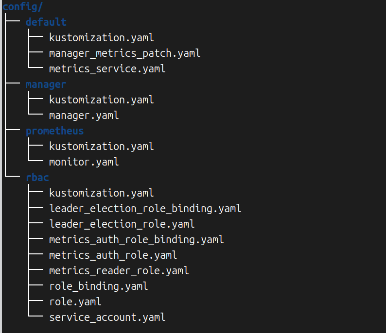
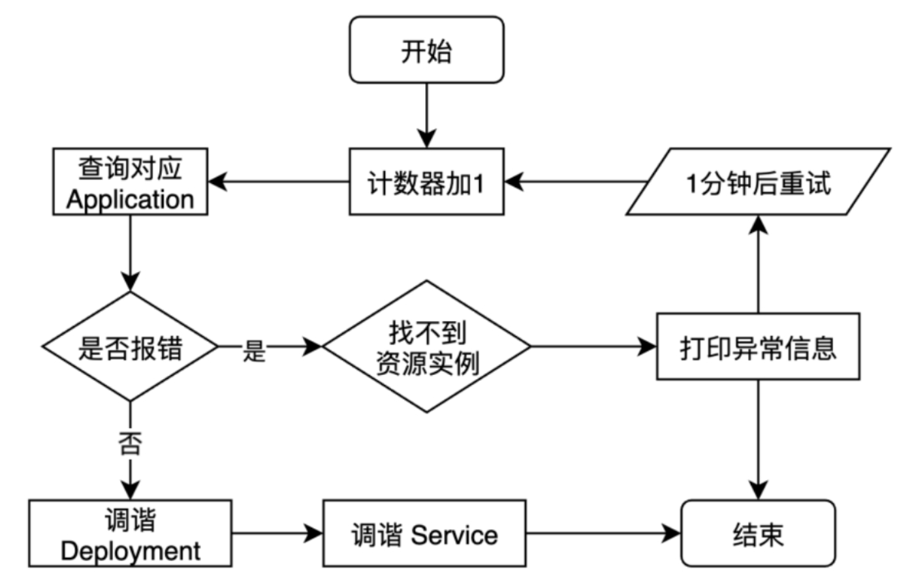
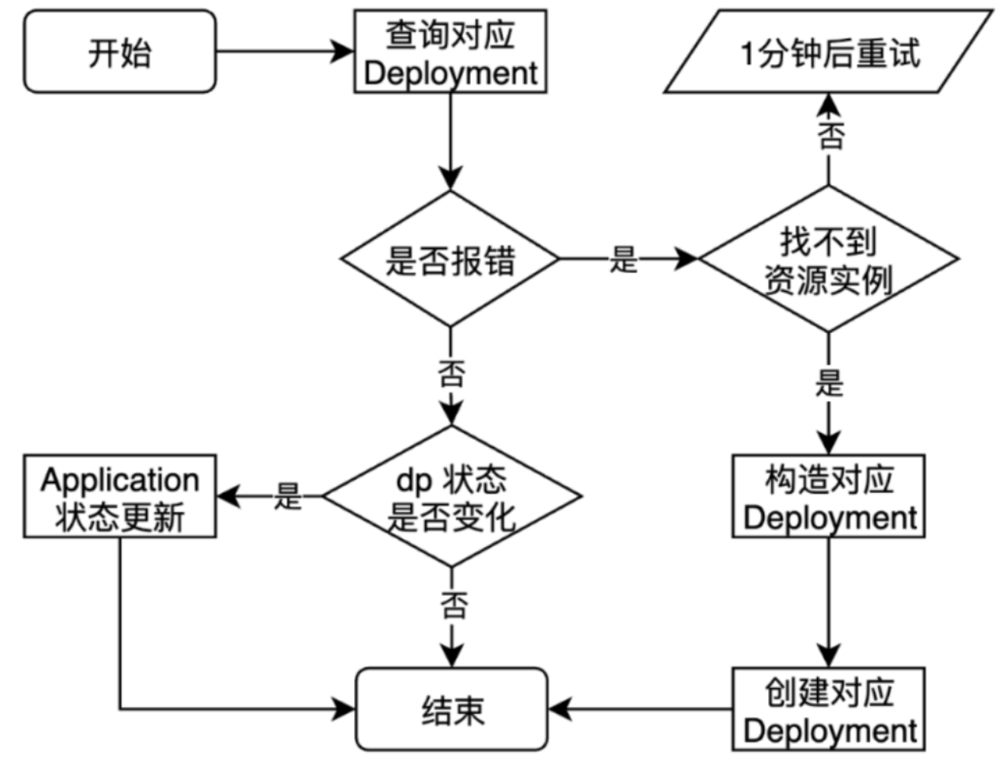
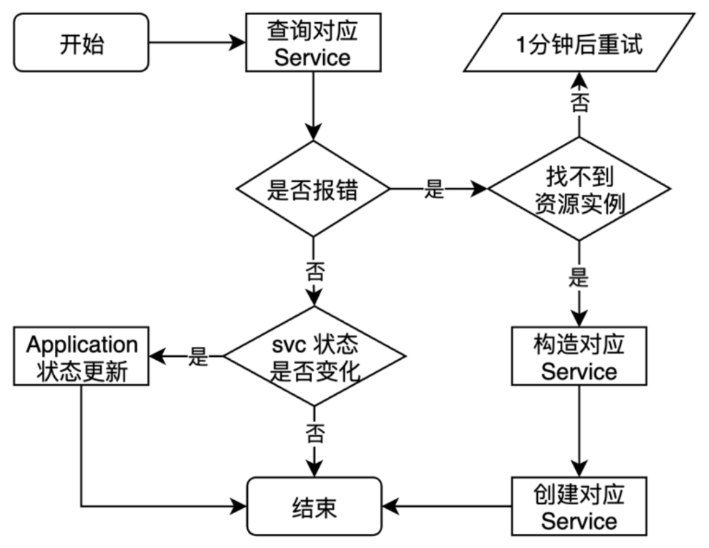

本章将详细介绍Operator开发的各种进阶技巧，希望通过本章的学习大家能够对Operator的能力有一个深入的理解，进而在以后的开发实践中能够更加清楚地知道什么样的功能需求适合Operator来做，什么样的功能需求不适合Operator来做。

# 一 进阶项目设计

一般我们需要将一个应用部署到Kubernetes中时，都会选择用Deployment来管理应用，用Service来做服务发现，进一步可能还需要配置ConfigMap、Ingress、Secret等资源。这么多类型资源的创建、维护、管理工作会变得烦琐且复杂。

我们可以通过Operator在一个应用部署所需的各种资源之上抽象一个Application类型，这个类型里包含必要的一些字段，然后用户只需要创建一个Application，我们通过<mark>自定义控制器去完成Application相关的Deployment、Service、ConfigMap等资源的创建和管理工作</mark>。

当然，本书主要是为了介绍Operator开发技术，所以这个项目也不真的去实现一个特别完善的Application Operator，而是通过管理Deployment和Service两种资源来演示如何开发Operator。剩下的ConfigMap、Secret等资源如果大家感兴趣，可以自己补充进去。

# 二 准备application-operator项目

## 2.1 创建新项目

创建我们的学习项目application-operator

```shell
cd MyOperatorProjects
mkdir application-operator
cd application-operator
kubebuilder init --domain hyj.cn \
--repo=github.com/asjfoajs/MyOperatorProjects/application-operator \
--owner asjfoajs
```

这时Kubebuilder就准备好了一个Operator项目骨架，项目名默认是用的当前目录名，也就是application-operator这个目录名。项目名也可以通过--project-name参数来自定义，但是一般没有这个需求，因为很少会有目录名和项目名保持不一致的场景。这里需要知道的是项目名体现在哪些地方，假如中途想修改项目名，直接找到这些配置项，手动调整即可：

1. PROJECT文件中的projectName配置。

2. config/default/kustomization.yaml文件中的namespace配置。

3. config/default/kustomization.yaml文件中的namePrefix配置。

## 2.2 项目基础结构分析

这时Kubebuilder为我们创建了很多文件，接下来详细看一下都有哪些。

### 2.2.1 go.mod

该文件包含项目的基础依赖：

```go
go 1.22.0

require (
    github.com/onsi/ginkgo/v2 v2.17.1
    github.com/onsi/gomega v1.32.0
    k8s.io/apimachinery v0.30.1
    k8s.io/client-go v0.30.1
    sigs.k8s.io/controller-runtime v0.18.4
)
```

### 2.2.2 Makefile

该文件中存放的是和开发过程中<mark>构建、部署、测试</mark>等相关的一系列命令，下面略去了很多不太需要关注的部分：

```shell
# Image URL to use all building/pushing image targets
IMG ?= controller:latest
# ENVTEST_K8S_VERSION refers to the versi
n of kubebuilder assets to be downloaded by envtest binary.
ENVTEST_K8S_VERSION = 1.30.0

#...
manifests: controller-gen ## Generate WebhookConfiguration, ClusterRole and CustomResourceDefinition objects.
    $(CONTROLLER_GEN) rbac:roleName=manager-role crd webhook paths="./..." output:crd:artifacts:config=config/crd/bases

.PHONY: generate
generate: controller-gen ## Generate code containing DeepCopy, DeepCopyInto, and DeepCopyObject method implementations.
    $(CONTROLLER_GEN) object:headerFile="hack/boilerplate.go.txt" paths="./..."
#...

##@ Build

.PHONY: build
build: manifests generate fmt vet ## Build manager binary.
    go build -o bin/manager cmd/main.go

.PHONY: run
run: manifests generate fmt vet ## Run a controller from your host.
    go run ./cmd/main.go

# If you wish to build the manager image targeting other platforms you can use the --platform flag.
# (i.e. docker build --platform linux/arm64). However, you must enable docker buildKit for it.
# More info: https://docs.docker.com/develop/develop-images/build_enhancements/
.PHONY: docker-build
docker-build: ## Build docker image with the manager.
    $(CONTAINER_TOOL) build -t ${IMG} .

.PHONY: docker-push
docker-push: ## Push docker image with the manager.
    $(CONTAINER_TOOL) push ${IMG}

#...
.PHONY: install
install: manifests kustomize ## Install CRDs into the K8s cluster specified in ~/.kube/config.
    $(KUSTOMIZE) build config/crd | $(KUBECTL) apply -f -

.PHONY: uninstall
uninstall: manifests kustomize ## Uninstall CRDs from the K8s cluster specified in ~/.kube/config. Call with ignore-not-found=true to ignore resource not found errors during deletion.
    $(KUSTOMIZE) build config/crd | $(KUBECTL) delete --ignore-not-found=$(ignore-not-found) -f -

.PHONY: deploy
deploy: manifests kustomize ## Deploy controller to the K8s cluster specified in ~/.kube/config.
    cd config/manager && $(KUSTOMIZE) edit set image controller=${IMG}
    $(KUSTOMIZE) build config/default | $(KUBECTL) apply -f -

.PHONY: undeploy
undeploy: kustomize ## Undeploy controller from the K8s cluster specified in ~/.kube/config. Call with ignore-not-found=true to ignore resource not found errors during deletion.
    $(KUSTOMIZE) build config/default | $(KUBECTL) delete --ignore-not-found=$(ignore-not-found) -f -

#...
```

### 2.2.3 PROJECT

该文件存放的是一些Kubebuilder需要用到的元数据：

```yaml
domain: hyj.cn
layout:
- go.kubebuilder.io/v4
projectName: application-operator
repo: github.com/asjfoajs/MyOperatorProjects/application-operator
version: "3"
```

### 2.2.4 部署配置

还有很多与Operator部署相关的配置文件保存在config目录下，主要是运行Controller相关的Kustomize配置以及各种资源配置。



### 2.2.5 main.go

打开cmd目录下的main.go文件，我们来从上往下看。

首先是注释内容：

```go
/*
Copyright 2024 asjfoajs.

Licensed under the Apache License, Version 2.0 (the "License");
you may not use this file except in compliance with the License.
You may obtain a copy of the License at

    http://www.apache.org/licenses/LICENSE-2.0

Unless required by applicable law or agreed to in writing, software
distributed under the License is distributed on an "AS IS" BASIS,
WITHOUT WARRANTIES OR CONDITIONS OF ANY KIND, either express or implied.
See the License for the specific language governing permissions and
limitations under the License.
*/
```

我们之前提到过每个源文件开头的Copyright声明来自hack/boilerplate.go.txt文件，并且这里会自动加上在kubebuilder init命令中使用--owner=asjfoajs所指定的作者签名。

接下来是import部分：

```go
import (
    "crypto/tls"
    "flag"
    "os"

    // Import all Kubernetes client auth plugins (e.g. Azure, GCP, OIDC, etc.)
    // to ensure that exec-entrypoint and run can make use of them.
    _ "k8s.io/client-go/plugin/pkg/client/auth"

    "k8s.io/apimachinery/pkg/runtime"
    utilruntime "k8s.io/apimachinery/pkg/util/runtime"
    clientgoscheme "k8s.io/client-go/kubernetes/scheme"
    ctrl "sigs.k8s.io/controller-runtime"
    "sigs.k8s.io/controller-runtime/pkg/healthz"
    "sigs.k8s.io/controller-runtime/pkg/log/zap"
    "sigs.k8s.io/controller-runtime/pkg/metrics/filters"
    metricsserver "sigs.k8s.io/controller-runtime/pkg/metrics/server"
    "sigs.k8s.io/controller-runtime/pkg/webhook"

    appsv1 "github.com/asjfoajs/MyOperatorProjects/application-operator/api/v1"
    "github.com/asjfoajs/MyOperatorProjects/application-operator/internal/controller"
    // +kubebuilder:scaffold:imports
)
```

这里主要是导入了核心的sigs.k8s.io/controller-runtime依赖包，其他包在后面使用的时候再来具体看其作用。

剩下的逻辑其实很简单：

```go
func main() {
    var metricsAddr string
    var enableLeaderElection bool
    var probeAddr string
    var secureMetrics bool
    var enableHTTP2 bool
    var tlsOpts []func(*tls.Config)
    flag.StringVar(&metricsAddr, "metrics-bind-address", "0", "The address the metrics endpoint binds to. "+
        "Use :8443 for HTTPS or :8080 for HTTP, or leave as 0 to disable the metrics service.")
    flag.StringVar(&probeAddr, "health-probe-bind-address", ":8081", "The address the probe endpoint binds to.")
    flag.BoolVar(&enableLeaderElection, "leader-elect", false,
        "Enable leader election for controller manager. "+
            "Enabling this will ensure there is only one active controller manager.")
    flag.BoolVar(&secureMetrics, "metrics-secure", true,
        "If set, the metrics endpoint is served securely via HTTPS. Use --metrics-secure=false to use HTTP instead.")
    flag.BoolVar(&enableHTTP2, "enable-http2", false,
        "If set, HTTP/2 will be enabled for the metrics and webhook servers")
    opts := zap.Options{
        Development: true,
    }
    opts.BindFlags(flag.CommandLine)
    flag.Parse()

    ctrl.SetLogger(zap.New(zap.UseFlagOptions(&opts)))

    // if the enable-http2 flag is false (the default), http/2 should be disabled
    // due to its vulnerabilities. More specifically, disabling http/2 will
    // prevent from being vulnerable to the HTTP/2 Stream Cancellation and
    // Rapid Reset CVEs. For more information see:
    // - https://github.com/advisories/GHSA-qppj-fm5r-hxr3
    // - https://github.com/advisories/GHSA-4374-p667-p6c8
    disableHTTP2 := func(c *tls.Config) {
        setupLog.Info("disabling http/2")
        c.NextProtos = []string{"http/1.1"}
    }

    if !enableHTTP2 {
        tlsOpts = append(tlsOpts, disableHTTP2)
    }

    webhookServer := webhook.NewServer(webhook.Options{
        TLSOpts: tlsOpts,
    })

    // Metrics endpoint is enabled in 'config/default/kustomization.yaml'. The Metrics options configure the server.
    // More info:
    // - https://pkg.go.dev/sigs.k8s.io/controller-runtime@v0.18.4/pkg/metrics/server
    // - https://book.kubebuilder.io/reference/metrics.html
    metricsServerOptions := metricsserver.Options{
        BindAddress:   metricsAddr,
        SecureServing: secureMetrics,
        // TODO(user): TLSOpts is used to allow configuring the TLS config used for the server. If certificates are
        // not provided, self-signed certificates will be generated by default. This option is not recommended for
        // production environments as self-signed certificates do not offer the same level of trust and security
        // as certificates issued by a trusted Certificate Authority (CA). The primary risk is potentially allowing
        // unauthorized access to sensitive metrics data. Consider replacing with CertDir, CertName, and KeyName
        // to provide certificates, ensuring the server communicates using trusted and secure certificates.
        TLSOpts: tlsOpts,
    }

    if secureMetrics {
        // FilterProvider is used to protect the metrics endpoint with authn/authz.
        // These configurations ensure that only authorized users and service accounts
        // can access the metrics endpoint. The RBAC are configured in 'config/rbac/kustomization.yaml'. More info:
        // https://pkg.go.dev/sigs.k8s.io/controller-runtime@v0.18.4/pkg/metrics/filters#WithAuthenticationAndAuthorization
        metricsServerOptions.FilterProvider = filters.WithAuthenticationAndAuthorization
    }

    mgr, err := ctrl.NewManager(ctrl.GetConfigOrDie(), ctrl.Options{
        Scheme:                 scheme,
        Metrics:                metricsServerOptions,
        WebhookServer:          webhookServer,
        HealthProbeBindAddress: probeAddr,
        LeaderElection:         enableLeaderElection,
        LeaderElectionID:       "bb1a6356.hyj.cn",
        // LeaderElectionReleaseOnCancel defines if the leader should step down voluntarily
        // when the Manager ends. This requires the binary to immediately end when the
        // Manager is stopped, otherwise, this setting is unsafe. Setting this significantly
        // speeds up voluntary leader transitions as the new leader don't have to wait
        // LeaseDuration time first.
        //
        // In the default scaffold provided, the program ends immediately after
        // the manager stops, so would be fine to enable this option. However,
        // if you are doing or is intended to do any operation such as perform cleanups
        // after the manager stops then its usage might be unsafe.
        // LeaderElectionReleaseOnCancel: true,
    })
    if err != nil {
        setupLog.Error(err, "unable to start manager")
        os.Exit(1)
    }

    if err = (&controller.ApplicationReconciler{
        Client: mgr.GetClient(),
        Scheme: mgr.GetScheme(),
    }).SetupWithManager(mgr); err != nil {
        setupLog.Error(err, "unable to create controller", "controller", "Application")
        os.Exit(1)
    }
    // +kubebuilder:scaffold:builder

    if err := mgr.AddHealthzCheck("healthz", healthz.Ping); err != nil {
        setupLog.Error(err, "unable to set up health check")
        os.Exit(1)
    }
    if err := mgr.AddReadyzCheck("readyz", healthz.Ping); err != nil {
        setupLog.Error(err, "unable to set up ready check")
        os.Exit(1)
    }

    setupLog.Info("starting manager")
    if err := mgr.Start(ctrl.SetupSignalHandler()); err != nil {
        setupLog.Error(err, "problem running manager")
        os.Exit(1)
    }
}
```

在main()函数中先设置了一些与metrics相关的标志(flags)，接着实例化了一个Manager对象，Manager<mark>负责跟踪维护和运行所有的Controllers</mark>，同时也设置了<mark>共享缓存</mark>以及和<mark>kube-apiserver通信用的各种Clients</mark>。最后在main()函数中<mark>通过Start()方法启动了Manager</mark>，<mark>Manager运行后反过来会启动所有Controller和Webhook</mark>。这个Manager会一直运行在后台，直到接收到“优雅停止”信号。

# 三 定义Application资源

我们接着来定义和实现API。

## 3.1添加新API

创建Application类型和其对应的控制器，其命令是kubebuilder create api：

```shell
#创建GVK
kubebuilder create api \
--group apps --version v1 --kind Application
```

这里我们需要输入两次y，分别在Create Resource [y/n]和Create Controller [y/n]之后。

这个命令执行完后，最后几行日志大致是这样的：

```shell
INFO Update dependencies:
$ go mod tidy           
warning: GOPATH set to GOROOT (/usr/local/go) has no effect
INFO Running make:
$ make generate                
warning: GOPATH set to GOROOT (/usr/local/go) has no effect
mkdir -p /home/hyj/MyOperatorProjects/application-operator/bin
Downloading sigs.k8s.io/controller-tools/cmd/controller-gen@v0.15.0
warning: GOPATH set to GOROOT (/usr/local/go) has no effect
/home/hyj/MyOperatorProjects/application-operator/bin/controller-gen object:headerFile="hack/boilerplate.go.txt" paths="./..."
Next: implement your new API and generate the manifests (e.g. CRDs,CRs) with:
$ make manifests
```

再来看api/v1目录，对于一个新的group-version，也就是组和版本都相同的一个资源类型，kubebuilder create api命令会新建一个目录来存放这个group-version。比如这时我们的项目内就多了一个api/v1/目录，该目录也就对应了apps.hyj.cn/v1这个group-version。还记得我们用的参数--group apps吗？group名会自动加上一开始新建项目时使用--domain所指定的hyj.cn域名，所以也就变成了apps.hyj.cn。

ps：可以查看一下`cat api/v1/groupversion_info.go`

```go
var (
    // GroupVersion is group version used to register these objects
    GroupVersion = schema.GroupVersion{Group: "apps.hyj.cn", Version: "v1"}

    // SchemeBuilder is used to add go types to the GroupVersionKind scheme
    SchemeBuilder = &scheme.Builder{GroupVersion: GroupVersion}

    // AddToScheme adds the types in this group-version to the given scheme.
    AddToScheme = SchemeBuilder.AddToScheme
)
```

然后打开application_types.go文件，有关Copyright部分就不用说了，import部分可以看到只有简单的一行依赖：

```go
import (
    metav1 "k8s.io/apimachinery/pkg/apis/meta/v1"
)
```

后面接着是Application类型对应的Spec和Status结构体定义：

```go
// ApplicationSpec defines the desired state of Application
type ApplicationSpec struct {
    // INSERT ADDITIONAL SPEC FIELDS - desired state of cluster
    // Important: Run "make" to regenerate code after modifying this file

    // Foo is an example field of Application. Edit application_types.go to remove/update
    Foo string `json:"foo,omitempty"`
}

// ApplicationStatus defines the observed state of Application
type ApplicationStatus struct {
    // INSERT ADDITIONAL STATUS FIELD - define observed state of cluster
    // Important: Run "make" to regenerate code after modifying this file
}
```

我们知道Operator的核心逻辑就是不断调谐资源对象的实际状态和期望状态(Spec)保持一致。这里的Status当然不是严格对应“实际状态”​，而是观察并记录下来的当前对象最新“状态”​。大多数资源对象都有Spec和Status两个部分，但是也有部分资源对象不符合这种模式，比如ConfigMap之类的静态资源对象就不存在着“期望的状态”这一说法。

继续往下可以看到对应Application类型的结构体定义：

```go
// +kubebuilder:object:root=true
// +kubebuilder:subresource:status

// Application is the Schema for the applications API
type Application struct {
    metav1.TypeMeta   `json:",inline"`
    metav1.ObjectMeta `json:"metadata,omitempty"`

    Spec   ApplicationSpec   `json:"spec,omitempty"`
    Status ApplicationStatus `json:"status,omitempty"`
}

// +kubebuilder:object:root=true

// ApplicationList contains a list of Application
type ApplicationList struct {
    metav1.TypeMeta `json:",inline"`
    metav1.ListMeta `json:"metadata,omitempty"`
    Items           []Application `json:"items"`
}
```

Application结构体是Application类型的“根类型”​，和其他所有的Kubernetes资源类型一样包含TypeMeta和ObjectMeta。TypeMeta中存放的是当前资源的Kind和APIVersion信息，ObjectMeta中存放的是Name、Namespace、Labels和Annotations等信息。

而ApplicationList其实只是简单的一个Application集合类型，其中通过Items存放一组Application，用于List之类的批量操作。

一般情况下，这两个对象都是不需要修改的，我们修改的是前面提到的<mark>ApplicationSpec和ApplicationStatus</mark>两个结构体。

另外，我们还看到上面的代码中有一行`//+kubebuilder:object:root=true`这样的特殊注释标记。这个标记主要是被controller-tools识别，然后controller-tools的对象生成器就知道这个标记下面的对象代表一个Kind，接着对象生成器会生成相应的Kind需要的代码，也就是实现runtime.Object接口。换言之，一个结构体要表示一个Kind，必须<mark>实现runtime.Object接口。</mark>

最后还有一个init()函数：

```go
func init() {
    SchemeBuilder.Register(&Application{}, &ApplicationList{})
}
```

## 3.2自定义新API

接下来定义自己的API，将Application改成需要的样子。如下所示，在ApplicationSpec中添加Deployment和Service属性，类型分别为DeploymentTemplate和ServiceTemplate：

```go
type ApplicationSpec struct {
    // INSERT ADDITIONAL SPEC FIELDS - desired state of cluster
    // Important: Run "make" to regenerate code after modifying this file

    Deployment DeploymentTemplate `json:"deployment,omitempty"`
    Service    ServiceTemplate    `json:"service,omitempty"`
}
```

下一步是定义DeploymentTemplate和ServiceTemplate：

```go
type DeploymentTemplate struct {
    appsv1.DeploymentSpec `json:",inline"`
}

type ServiceTemplate struct {
    corev1.ServiceSpec `json:",inline"`
}
```

我们简单地引用Kubernetes原生的DeploymentSpec对象和ServiceSpec对象来构造DeploymentTemplate和ServiceTemplate。

接着就是状态的定义：

```go
type ApplicationStatus struct {
    // INSERT ADDITIONAL STATUS FIELD - define observed state of cluster
    // Important: Run "make" to regenerate code after modifying this file

    Workflow appsv1.DeploymentStatus `json:"workflow"`
    Network  corev1.ServiceStatus    `json:"network"`
}
```

当然，这里不需要太复杂的逻辑，同样是简单地引用Kubernetes原生的DeploymentStatus对象和ServiceStatus对象来实现状态管理逻辑。

# 四 实现Application Controller

我们继续来实现控制器的逻辑。

## 4.1 实现主调谐流程

Application资源定义好之后，当然就要开始写控制器的核心调谐逻辑了。打开internal/controllers/application_controller.go源文件，我们可以看到Reconcile方法的骨架。

ps：和书上步骤相反我感觉更好理解

### 4.1.1 计数器

```go
    <-time.NewTicker(100 * time.Millisecond).C
    log := log.FromContext(ctx)

    CounterReconcileApplication += 1
    log.Info("Starting a reconcile", "number", CounterReconcileApplication)
```

由于调谐过程是并发执行的，也就是说，如果同时创建3个Application类型的资源实例，这时3个事件会同时被处理，日志会比较混乱，所以我们在开头加了一个100毫秒的等待，同时在后面加了一个计数器CounterReconcileApplication，并打印一条日志来输出当前是第几轮调谐。这里不用担心这个数字会溢出，大家如果感兴趣可以计算一下int64有多大，是不是能够让这个程序运行100年也不用担心这里的计数器溢出。CounterReconcileApplication的声明是： `var CounterReconcileApplication int64`

### 4.1.2 查询对应的Application

```go
    app := appsv1.Application{}
    if err := r.Get(ctx, req.NamespacedName, &app); err != nil {
        if errors.IsNotFound(err) {
            log.Info("Application not found")
            return ctrl.Result{}, nil
        }

        log.Error(err, "Failed to get the Application,will requeue after a short time")

        return ctrl.Result{RequeueAfter: GenericRequeueDuration}, err
    }
```

这里先实例化了一个*v1.Application类型的app对象，然后通过r.Get()方法查询触发当前调谐逻辑对应的Application，将其写入app。

接着我们需要处理err != nil的情况，错误分为两种：Application不存在与其他错误。如果是Application不存在，我们的处理是打印一条日志，然后直接返回ctrl.Result{},nil，也就是意味着“本轮调谐结束”​。因为不管是出于什么原因导致Application不存在，比如是被删除了，这时控制器不管进行什么处理都是没有意义的。如果之后不久Application又被创建出来，那么这个调谐过程会被再次触发。所以当前调谐过程只需要直接退出就行了。除此以外的错误，我们需要通过重试来处理，所以除了错误日志打印外，还需要返回ctrl.Result{RequeueAfter:GenericRequeueDuration},err，也就是在1分钟后再次触发本函数调谐。这里的GenericRequeueDuration定义在文件开头：`const GenericRequeueDuration = 1 * time.Minute`

### 4.1.3 调谐Deployment

```go
    //reconcile sub-resources
    var result ctrl.Result
    var err error

    result, err = r.reconcileDeployment(ctx, app)
    if err != nil {
        log.Error(err, "Failed to reconcile Deployment")
        return result, err
    }
```

这里将主要逻辑封装到reconcileDeployment()方法中去实现，从而让主调谐函数看起来可读性更好。当然，reconcileDeployment()方法要做的事情就是完成Deployment资源的调谐过程，然后返回对应的result和error，对于主调谐函数Reconcile()来说，只需要在reconcileDeployment()方法返回的error不等于nil的时候直接返回这个result和error即可。

### 4.1.4 调谐Service

```go
    result, err = r.reconcileService(ctx, app)
    if err != nil {
        log.Error(err, "Failed to reconcile Service")
    }
```

Service的调谐方式和Deployment基本是一样的，我们同样封装到一个名为reconcileService()的方法中。上面的Deployment调谐过程如果没有任何错误，代码逻辑就会继续走到Service的调谐，最后如果Service的调谐过程没有任何错误，那么主调谐函数的任务就算完成了。所以最后的逻辑是：

```go
    log.Info("All resources have been reconciled")
    return ctrl.Result{}, nil
```

最后完整代码和流程图如下：

```go
func (r *ApplicationReconciler) Reconcile(ctx context.Context, req ctrl.Request) (ctrl.Result, error) {
    _ = log.FromContext(ctx)

    // TODO(user): your logic here
    <-time.NewTicker(100 * time.Millisecond).C
    log := log.FromContext(ctx)

    CounterReconcileApplication += 1
    log.Info("Starting a reconcile", "number", CounterReconcileApplication)

    app := &appsv1.Application{}
    if err := r.Get(ctx, req.NamespacedName, app); err != nil {
        if errors.IsNotFound(err) {
            log.Info("Application not found")
            return ctrl.Result{}, nil
        }

        log.Error(err, "Failed to get the Application,will requeue after a short time")

        return ctrl.Result{RequeueAfter: GenericRequeueDuration}, err
    }

    //reconcile sub-resources
    var result ctrl.Result
    var err error

    result, err = r.reconcileDeployment(ctx, app)
    if err != nil {
        log.Error(err, "Failed to reconcile Deployment")
        return result, err
    }

    result, err = r.reconcileService(ctx, app)
    if err != nil {
        log.Error(err, "Failed to reconcile Service")
    }

    log.Info("All resources have been reconciled")
    return ctrl.Result{}, nil
}
```



## 4.2 实现Deployment调谐流程

在实现控制器的主调谐逻辑时，我们留了两个待实现的子调谐逻辑，也就是reconcileDeployment()方法和reconcileService()方法。接下来，自然是需要实现这两个方法了，我们先从reconcileDeployment()方法开始。

在controllers目录下，与application_controller.go源文件同级目录内创建一个deployment.go源文件来实现Deployment的调谐逻辑。

### 4.2.1 查询Deployment

```go
log := log.FromContext(ctx)

    var dp = &appsv1.Deployment{}
    err := r.Get(ctx, types.NamespacedName{
        Name:      app.Name,
        Namespace: app.Namespace,
    }, dp)
```

这一步比较常规，先根据Application的Namespace和Name信息来查询对应Deployment是否存在。 

### 4.2.2 没有错误发生时，更新状态

```go
    if err == nil {
        log.Info("The Deployment has already exist.")
        if reflect.DeepEqual(dp.Status, app.Status.Workflow) {
            return ctrl.Result{}, nil
        }

        app.Status.Workflow = dp.Status
        if err := r.Status().Update(ctx, app); err != nil {
            log.Error(err, "Failed to update Application status")
            return ctrl.Result{RequeueAfter: GenericRequeueDuration}, err
        }

        log.Info("The Deployment has been update.")
        return ctrl.Result{}, nil
    }
```

Deployment的status更新引起的调谐过程被触发。所以接下来判断dp.Status和app.Status.Workflow是否相等，如果不相等，则说明app.Status.Workflow需要更新。这里大家应该注意到Status更新用的是r.Status().Update()方法。

### 4.2.3 NotFound之外的错误场景

如果错误是NotFound，那么意味着需要创建一个新的Deployment资源实例，这个逻辑很明确，可以预见会有十几到二十行代码。而错误不是NotFound的时候呢？我们只能结束本轮调谐逻辑，选择指定一段时间后去重试。所以我们先写!NotFound的逻辑：

```go
    if !errors.IsNotFound(err) {
        log.Error(err, "Failed to get Deployment,will requeue after a short time")
        return ctrl.Result{RequeueAfter: GenericRequeueDuration}, err
    }
```

### 4.2.4 NotFound的时候

大家应该猜到了，这时要做的就是根据Application资源实例的信息来构造Deployment实例：

```go
    newDp := &appsv1.Deployment{}
    newDp.SetName(app.Name)
    newDp.SetNamespace(app.Namespace)
    newDp.SetLabels(app.Labels)
    newDp.Spec = app.Spec.Deployment.DeploymentSpec
    newDp.Spec.Template.SetLabels(app.Labels)

    if err := ctrl.SetControllerReference(app, newDp, r.Scheme); err != nil {
        log.Error(err, "Failed to set controller reference , will requeue after a short time.")
        return ctrl.Result{RequeueAfter: GenericRequeueDuration}, err
    }

    if err := r.Create(ctx, newDp); err != nil {
        log.Error(err, "Failed to create Deployment, will requeue after a short time.")
        return ctrl.Result{RequeueAfter: GenericRequeueDuration}, err
    }

    log.Info("The Deployment has been created.")
    return ctrl.Result{}, nil
```

最后完整代码和流程图如下：

```go
func (r *ApplicationReconciler) reconcileDeployment(ctx context.Context, app *v1.Application) (ctrl.Result, error) {
    log := log.FromContext(ctx)

    var dp = &appsv1.Deployment{}
    err := r.Get(ctx, types.NamespacedName{
        Name:      app.Name,
        Namespace: app.Namespace,
    }, dp)

    if err == nil {
        log.Info("The Deployment has already exist.")
        if reflect.DeepEqual(dp.Status, app.Status.Workflow) {
            return ctrl.Result{}, nil
        }

        app.Status.Workflow = dp.Status
        if err := r.Status().Update(ctx, app); err != nil {
            log.Error(err, "Failed to update Application status")
            return ctrl.Result{RequeueAfter: GenericRequeueDuration}, err
        }

        log.Info("The Deployment has been update.")
        return ctrl.Result{}, nil
    }

    if !errors.IsNotFound(err) {
        log.Error(err, "Failed to get Deployment,will requeue after a short time")
        return ctrl.Result{RequeueAfter: GenericRequeueDuration}, err
    }

    newDp := &appsv1.Deployment{}
    newDp.SetName(app.Name)
    newDp.SetNamespace(app.Namespace)
    newDp.SetLabels(app.Labels)
    newDp.Spec = app.Spec.Deployment.DeploymentSpec
    newDp.Spec.Template.SetLabels(app.Labels)

    if err := ctrl.SetControllerReference(app, newDp, r.Scheme); err != nil {
        log.Error(err, "Failed to set controller reference , will requeue after a short time.")
        return ctrl.Result{RequeueAfter: GenericRequeueDuration}, err
    }

    if err := r.Create(ctx, newDp); err != nil {
        log.Error(err, "Failed to create Deployment, will requeue after a short time.")
        return ctrl.Result{RequeueAfter: GenericRequeueDuration}, err
    }

    log.Info("The Deployment has been created.")
    return ctrl.Result{}, nil
}
```



## 4.3 实现Service调谐流程

我们继续实现Service的调谐过程。在controllers目录下，即与application_controller.go源文件同级目录内创建一个service.go源文件来实现Service的调谐逻辑。

### 4.3.1 查询Service

```go
    log := log.FromContext(ctx)

    var svc = &corev1.Service{}
    err := r.Get(ctx, types.NamespacedName{
        Name:      app.Name,
        Namespace: app.Namespace,
    }, svc)
```

这一步同样是通过Application的Namespace和Name信息来查询资源的，我们这里尝试去Get Service，查看这个Service是否存在。

### 4.3.2 没有错误发生时，更新状态

```go
if err == nil {
        log.Info("The Service has already exist.")
        if reflect.DeepEqual(svc.Status, app.Status.Network) {
            return ctrl.Result{}, nil
        }

        app.Status.Network = svc.Status
        if err := r.Status().Update(ctx, app); err != nil {
            log.Error(err, "Failed to update Application status")
            return ctrl.Result{RequeueAfter: GenericRequeueDuration}, err
        }
        log.Info("The application status has been update")

        return ctrl.Result{}, nil
    }
```

这一步是通过比较svc.Status和app.Status.Network的差异来判断Service的Status是否发生了变化，如果有变化就去更新app.Status。

### 4.3.3 NotFound之外的错误场景

```go
    if !errors.IsNotFound(err) {
        log.Error(err, "Failed to get Service,will requeue after a short time")
        return ctrl.Result{RequeueAfter: GenericRequeueDuration}, err
    }
```

NotFound之外的错误处理，这里没有新的知识点，我们同样选择在1分钟后重试。

### 4.3.4 NotFound的时候

```go
    newSvc := &corev1.Service{}
    newSvc.SetName(app.Name)
    newSvc.SetNamespace(app.Namespace)
    newSvc.SetLabels(app.Labels)
    newSvc.Spec = app.Spec.Service.ServiceSpec
    newSvc.Spec.Selector = app.Labels

    if err := ctrl.SetControllerReference(app, newSvc, r.Scheme); err != nil {
        log.Error(err, "Failed to set controller reference , will requeue after a short time.")
        return ctrl.Result{RequeueAfter: GenericRequeueDuration}, err
    }

    if err := r.Create(ctx, newSvc); err != nil {
        log.Error(err, "Failed to create Service,will requeue after a short time")
        return ctrl.Result{RequeueAfter: GenericRequeueDuration}, err
    }

    log.Info("The Service has been created.")
    return ctrl.Result{}, nil
```

如果Service不存在，就根据Application资源实例的信息来构造Service。至此，Service资源的调谐逻辑也就写好了。

最后完整代码和流程图如下：

```go
func (r *ApplicationReconciler) reconcileService(ctx context.Context, app *v1.Application) (ctrl.Result, error) {
    log := log.FromContext(ctx)

    var svc = &corev1.Service{}
    err := r.Get(ctx, types.NamespacedName{
        Name:      app.Name,
        Namespace: app.Namespace,
    }, svc)

    if err == nil {
        log.Info("The Service has already exist.")
        if reflect.DeepEqual(svc.Status, app.Status.Network) {
            return ctrl.Result{}, nil
        }

        app.Status.Network = svc.Status
        if err := r.Status().Update(ctx, app); err != nil {
            log.Error(err, "Failed to update Application status")
            return ctrl.Result{RequeueAfter: GenericRequeueDuration}, err
        }
        log.Info("The application status has been update")

        return ctrl.Result{}, nil
    }

    if !errors.IsNotFound(err) {
        log.Error(err, "Failed to get Service,will requeue after a short time")
        return ctrl.Result{RequeueAfter: GenericRequeueDuration}, err
    }

    newSvc := &corev1.Service{}
    newSvc.SetName(app.Name)
    newSvc.SetNamespace(app.Namespace)
    newSvc.SetLabels(app.Labels)
    newSvc.Spec = app.Spec.Service.ServiceSpec
    newSvc.Spec.Selector = app.Labels

    if err := ctrl.SetControllerReference(app, newSvc, r.Scheme); err != nil {
        log.Error(err, "Failed to set controller reference , will requeue after a short time.")
        return ctrl.Result{RequeueAfter: GenericRequeueDuration}, err
    }

    if err := r.Create(ctx, newSvc); err != nil {
        log.Error(err, "Failed to create Service,will requeue after a short time")
        return ctrl.Result{RequeueAfter: GenericRequeueDuration}, err
    }

    log.Info("The Service has been created.")
    return ctrl.Result{}, nil
}
```



## 4.4 设置RBAC权限

我们在前面实现Deployment和Service的调谐逻辑之后，其实还有一个问题没有考虑到，就是这个<mark>Operator程序默认是没有权限操作Deployment和Service资源的</mark>。当然，<mark>我们不需要自己去编写RBAC配置，只需通过几行注释标记代码，工具会自动帮助我们生成相应的配置文件。</mark>

回到controllers/application_controller.go文件的Reconcile()方法，可以看到Reconcile()方法上面有这样几行注释：

```go
// +kubebuilder:rbac:groups=apps.hyj.cn,resources=applications,verbs=get;list;watch;create;update;patch;delete
// +kubebuilder:rbac:groups=apps.hyj.cn,resources=applications/status,verbs=get;update;patch
// +kubebuilder:rbac:groups=apps.hyj.cn,resources=applications/finalizers,verbs=update
```

在下方添加操作Deployment和Service相关的注释：

```go
// +kubebuilder:rbac:groups=apps,resources=deployments,verbs=get;list;watch;create;update;patch;delete
// +kubebuilder:rbac:groups=apps,resources=deployments/status,verbs=get;update;patch
// +kubebuilder:rbac:groups=apps,resources=services,verbs=get;list;watch;create;update;patch;delete
// +kubebuilder:rbac:groups=apps,resources=services/status,verbs=get;update;patch
```

然后执行如下命令：

```go
 make manifests
/home/hyj/MyOperatorProjects/application-operator/bin/controller-gen rbac:roleName=manager-role crd webhook paths="./..." output:crd:artifacts:config=config/crd/bases
```

这时打开config/rbac/目录下的role.yaml，可以看到如下配置：

```yaml
---
apiVersion: rbac.authorization.k8s.io/v1
kind: ClusterRole
metadata:
  name: manager-role
rules:
- apiGroups:
  - apps
  resources:
  - deployments
  verbs:
  - create
  - delete
  - get
  - list
  - patch
  - update
  - watch
- apiGroups:
  - apps
  resources:
  - deployments/status
  verbs:
  - get
  - patch
  - update
- apiGroups:
  - apps
  resources:
  - services
  verbs:
  - create
  - delete
  - get
  - list
  - patch
  - update
  - watch
- apiGroups:
  - apps
  resources:
  - services/status
  verbs:
  - get
  - patch
  - update
- apiGroups:
  - apps.hyj.cn
  resources:
  - applications
  verbs:
  - create
  - delete
  - get
  - list
  - patch
  - update
  - watch
- apiGroups:
  - apps.hyj.cn
  resources:
  - applications/finalizers
  verbs:
  - update
- apiGroups:
  - apps.hyj.cn
  resources:
  - applications/status
  verbs:
  - get
  - patch
  - update
```

可以看到这个ClusterRole中定义了对Deployment和Service等资源的操作权限。但是也有可能会惊奇地发现在自己的环境中执行完make manifests之后，得到的role.yaml文件是这样的：就是没有变化，原因：丢失空行，不能正确生成role.yaml文件了，因为工具还不是很成熟。

## 4.5 过滤调谐事件

我们来思考一下，什么情况下调谐逻辑需要被触发执行一次？

首先Application创建时，肯定是需要执行的，也是整个程序逻辑的第一步。其他的呢？比如Application发生变更时，其实需要根据新的Application中的配置来决定是否需要更新已有的Deployment和Service资源实例。

当然，目前我们在调谐Deployment和Service时并没有做得那么完善，只考虑了新建的情况。再来考虑Application的Status发生变更时应该如何处理，明显我们会根据Deployment和Service资源实例的Status变化来更新Application的Status，这时Status更新了，如果再触发一次调谐，其实这次调谐是没有意义的。

另外，我们也想办法让Deployment和Service的一些变化事件能够选择性地触发调谐逻辑的运行，所以还需要在<mark>SetupWithManager()</mark>方法中添加一些程序逻辑。

先看代码：

```go
// SetupWithManager sets up the controller with the Manager.
func (r *ApplicationReconciler) SetupWithManager(mgr ctrl.Manager) error {
    setupLog := ctrl.Log.WithName("setup")

    return ctrl.NewControllerManagedBy(mgr).
        For(&v1.Application{}, builder.WithPredicates(predicate.Funcs{
            CreateFunc: func(e event.CreateEvent) bool {
                return true
            },
            DeleteFunc: func(e event.DeleteEvent) bool {
                setupLog.Info("The Application has been deleted.", "name", e.Object.GetName())
                return false
            },
            UpdateFunc: func(e event.UpdateEvent) bool {
                if e.ObjectNew.GetResourceVersion() == e.ObjectOld.GetResourceVersion() {
                    return false
                }
                if reflect.DeepEqual(e.ObjectNew.(*v1.Application).Spec, e.ObjectOld.(*v1.Application).Spec) {
                    return false
                }
                return true
            },
        })).
        //1.Deployment
        Owns(&appsv1.Deployment{}, builder.WithPredicates(predicate.Funcs{
            CreateFunc: func(e event.CreateEvent) bool {
                return false
            },
            DeleteFunc: func(e event.DeleteEvent) bool {
                setupLog.Info("The Deployment has been deleted.", "name", e.Object.GetName())
                return true
            },
            UpdateFunc: func(e event.UpdateEvent) bool {
                if e.ObjectNew.GetResourceVersion() == e.ObjectOld.GetResourceVersion() {
                    return false
                }

                if reflect.DeepEqual(e.ObjectNew.(*v1.Application).Spec, e.ObjectOld.(*v1.Application)) {
                    return false
                }
                return true
            },
            GenericFunc: nil,
        })).
        //2.Service
        Owns(&corev1.Service{}, builder.WithPredicates(predicate.Funcs{
            CreateFunc: func(e event.CreateEvent) bool {
                return false
            },
            DeleteFunc: func(e event.DeleteEvent) bool {
                setupLog.Info("The Service has been deleted.", "name", e.Object.GetName())
                return true
            },
            UpdateFunc: func(e event.UpdateEvent) bool {
                if e.ObjectNew.GetResourceVersion() == e.ObjectOld.GetResourceVersion() {
                    return false
                }
                if reflect.DeepEqual(e.ObjectNew.(*v1.Application).Spec, e.ObjectOld.(*v1.Application)) {
                    return false
                }
                return true
            },
        })).
        Complete(r)
}
```

这里有三块代码逻辑：Application、Deployment和Service。我们逐个进行分析。

### 4.5.1 Application

对于Application来说，Create事件肯定是无条件处理的；Delete其实不需要做资源清理工作，因为在创建Deployment和Service时都写过类似的代码：

```go
    if err := ctrl.SetControllerReference(app, newSvc, r.Scheme); err != nil {
        log.Error(err, "Failed to set controller reference , will requeue after a short time.")
        return ctrl.Result{RequeueAfter: GenericRequeueDuration}, err
    }
```

这些代码的作用就是<u>将当前创建的Deployment资源设置成Application类型的app资源的子资源</u>，这样当对应的Application类型实例被删除时，这个Deployment类型的资源实例就会被系统的垃圾回收系统回收。

Update时需要获取Application中更新的内容，然后将其应用到已创建好的Deployment和Service资源实例中。为了不使得这个项目过于复杂，我们在本书中不展开说明这段程序逻辑。

### 4.5.2 Deployment和Service

Deployment资源对象需要关注的是其变更和删除逻辑。比如用户不小心误删了一个Deployment，这时控制器应该要能够根据Application配置将其恢复，或者用户不小心修改了Deployment，我们也要能够将其恢复回来。对于新增Deployment，其实不需要做任何处理。比如Application第一次被创建时，我们在调谐逻辑中会去创建Deployment，如果这时候再触发一轮调谐，那么新一轮调谐其实什么事情也做不了。

这里需要注意的是，如果我们考虑健壮性，例如用户手动多创建了一个Deployment，其实控制器需要去检测Deployment的数量，然后将多余的删除。但是现在主要是为了学习Operator开发，而不是做一个真正可以上生产环境运行的非常健壮的Operator应用，所以这类比较复杂的健壮性逻辑先不考虑。

Deployment的事件过滤逻辑就是<mark>Create过滤掉，Delete放行，Update选择性放行</mark>。

Service的事件过滤逻辑其实和Deployment没有多少区别。

## 4.6 资源别名

读者可能已经注意到，目前查询Application类型资源时，命令中必须完整输入application(s)，也就是大概这样：

```shell
kubectl get applications
NAME           AGE
nginx-sample   2m22s
```

有没有办法像查询DaemonSet时可以用ds来缩写一样，用app来代替application(s)呢？

当然可以，只需要添加这样一行标记在Application结构体之上：

```go
// +kubebuilder:resource:path=applications,singular=application,scope=Namespaced,shortName=app
```

然后重新执行make install命令，这时可以通过短命名app来查询Application类型资源实例：

```go
kubectl get app
NAME           AGE
nginx-sample   6m6s
```
