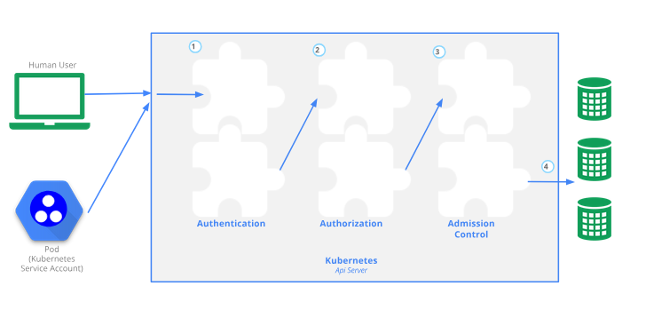

# 一 使用Webhook

Operator除了通过自定义API的方式实现拓展资源管理外，还能通过Webhook方式实现资源访问控制。本节继续学习Webhook。

## 1.1 Kubernetes API访问控制

我们知道访问Kubernetes API有好几种方式，比如使用kubectl命令、使用client-go之类的开发库、直接通过REST请求等。不管是一个使用kubectl的真人用户，还是一个ServiceAccount，都可以通过API访问认证，这个过程官网有一张图描述得很直观

https://kubernetes.io/docs/concepts/security/controlling-access/



一个访问请求发送到API Server的时候，会依次经过<mark>认证、鉴权、准入控制</mark>三个主要的过程。本节主要学习的Admission Webhook就是这里提到的<mark>“准入控制</mark>”的范畴。

<mark>准入控制(Admission Control)模块能够实现更改一个请求的内容或者决定是否拒绝一个请求的功能</mark>。准入控制主要是在一个对象发生变更时生效，变更包括创建、更新、删除等动作，也就是不包含查询动作。如果配置了多个准入控制模块，那么这些模块是按顺序工作的。关于拒绝请求这个能力，一个请求在多个准入控制模块中有一个模块拒绝，这个请求就会被拒绝，这和认证或者鉴权模块明显不一样。而更改一个请求内容的能力，主要用于给一些请求字段设置默认值。

准入控制器基本都是在kube-apiserver中实现的，所以它们的启用也是通过在kube-apiserver的启动参数上添加相应配置，比如：

`kube-apiserverr --enable-admission-plugins=NamespaceLifecycle,LimitRanger`

大家可以在[https://kubernetes.io/docs/reference/access-authn-authz/admission-controllers/#what-does-each-admission-controller-do]()看到目前有哪些准入控制器以及它们的作用。这里的多数准入控制器只能决定它们的启用或者禁用，除了这类在kube-apiserver内部实现的准入控制器外，我们可以看到有两个特殊的准入控制器：<mark>ValidatingAdmissionWebhook</mark>和<mark>MutatingAdmissionWebhook</mark>。这是Kubernetes提供的一种拓展机制，让我们能够通过Webhook的方式独立于kube-apiserver运行自己的准入控制逻辑。

## 1.2 Admission Webhook介绍

顾名思义，Admission Webhook是一个<mark>HTTP回调钩子</mark>，可以用来接收“准入请求”​，然后对这个请求做相应的逻辑处理。

Admission Webhook有两种：

- ValidatingAdmissionWebhook

- MutatingAdmissionWebhook

先执行的是MutatingAdmissionWebhook，这个准入控制器可以修改请求对象，主要用来注入自定义字段；当这个对象被API Server校验时，就会回调ValidatingAdmissionWebhook，然后相应的自定义校验策略就会被执行，以决定这个请求能否被通过。

## 1.3Admission Webhook的实现

我们可以通过Kubebuilder的create webhook命令来生成实现Admission Webhook的代码脚手架：

```go
# kubebuilder create webhook --group apps --version v1 --kind Application --defaulting --programmatic-validation --force
INFO Writing kustomize manifests for you to edit... 
INFO Writing scaffold for you to edit...          
INFO api/v1/application_webhook.go                
INFO api/v1/application_webhook_test.go           
INFO api/v1/webhook_suite_test.go                 
INFO Update dependencies:
$ go mod tidy           
warning: GOPATH set to GOROOT (/usr/local/go) has no effect
go: downloading github.com/onsi/gomega v1.33.1
go: downloading github.com/stretchr/testify v1.9.0
go: downloading github.com/go-task/slim-sprig/v3 v3.0.0
go: downloading golang.org/x/tools v0.21.1-0.20240508182429-e35e4ccd0d2d
go: downloading github.com/google/pprof v0.0.0-20240525223248-4bfdf5a9a2af
go: downloading github.com/pmezard/go-difflib v1.0.1-0.20181226105442-5d4384ee4fb2
go: downloading github.com/rogpeppe/go-internal v1.12.0
INFO Running make:
$ make generate                
warning: GOPATH set to GOROOT (/usr/local/go) has no effect
/home/hyj/MyOperatorProjects/application-operator/bin/controller-gen object:headerFile="hack/boilerplate.go.txt" paths="./..."
Next: implement your new Webhook and generate the manifests with:
$ make manifests
```

这个命令执行完成后，可以看到项目内多了文件。打开api/v1/application_webhook.go源文件，可以看到里面有一个Default()方法。在Default()方法中就可以完成MutatingAdmissionWebhook的相关逻辑。

### 1.3.1实现MutatingAdmissionWebhook

我们以Replicas默认值注入为例，比如用户提交的Application配置中没有给出Replicas的大小，那么注入一个默认值3，代码如下：

```go
func (r *Application) Default() {
    applicationlog.Info("default", "name", r.Name)

    // TODO(user): fill in your defaulting logic.

    if r.Spec.Deployment.Replicas == nil {
        r.Spec.Deployment.Replicas = new(int32)
        *r.Spec.Deployment.Replicas = 3
    }
}
```

### 1.3.2 实现ValidatingAdmissionWebhook

在application_webhook.go源文件中继续往后看，可以发现有3个Validate×××()方法，分别是ValidateCreate、ValidateUpdate和ValidateDelete。顾名思义，这几个Validate方法的触发条件分别是相应对象在创建、更新、删除的时候。

 删除时不需要做什么校验逻辑，而创建和更新的校验逻辑几乎是一样的，所以我们将创建和更新时所需的校验逻辑封装一下，编写一个validateApplication()方法：

```go
func (r *Application) validateApplication() error {
    if *r.Spec.Deployment.Replicas > 10 {
        return fmt.Errorf("replicas tooo many error")
    }
    return nil
}
```

这里我们简单地校验Replicas是不是设置得过大了，其他业务逻辑也是类似的校验方法，如果觉得条件不满足，就返回一个error，反之返回nil就行。

接下来，在几个Validate×××()方法中调用这个validateApplication()方法：

```go
func (r *Application) ValidateCreate() (admission.Warnings, error) {
    applicationlog.Info("validate create", "name", r.Name)

    // TODO(user): fill in your validation logic upon object creation.
    return nil, r.validateApplication()
}

// ValidateUpdate implements webhook.Validator so a webhook will be registered for the type
func (r *Application) ValidateUpdate(old runtime.Object) (admission.Warnings, error) {
    applicationlog.Info("validate update", "name", r.Name)

    // TODO(user): fill in your validation logic upon object update.
    return nil, r.validateApplication()
}

// ValidateDelete implements webhook.Validator so a webhook will be registered for the type
func (r *Application) ValidateDelete() (admission.Warnings, error) {
    applicationlog.Info("validate delete", "name", r.Name)

    // TODO(user): fill in your validation logic upon object deletion.
    return nil, nil
}
```

这时如果想在本地运行测试Webhook，默认需要准备证书，放到`/tmp/k8s-webhook-server/serving-certs/tls.{crt,key}`中，然后执行make run命令。

ps：就不弄了,直接k8s集群

## 1.4 cert-manager部署

在部署Webhook之前需要先安装cert-manager，用来实现<mark>证书签发功能</mark>。关于cert-manager的详细介绍大家可以参考官方文档：[https://cert-manager.io/docs/]()，本节我们只介绍怎么部署cert-manager。

cert-manager提供了helm Chart包方式部署，我们来一步一步以helm的方式部署cert-manager：[Helm - cert-manager Documentation](https://cert-manager.io/docs/installation/helm/)

添加Helm存储库

```shell
helm repo add jetstack https://charts.jetstack.io --force-update
```

安装cert-manager

```go
helm install \
  cert-manager jetstack/cert-manager \
  --namespace cert-manager \
  --create-namespace \
  --version v1.15.3 \
  --set crds.enabled=true
```

验证成功

```shell
# kubectl get pods -n cert-manager
NAME                                       READY   STATUS      RESTARTS   AGE
cert-manager-98c64c5bd-825kj               1/1     Running     0          5m39s
cert-manager-cainjector-5f67bf667f-lcj7s   1/1     Running     0          5m39s
cert-manager-startupapicheck-gvbbd         0/1     Completed   1          5m38s
cert-manager-webhook-749d497c97-6j5wh      1/1     Running     0          5m39s
```

如果你和我一样用的kind，那么可能是这样的

```shell
# kubectl get pods -n cert-manager
NAME                                       READY   STATUS             RESTARTS   AGE
cert-manager-98c64c5bd-jvhfn               0/1     ErrImagePull       0          3m16s
cert-manager-cainjector-5f67bf667f-9hlqq   0/1     ImagePullBackOff   0          3m16s
cert-manager-startupapicheck-jp5cz         0/1     ErrImagePull       0          3m14s
cert-manager-webhook-749d497c97-wr5wr      0/1     ErrImagePull       0          3m16s许需要要亚要
```

那么需要手动将本地镜像导入kind

```shell
docker pull quay.io/jetstack/cert-manager-controller:v1.15.3
docker pull quay.io/jetstack/cert-manager-cainjector:v1.15.3
docker pull quay.io/jetstack/cert-manager-startupapicheck:v1.15.3
docker pull quay.io/jetstack/cert-manager-webhook:v1.15.3

kind load docker-image quay.io/jetstack/cert-manager-controller:v1.15.3 --name dev1m3s
kind load docker-image quay.io/jetstack/cert-manager-cainjector:v1.15.3 --name dev1m3s
kind load docker-image quay.io/jetstack/cert-manager-startupapicheck:v1.15.3 --name dev1m3s
kind load docker-image quay.io/jetstack/cert-manager-webhook:v1.15.3 --name dev1m3s
```

## 1.5 Webhook部署运行

### 1.5.1构建并推送镜像

我们执行以下两行命令来构建镜像，并把镜像加载到kind集群中：

```shell
make docker-build IMG=application-operator:v0.1
kind load docker-image application-operator:v0.1 --name dev1m3s
```

如果比较慢，记得在DockerFile中`ENV GOPROXY=https://goproxy.io`

如果出现异常

```go
RUN CGO_ENABLED=0 GOOS=linux GOARCH=amd64 go build -a -o manager cmd/main.go:                                    
#0 45.34 # sigs.k8s.io/controller-runtime/pkg/internal/controller
#0 45.34 /go/pkg/mod/sigs.k8s.io/controller-runtime@v0.18.4/pkg/internal/controller/controller.go:103:9: not enough arguments in call to fn
#0 45.34     have (interface{})
#0 45.34     want (context.Context, interface{})
#0 45.36 # sigs.k8s.io/controller-runtime/pkg/webhook/admission
#0 45.36 /go/pkg/mod/sigs.k8s.io/controller-runtime@v0.18.4/pkg/webhook/admission/webhook.go:158:9: not enough arguments in call to fn
#0 45.36     have (interface{})
#0 45.36     want (context.Context, interface{})己是1.5.2 部署CRD
```

就是包不兼容，可以参考这个[https://github.com/kubernetes-sigs/controller-runtime/issues/2925](),如果还是不行就复制我的go.mod,因为我就不行，我复制的以前项目的go.mod就好了。

### 1.5.2 部署CRD

CRD的部署很简单，执行以下命令：

```shell
make install
```

### 1.5.3 证书相关配置

我们前面部署了cert-manager，要使用cert-manager还需要做一些配置。首先config/default/kustomization.yaml文件需要做一些调整，打开几行注释内容，最后看起来应该是这样的：

```yaml
# Adds namespace to all resources.
namespace: application-operator-system

# Value of this field is prepended to the
# names of all resources, e.g. a deployment named
# "wordpress" becomes "alices-wordpress".
# Note that it should also match with the prefix (text before '-') of the namespace
# field above.
namePrefix: application-operator-

# Labels to add to all resources and selectors.
#labels:
#- includeSelectors: true
#  pairs:
#    someName: someValue

resources:
- ../crd
- ../rbac
- ../manager
# [WEBHOOK] To enable webhook, uncomment all the sections with [WEBHOOK] prefix including the one in
# crd/kustomization.yaml
- ../webhook
# [CERTMANAGER] To enable cert-manager, uncomment all sections with 'CERTMANAGER'. 'WEBHOOK' components are required.
- ../certmanager
# [PROMETHEUS] To enable prometheus monitor, uncomment all sections with 'PROMETHEUS'.
#- ../prometheus
# [METRICS] Expose the controller manager metrics service.
- metrics_service.yaml

# Uncomment the patches line if you enable Metrics, and/or are using webhooks and cert-manager
patches:
# [METRICS] The following patch will enable the metrics endpoint using HTTPS and the port :8443.
# More info: https://book.kubebuilder.io/reference/metrics
- path: manager_metrics_patch.yaml
  target:
    kind: Deployment

# [WEBHOOK] To enable webhook, uncomment all the sections with [WEBHOOK] prefix including the one in
# crd/kustomization.yaml
- path: manager_webhook_patch.yaml

# [CERTMANAGER] To enable cert-manager, uncomment all sections with 'CERTMANAGER'.
# Uncomment 'CERTMANAGER' sections in crd/kustomization.yaml to enable the CA injection in the admission webhooks.
# 'CERTMANAGER' needs to be enabled to use ca injection
- path: webhookcainjection_patch.yaml

# [CERTMANAGER] To enable cert-manager, uncomment all sections with 'CERTMANAGER' prefix.
# Uncomment the following replacements to add the cert-manager CA injection annotations
replacements:
  - source: # Add cert-manager annotation to ValidatingWebhookConfiguration, MutatingWebhookConfiguration and CRDs
      kind: Certificate
      group: cert-manager.io
      version: v1
      name: serving-cert # this name should match the one in certificate.yaml
      fieldPath: .metadata.namespace # namespace of the certificate CR
    targets:
      - select:
          kind: ValidatingWebhookConfiguration
        fieldPaths:
          - .metadata.annotations.[cert-manager.io/inject-ca-from]
        options:
          delimiter: '/'
          index: 0
          create: true
      - select:
          kind: MutatingWebhookConfiguration
        fieldPaths:
          - .metadata.annotations.[cert-manager.io/inject-ca-from]
        options:
          delimiter: '/'
          index: 0
          create: true
      - select:
          kind: CustomResourceDefinition
        fieldPaths:
          - .metadata.annotations.[cert-manager.io/inject-ca-from]
        options:
          delimiter: '/'
          index: 0
          create: true
  - source:
      kind: Certificate
      group: cert-manager.io
      version: v1
      name: serving-cert # this name should match the one in certificate.yaml
      fieldPath: .metadata.name
    targets:
      - select:
          kind: ValidatingWebhookConfiguration
        fieldPaths:
          - .metadata.annotations.[cert-manager.io/inject-ca-from]
        options:
          delimiter: '/'
          index: 1
          create: true
      - select:
          kind: MutatingWebhookConfiguration
        fieldPaths:
          - .metadata.annotations.[cert-manager.io/inject-ca-from]
        options:
          delimiter: '/'
          index: 1
          create: true
      - select:
          kind: CustomResourceDefinition
        fieldPaths:
          - .metadata.annotations.[cert-manager.io/inject-ca-from]
        options:
          delimiter: '/'
          index: 1
          create: true
  - source: # Add cert-manager annotation to the webhook Service
      kind: Service
      version: v1
      name: webhook-service
      fieldPath: .metadata.name # namespace of the service
    targets:
      - select:
          kind: Certificate
          group: cert-manager.io
          version: v1
        fieldPaths:
          - .spec.dnsNames.0
          - .spec.dnsNames.1
        options:
          delimiter: '.'
          index: 0
          create: true
  - source:
      kind: Service
      version: v1
      name: webhook-service
      fieldPath: .metadata.namespace # namespace of the service
    targets:
      - select:
          kind: Certificate
          group: cert-manager.io
          version: v1
        fieldPaths:
          - .spec.dnsNames.0
          - .spec.dnsNames.1
        options:
          delimiter: '.'
          index: 1
          create: true

```

接着还需要调整config/crd/kustomization.yaml文件，修改如下：

```yaml
# This kustomization.yaml is not intended to be run by itself,
# since it depends on service name and namespace that are out of this kustomize package.
# It should be run by config/default
resources:
- bases/apps.hyj.cn_applications.yaml
# +kubebuilder:scaffold:crdkustomizeresource

patches:
# [WEBHOOK] To enable webhook, uncomment all the sections with [WEBHOOK] prefix.
# patches here are for enabling the conversion webhook for each CRD
- path: patches/webhook_in_applications.yaml
# +kubebuilder:scaffold:crdkustomizewebhookpatch

# [CERTMANAGER] To enable cert-manager, uncomment all the sections with [CERTMANAGER] prefix.
# patches here are for enabling the CA injection for each CRD
- path: patches/cainjection_in_applications.yaml
# +kubebuilder:scaffold:crdkustomizecainjectionpatch

# [WEBHOOK] To enable webhook, uncomment the following section
# the following config is for teaching kustomize how to do kustomization for CRDs.

configurations:
- kustomizeconfig.yaml
```

### 1.5.4 部署控制器

接下来可以部署控制器，执行以下命令：

```shell
make deploy IMG=application-operator:v0.1
```

### 1.5.5 查看结果

最后可以查看Pod是否正常运行：

```shell
kubectl get pod -n application-operator-system
NAME                                                     READY   STATUS    RESTARTS        AGE
application-operator-controller-manager-d8549787-vrkdx   1/1     Running   143 (79s ago)   16h
```

## 1.6 Webhook测试

我们准备一个YAML配置：

```yaml
apiVersion: apps.hyj.cn/v1
kind: Application
metadata:
  name: nginx-sample
  namespace: default
#  labels:
#    app: nginx
spec:
  deployment:
    replicas: 11
    selector:
      matchLabels:
        app: nginx
    template:
      metadata:
#        labels:
#          app: nginx
      spec:
        containers:
          - name: nginx
            image: nginx:1.14.2
            ports:
              - containerPort: 80
  service:
    type: NodePort
    ports:
      - port: 80
        targetPort: 80
        nodePort: 30080
```

注意这里的replicas给了11，然后应用一下看看Validator是否生效：

```shell
kubectl apply -f config/samples/apps_v1_application.yaml 
Error from server (Forbidden): error when creating "config/samples/apps_v1_application.yaml": admission webhook "vapplication.kb.io" denied the request: replicas tooo many error
```

符合预期，我们得到了一个replicas too many error错误。接着将Replicas删除，使用同样的方式可以验证Defaulter能不能正常工作。结果是在不设置Replicas的情况下，Replicas默认值会变成3。大家可以自行验证，这里不再赘述。

# 二 API多版本支持

一般情况下，我们开发一个新项目，它的API是会经常变更的，不管一开始考虑得多么详细，都避免不了迭代的过程中去修改API定义。过了一段时间后，API会趋于稳定，在达到稳定版本之后，可能我们才正式发布V1.0版本。当然，这个稳定版的API就不应该再变化了，如果过了半年想增强一下这个API，可能需要发布V2.0版本，这时V1.0版本还是要能够继续正常工作。本节看一下Operator中是如何支持多版本API的。

## 2.1 实现V2版本API

我们先通过kubebuilder命令添加一个V2版本的API，需要注意的是，这里不要创建Controller。

```shell
kubebuilder create api --group apps --version v2 --kind Application
INFO Create Resource [y/n]                        
y
INFO Create Controller [y/n]                      
n
INFO Writing kustomize manifests for you to edit... 
INFO Writing scaffold for you to edit...          
INFO api/v2/application_types.go                  
INFO api/v2/groupversion_info.go                  
INFO Update dependencies:
$ go mod tidy           
warning: GOPATH set to GOROOT (/usr/local/go) has no effect
INFO Running make:
$ make generate                
warning: GOPATH set to GOROOT (/usr/local/go) has no effect
/home/hyj/MyOperatorProjects/application-operator/bin/controller-gen object:headerFile="hack/boilerplate.go.txt" paths="./..."
Next: implement your new API and generate the manifests (e.g. CRDs,CRs) with:
$ make manifests
```

可以看到api目录下多了一个v2目录，另外main.go和PROJECT发生了变化。大家可以逐个点开查看具体的变更内容，这里就不赘述这个变化了，因为新增的内容和V1版本其实是对称一致的。

V2版本只用于演示多版本API，所以这里不用添加太多的功能。前面在Application类型的Spec中定义了一个Deployment字段，假如想要将其改成更通用的Workflow，我们在api/v2目录下的application_types.go文件中实现和V1版本完全一样的代码逻辑（除了package v2这一行有差异）​，然后把ApplicationSpec结构体修改如下：

```go
type ApplicationSpec struct {
    // INSERT ADDITIONAL SPEC FIELDS - desired state of cluster
    // Important: Run "make" to regenerate code after modifying this file

    Workflow appsv1.DeploymentStatus `json:"workflow"`
    Service  corev1.ServiceStatus    `json:"service"`
}
```

至此，代码就改完了。但是有了多个版本的API，我们在API Server中却只能指定持久化一个版本，这里选择持久化V1版本，所以需要在V1版本的Application上增加一行注解“//+kubebuilder:storageversion”​，最后的代码如下：

```go
// +kubebuilder:object:root=true
// +kubebuilder:subresource:status
// +kubebuilder:resource:path=applications,singular=application,scope=Namespaced,shortName=app
// +kubebuilder:storageversion

// Application is the Schema for the applications API
type Application struct {
    metav1.TypeMeta   `json:",inline"`
    metav1.ObjectMeta `json:"metadata,omitempty"`

    Spec   ApplicationSpec   `json:"spec,omitempty"`
    Status ApplicationStatus `json:"status,omitempty"`
}
```

至此，新版本类型的实现就算完成了。这时应该添加一个Webhook用来接收API Server的conversion回调请求（参考https://book.kubebuilder.io/multiversion-tutorial/webhooks.html）​。1.6节其实已经配置过Webhook了，所以这里什么也不需要做，已经可以开始部署测试多版本API了。

## 2.2 多版本API部署测试

接下来测试多版本API是否和预期的一致，我们验证一下。

### 2.2.1构建镜像并且推给kind集群

```shell
make docker-build IMG=application-operator:v0.2
kind load docker-image application-operator:v0.2 --name dev1m3s
```

### 2.2.2部署CRD等

```shell
make install
```

### 2.2.3 部署Operator

```shell
make deploy IMG=application-operator:v0.2
```

### 2.2.4 查看结果

```shell
kubectl get pod -n application-operator-system
NAME                                                       READY   STATUS    RESTARTS   AGE
application-operator-controller-manager-5f97554584-rzvrj   1/1     Running   0          52s
```

### 2.2.5 部署V2版本资源

我们准备一个新的资源YAML配置：

```yaml
apiVersion: apps.hyj.cn/v2
kind: Application
metadata:
  name: nginx-sample1
  namespace: default
#  labels:
#    app: nginx
spec:
  workflow:
    replicas: 11
    selector:
      matchLabels:
        app: nginx
    template:
      metadata:
      #        labels:
      #          app: nginx
      spec:
        containers:
          - name: nginx
            image: nginx:1.14.2
            ports:
              - containerPort: 80
  service:
    type: NodePort
    ports:
      - port: 80
        targetPort: 80
        nodePort: 30082

```

注意到这里用了apps.hyj.cn/v2，然后通过kubectl apply这个YAML文件就完成了资源的创建：

```shell
# kubectl apply -f config/samples/apps_v2_application.yaml
Error from server: error when creating "config/samples/apps_v2_application.yaml": conversion webhook for apps.hyj.cn/v2, Kind=Application failed: the server could not find the requested resource擦参考考卡考参报错
```

报错参考官网，也还是不行，后续解决下：

[and setting up the webhooks - The Kubebuilder Book](https://book.kubebuilder.io/multiversion-tutorial/webhooks)

跟踪下[https://github.com/daniel-hutao/Advanced-Kubernetes-Operator/issues/6]()

### 2.2.6 通过版本查询

我们通过v1/V2版本创建的资源，当然可以查询到该版本的资源：

```go
kubectl get applications.v2.apps.hyj.cn -o yaml 
kubectl get applications.v1.apps.hyj.cn -o yaml 
```

可以看到，多版本API正常工作了，通过两个版本都可以查询到资源。其实这也说明Convert函数在正常工作。

# 三 API分组支持

有时我们会在一个Operator项目中实现<mark>多个控制器来管理不同的API资源组</mark>。比如如果要实现一个ai-operator项目，其中可能包含模型训练相关的控制器trainjob-controller和推理服务相关的控制器application-controller。那么如何将API分别放到apps组和batch组中呢？我们继续来学习API分组怎么实现。

首先通过Kubebuilder做一些简单的工作：

```shell
kubebuilder edit --multigroup = true 
```

这个命令的能力其实非常有限，它只是在Dockerfile文件中将api/目录变成了apis/目录，然后在PROJECT文件中加了一行multigroup:true。

接着还有一些手动工作需要完成：

```shell
cd ~/MyOperatorProjects/application-operator
mkdir -p apis/apps
mv api/v* apis/apps
rm -rf api/
```

这时旧版的API就被挪动到合适的目录了。接着还需要挪动controllers目录内的控制器相关源文件：

```shell
mkdir -p internal/controllers/apps
mv internal/controller/*.go internal/controllers/apps
```

还有一个细节就是/internal/controller/suite_test.go中和envtest相关的代码要做一个小更新，因为将这个源文件放到了更深一层的目录中，所以这行代码如下：

```go
CRDDirectoryPaths:     []string{filepath.Join("..", "..", "config", "crd", "bases")},
```

需要更新为：

```go
CRDDirectoryPaths:     []string{filepath.Join("..", "..", "..", "config", "crd", "bases")},
```

到这里就完成了API分组支持的配置。记得PROJECT文件中多出来的一行multigroup:true配置吗？这行配置会告诉Kubebuilder后面新增的API不要放到api/<version>目录下，而是放到apis/<group>/<version>目录下；另外控制器的代码也不再放到controllers目录下，而是放到controllers/<group>目录下。
