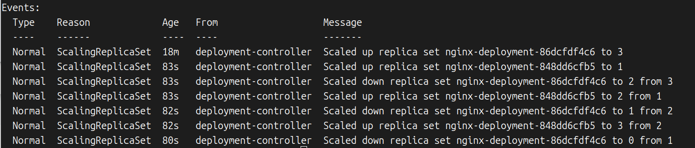

我们在深度使用Operator模式进行开发时，虽然可以借助Kubebuilder和Operator SDK等工具较好地屏蔽底层细节，让我们专注于自身业务逻辑，但是不清楚底层原理会让我们在编码过程中心里没底，比如：自定义控制器重启时会重新收到所有相关资源的Event吗？我们调谐的子资源是Deployment时相关Pod的变更会触发调谐逻辑吗？很多类似的细节问题会不停跳出来，让你对自己编写的代码没有信心。所以我们想要真正深入Operator开发，写出高效、健壮的代码，就必须多阅读一些相关组件的实现原理和源码，从而对自己开发的自定义控制器行为能够知根知底，胸有成竹。

Deployment是常用的Kubernetes原生工作负载资源之一，刚开始尝试使用Kubernetes时大概率就是从运行一个Deployment类型的工作负载开始的。本章将从Deployment的特性介绍、源码分析等方面深度剖析Deployment资源及其背后的Deployment控制器的工作原理。

# 一 Deployment功能分析

Deployment的基础特性大家肯定都熟悉，所以本节不赘述Deployment的所有功能细节，而是从滚动更新等不算基础的特性入手，看一下Deployment支持哪些特性，为后面分析源码做准备。

## 1.1 Deployment基础知识

我们先创建一个简单的Deployment，然后查看其中的一些细节。以运行nginx为例，可以通过Deployment来启动一个具有3个副本的nginx负载，先准备YAML文件：

```shell
cat <<EOF >nginx-deployment.yaml
apiVersion: apps/v1
kind: Deployment
metadata:
  name: nginx-deployment
spec:
  replicas: 3
  selector:
    matchLabels:
      app: nginx
  template:
    metadata:
      labels:
        app: nginx
    spec:
      containers:
        - name: nginx
          image: nginx:1.14.2
          ports:
            - containerPort: 80
EOF
```

然后通过kubectl来部署这个Deployment：`kubectl create -f nginx-deployment.yaml`


等不了多久，就可以通过kubectl get deploy命令看到所有Pod都建立起来了。这里关注该命令输出字段的含义（NAME和AGE就不用说了）​：

- UP-TO-DATE：已经更新到期望状态的副本数。

- AVAILABLE：已经可以提供服务的副本数。

- READY：可以提供服务的副本数/期望副本数。

继续查询一下ReplicaSet：`kubectl get rs --selector=app=nginx`


创建了Deployment之后，可以看到集群中多了一个ReplicaSet资源，也就是说Deployment管理的其实是ReplicaSet，而不是直接管理Pod。我们继续看ReplicaSet的配置来验证这个想法：`kubectl get rs nginx-deployment-86dcfdf4c6 -o yaml`

```yaml
apiVersion: apps/v1
kind: ReplicaSet
metadata:
  annotations:
    deployment.kubernetes.io/desired-replicas: "3"
    deployment.kubernetes.io/max-replicas: "4"
    deployment.kubernetes.io/revision: "1"
  creationTimestamp: "2024-09-04T01:27:39Z"
  generation: 1
  labels:
    app: nginx
    pod-template-hash: 86dcfdf4c6
  name: nginx-deployment-86dcfdf4c6
  namespace: default
  ownerReferences:
  - apiVersion: apps/v1
    blockOwnerDeletion: true
    controller: true
    kind: Deployment
    name: nginx-deployment
    uid: d03866fb-3b8b-4264-b57e-41d7260cb22b
  resourceVersion: "290065"
  uid: 74cb98f6-6ba0-4bb9-bf1c-c59c94ed477c
spec:
  replicas: 3
  selector:
    matchLabels:
      app: nginx
      pod-template-hash: 86dcfdf4c6
  template:
    metadata:
      creationTimestamp: null
      labels:
        app: nginx
        pod-template-hash: 86dcfdf4c6
    spec:
      containers:
      - image: nginx:1.14.2
        imagePullPolicy: IfNotPresent
        name: nginx
        ports:
        - containerPort: 80
          protocol: TCP
        resources: {}
        terminationMessagePath: /dev/termination-log
        terminationMessagePolicy: File
      dnsPolicy: ClusterFirst
      restartPolicy: Always
      schedulerName: default-scheduler
      securityContext: {}
      terminationGracePeriodSeconds: 30
status:
  availableReplicas: 3
  fullyLabeledReplicas: 3
  observedGeneration: 1
  readyReplicas: 3
  replicas: 3
```

这里可以看到ReplicaSet属于Deployment类型的nginx资源。用同样的方法可以看到对应的Pod是ReplicaSet管理的。

到这里，我们可以猜一下Deployment Controller的实现原理，大概可以想到其通过管理ReplicaSet的生命周期，借助ReplicaSet Controller提供的能力间接完成Pod生命周期的管理。另外，它可以通过创建多个ReplicaSet资源，控制其副本数来实现滚动更新和回滚等操作。这样Deployment Controller的实现逻辑就相对“高层”了。1.2 Deployment的滚动更新和回滚

## 1.2 Deployment的滚动更新和回滚

我们继续看一下Deployment的滚动更新过程，通过kubectl set命令来更新镜像：

`kubectl set image deployment/nginx-deployment nginx=nginx:1.16.1`


然后查看一下Event信息：



从Event中可以看到，deployment-controller通过调整ReplicaSet资源nginx-deployment-848dd6cfb5和nginx-deployment-86dcfdf4c6的副本数完成了这次滚动更新。先看这两个ReplicaSet：


可以看到这时新增了一个nginx-deployment-848dd6cfb5，副本数是3，同时旧的nginx-deployment-86dcfdf4c6变成了0副本。这个过程大概是这样的

1. up replica set nginx-deployment-848dd6cfb5 to 1:新rs增加一个副本到1，合计4个副本。

2. down replica set nginx-deployment-86dcfdf4c6 to 2 from 3:旧rs减少一个副本到2，合计3个副本。

3. up replica set nginx-deployment-848dd6cfb5 to 2 from 1:新rs增加一个副本到2，合计4个副本。

4. Scaled down replica set nginx-deployment-86dcfdf4c6 to 1 from 2:旧rs减少一个副本到1，合计3个副本。

5. Scaled up replica set nginx-deployment-848dd6cfb5 to 3 from 2:新rs增加一个副本到3，合计4个副本。

6. Scaled down replica set nginx-deployment-86dcfdf4c6 to 0 from 1:旧rs减少一个副本到0，合计3个副本。

ps:就是新副本增加1个，老副本就减少一个尽量维持replicas数量为3，只多不能少做冗余。

接着来看回滚操作，我们先看如何查询更新历史：`kubectl  rollout history deployments/nginx-deployment`。


这里可以看到一个细节，CHANGE-CAUSE是空的，这个字段其实是从kubernetes.io/change-cause注解中提取的，我们加一个注解试试：`kubectl annotate deployment/nginx-deployment kubernetes.io/change-cause="image updated to 1.16.1"`

然后查询一次：


第一个版本的注解似乎没有地方可以加？这里大概可以猜到如果要支持存储多个版本的CHANGE-CAUSE信息，这个注解应该是用于ReplicaSet中的，所以我们尝试这样补充第一个版本的注解：`kubectl annotate rs/nginx-deployment-86dcfdf4c6  kubernetes.io/change-cause="nginx deployment created"`

然后查询一次：`kubectl  rollout history deployments/nginx-deployment`


好了，现在每个版本都有注释信息了，这样我们进行回滚动作时就更加清楚需要指定哪个版本了。

我们通过设置一个不存在的镜像版本来模拟更新失败的场景：

`kubectl set image deployment/nginx-deployment nginx=nginx:1.1611`


给当前版本设置一个注解：`kubectl annotate rs/nginx-deployment-59b5f554d8 kubernetes.io/change-cause="image updated to 1.1611"`

然后尝试将版本回滚到2：`kubectl rollout undo deployment/nginx-deployment`

可以看到这时版本2变成了最新的版本：4。我们可以通过这种方式来查看某个版本的详细配置：

`kubectl rollout history deployments/nginx-deployment -- revision=1`

另外，回滚也可以指定具体的版本：`kubectl rollout undo deployment/nginx-deployment --to-revision=1`

## 1.3 Deployment的其他特性

最后我们了解Deployment类型spec的全部属性：

- minReadySeconds：默认值为0，表示一个Pod就绪之后多长时间可以提供服务。换句话说，配置成1就是Pod就绪之后1秒才对外提供服务。

- paused：挂起。·progressDeadlineSeconds：默认值为600，表示处理一个Deployment任务的超时时间，比如10分钟到了还没有升级成功，则标记为failed（失败）状态。

- replicas：副本数。

- revisionHistoryLimit：默认是10，表示保留的历史版本数量。

- selector：标签选择器。

- strategy：表示Deployment更新Pod时的替换策略。

- template：Pod模板。

上面提到的strategy有两个属性，分别是type和rollingUpdate。Type的可选值是"Recreate"和"RollingUpdate"，默认为"RollingUpdate"。strategy.rollingUpdate有两个属性：

- maxSurge：表示滚动更新的时候最多可以比期望副本数多几个，数字或者百分比配置都行，比如1表示更新过程中最多同时新增1个副本，然后等一个旧副本删掉之后才能继续增加1个新副本，百分比计算的结果要向上取整。

- maxUnavailable：表示滚动更新的时候可以有多少副本不可用，同样是数字或者百分比配置，比如期望副本数是3，1表示最多删除副本到剩下2，然后要等新副本创建才能继续删除，百分比计算的结果要向下取整。

# 二 Deployment源码分析

前一节介绍了Deployment的各种功能，本节继续从源码角度来看这些功能所对应的实现。

同时需要注意的是，阅读Deployment源码需要有一定的自定义控制器工作原理基础，里面涉及Informer工作机制、WorkQueue（延时/限速工作队列）​、ResourceEventHandler等逻辑。

## 2.1 逻辑入口：startDeploymentController

先进入Kubernetes项目的cmd/kube-controller-manager/app包，我们在apps.go中可以看到startDeploymentController()函数，这个函数也就是DeploymentController的初始化和启动入口：

```go
func startDeploymentController(ctx context.Context, controllerContext ControllerContext, controllerName string) (controller.Interface, bool, error) {
	//在startDeploymentController()函数中先通过NewDeploymentController()方法初始化一个DeploymentController实例，
	//这里的参数是DeploymentInformer、ReplicaSetInformer、PodInformer和ClientSet，
	//因而DeploymentController也就具备了获取Deployment、ReplicaSet、Pod三类资源变更事件 以及CURD apiserver操作各种资源的能力。
	dc, err := deployment.NewDeploymentController(
		ctx,
		controllerContext.InformerFactory.Apps().V1().Deployments(),
		controllerContext.InformerFactory.Apps().V1().ReplicaSets(),
		controllerContext.InformerFactory.Core().V1().Pods(),
		controllerContext.ClientBuilder.ClientOrDie("deployment-controller"),
	)
	if err != nil {
		return nil, true, fmt.Errorf("error creating Deployment controller: %v", err)
	}
	//接着这个函数中又调用了DeploymentController的Run()方法来启动DeploymentController，
	//这里的参数ConcurrentDeploymentSyncs默认值是5，也就是默认情况下并发调谐的Deployment数量是5个。
	go dc.Run(ctx, int(controllerContext.ComponentConfig.DeploymentController.ConcurrentDeploymentSyncs))
	return nil, true, nil
}

```

## 2.2 DeploymentController对象初始化

我们继续查看DeploymentController对象的定义和初始化过程，先看一下DeploymentController类型的定义。进入pkg/controller/deployment包，打开deployment_controller.go文件，可以看到DeploymentController的定义如下：

```go
// DeploymentController is responsible for synchronizing Deployment objects stored
// in the system with actual running replica sets and pods.
type DeploymentController struct {
	// rsControl is used for adopting/releasing replica sets.
	//ReplicaSet操控器
	rsControl controller.RSControlInterface
	client    clientset.Interface

	eventBroadcaster record.EventBroadcaster
	eventRecorder    record.EventRecorder

	// To allow injection of syncDeployment for testing.
	syncHandler func(ctx context.Context, dKey string) error
	// used for unit testing
	//测试用
	enqueueDeployment func(deployment *apps.Deployment)

	// dLister can list/get deployments from the shared informer's store
	//用来从cache中get/list Deployment
	dLister appslisters.DeploymentLister
	// rsLister can list/get replica sets from the shared informer's store
	//用来从cache中get/list ReplicaSet
	rsLister appslisters.ReplicaSetLister
	// podLister can list/get pods from the shared informer's store
	//用来从cache中get/list Pod
	podLister corelisters.PodLister

	// dListerSynced returns true if the Deployment store has been synced at least once.
	// Added as a member to the struct to allow injection for testing.
	dListerSynced cache.InformerSynced
	// rsListerSynced returns true if the ReplicaSet store has been synced at least once.
	// Added as a member to the struct to allow injection for testing.
	rsListerSynced cache.InformerSynced
	// podListerSynced returns true if the pod store has been synced at least once.
	// Added as a member to the struct to allow injection for testing.
	podListerSynced cache.InformerSynced

	// Deployments that need to be synced
	//工作队列，限速队列实现
	queue workqueue.TypedRateLimitingInterface[string]
}

```

eploymentController初始化逻辑也在这个源文件中，我们继续来看NewDeploymentController函数的实现：

```go
// NewDeploymentController creates a new DeploymentController.
func NewDeploymentController(ctx context.Context, dInformer appsinformers.DeploymentInformer, rsInformer appsinformers.ReplicaSetInformer, podInformer coreinformers.PodInformer, client clientset.Interface) (*DeploymentController, error) {
	//Event相关逻辑
	eventBroadcaster := record.NewBroadcaster(record.WithContext(ctx))
	logger := klog.FromContext(ctx)

	//初始化一个DeploymentController对象实例
	dc := &DeploymentController{
		client:           client,
		eventBroadcaster: eventBroadcaster,
		eventRecorder:    eventBroadcaster.NewRecorder(scheme.Scheme, v1.EventSource{Component: "deployment-controller"}),
		queue: workqueue.NewTypedRateLimitingQueueWithConfig(
			workqueue.DefaultTypedControllerRateLimiter[string](),
			workqueue.TypedRateLimitingQueueConfig[string]{
				Name: "deployment",
			},
		),
	}
	// 主要是ClientSet
	dc.rsControl = controller.RealRSControl{
		KubeClient: client,
		Recorder:   dc.eventRecorder,
	}
	//ResourceEventHandler配置，后面会分析到
	dInformer.Informer().AddEventHandler(cache.ResourceEventHandlerFuncs{
		AddFunc: func(obj interface{}) {
			dc.addDeployment(logger, obj)
		},
		UpdateFunc: func(oldObj, newObj interface{}) {
			dc.updateDeployment(logger, oldObj, newObj)
		},
		// This will enter the sync loop and no-op, because the deployment has been deleted from the store.
		DeleteFunc: func(obj interface{}) {
			dc.deleteDeployment(logger, obj)
		},
	})
	rsInformer.Informer().AddEventHandler(cache.ResourceEventHandlerFuncs{
		AddFunc: func(obj interface{}) {
			dc.addReplicaSet(logger, obj)
		},
		UpdateFunc: func(oldObj, newObj interface{}) {
			dc.updateReplicaSet(logger, oldObj, newObj)
		},
		DeleteFunc: func(obj interface{}) {
			dc.deleteReplicaSet(logger, obj)
		},
	})
	podInformer.Informer().AddEventHandler(cache.ResourceEventHandlerFuncs{
		DeleteFunc: func(obj interface{}) {
			dc.deletePod(logger, obj)
		},
	})
	//这里有主要逻辑，后面会继续分析到
	dc.syncHandler = dc.syncDeployment
	dc.enqueueDeployment = dc.enqueue
	//各种lister
	dc.dLister = dInformer.Lister()
	dc.rsLister = rsInformer.Lister()
	dc.podLister = podInformer.Lister()
	dc.dListerSynced = dInformer.Informer().HasSynced
	dc.rsListerSynced = rsInformer.Informer().HasSynced
	dc.podListerSynced = podInformer.Informer().HasSynced
	return dc, nil
}
```

这里提到了<mark>ResourceEventHandler</mark>和<mark>syncDeployment</mark>相关的逻辑比较重要。

## 2.3 ResourceEventHandler逻辑

前文提到的ResourceEventHandler，具体来看回调函数有如下几个：

- addDeployment。

- updateDeployment。

- deleteDeployment。

- addReplicaSet。

- updateReplicaSet。

- deleteReplicaSet。

- deletePod。

- 本小节就来看一下这些回调函数的实现逻辑。

### 2.3.1 Deployment变更事件相关函数

还是看deployment_controller.go源文件，我们可以找到addDeployment、updateDeployment和deleteDeployment三个方法的代码：

```go
func (dc *DeploymentController) addDeployment(logger klog.Logger, obj interface{}) {
	d := obj.(*apps.Deployment)
	logger.V(4).Info("Adding deployment", "deployment", klog.KObj(d))
	// 新增 Deployment时直接入队（enqueue）
	dc.enqueueDeployment(d)
}

func (dc *DeploymentController) updateDeployment(logger klog.Logger, old, cur interface{}) {
	oldD := old.(*apps.Deployment)
	curD := cur.(*apps.Deployment)
	logger.V(4).Info("Updating deployment", "deployment", klog.KObj(oldD))
	//old Deployment只是用来打印一个日志，cur Deployment enqueue
	dc.enqueueDeployment(curD)
}

func (dc *DeploymentController) deleteDeployment(logger klog.Logger, obj interface{}) {
	d, ok := obj.(*apps.Deployment)
	if !ok { // 处理DeletedFinalStateUnknown场景
		tombstone, ok := obj.(cache.DeletedFinalStateUnknown)
		if !ok {
			utilruntime.HandleError(fmt.Errorf("couldn't get object from tombstone %#v", obj))
			return
		}
		d, ok = tombstone.Obj.(*apps.Deployment)
		if !ok {
			utilruntime.HandleError(fmt.Errorf("tombstone contained object that is not a Deployment %#v", obj))
			return
		}
	}
	logger.V(4).Info("Deleting deployment", "deployment", klog.KObj(d))
	//入队
	dc.enqueueDeployment(d)
}

```

ps:都是调用dc.enqueueDeployment方法，其实都是像workqueue中添加元素。

### 2.3.2 ReplicaSet变更事件相关函数：Added

```go
func (dc *DeploymentController) addReplicaSet(logger klog.Logger, obj interface{}) {
	rs := obj.(*apps.ReplicaSet)

	// 如果准备删除了，在重启的过程中就会收到Added事件，这时直接调用删除操作
	if rs.DeletionTimestamp != nil {
		// On a restart of the controller manager, it's possible for an object to
		// show up in a state that is already pending deletion.
		dc.deleteReplicaSet(logger, rs)
		return
	}
	// If it has a ControllerRef, that's all that matters.
	//查询对应的Deployment
	if controllerRef := metav1.GetControllerOf(rs); controllerRef != nil {
		d := dc.resolveControllerRef(rs.Namespace, controllerRef)
		if d == nil {
			return
		}
		logger.V(4).Info("ReplicaSet added", "replicaSet", klog.KObj(rs))
		dc.enqueueDeployment(d)
		return
	}

	// Otherwise, it's an orphan. Get a list of all matching Deployments and sync
	// them to see if anyone wants to adopt it.
	//如果是一个孤儿ReplicaSet，则看一下是否找到一个Deployment来领养
	ds := dc.getDeploymentsForReplicaSet(logger, rs)
	if len(ds) == 0 {
		return
	}
	logger.V(4).Info("Orphan ReplicaSet added", "replicaSet", klog.KObj(rs))
	//一般只有一个Deployment，但是也不能排除多个的情况，所以这里用的是ds 列表，循环enqueue
	for _, d := range ds {
		dc.enqueueDeployment(d)
	}
}
```

### 2.3.3 ReplicaSet变更事件相关函数：Updated

```go
func (dc *DeploymentController) updateReplicaSet(logger klog.Logger, old, cur interface{}) {
	curRS := cur.(*apps.ReplicaSet)
	oldRS := old.(*apps.ReplicaSet)
	if curRS.ResourceVersion == oldRS.ResourceVersion {
		// Periodic resync will send update events for all known replica sets.
		// Two different versions of the same replica set will always have different RVs.
		//Resync的时候RV相同，不做处理
		return
	}

	curControllerRef := metav1.GetControllerOf(curRS)
	oldControllerRef := metav1.GetControllerOf(oldRS)
	controllerRefChanged := !reflect.DeepEqual(curControllerRef, oldControllerRef)
	if controllerRefChanged && oldControllerRef != nil {
		// The ControllerRef was changed. Sync the old controller, if any.
		//如果rs的ref变更了，就需要通知旧的ref对应的Deployment
		if d := dc.resolveControllerRef(oldRS.Namespace, oldControllerRef); d != nil {
			dc.enqueueDeployment(d)
		}
	}
	// If it has a ControllerRef, that's all that matters.
	if curControllerRef != nil {
		d := dc.resolveControllerRef(curRS.Namespace, curControllerRef)
		if d == nil {
			return
		}
		logger.V(4).Info("ReplicaSet updated", "replicaSet", klog.KObj(curRS))
		//当前res对应的do入队
		dc.enqueueDeployment(d)
		return
	}

	// Otherwise, it's an orphan. If anything changed, sync matching controllers
	// to see if anyone wants to adopt it now.
	//孤儿rs的场景，与Added时处理逻辑一样
	labelChanged := !reflect.DeepEqual(curRS.Labels, oldRS.Labels)
	if labelChanged || controllerRefChanged {
		ds := dc.getDeploymentsForReplicaSet(logger, curRS)
		if len(ds) == 0 {
			return
		}
		logger.V(4).Info("Orphan ReplicaSet updated", "replicaSet", klog.KObj(curRS))
		for _, d := range ds {
			dc.enqueueDeployment(d)
		}
	}
}

```

ps:update如果列表有变化，有变化的都调用dc.enqueueDeployment(d)

### 2.3.4 ReplicaSet变更事件相关函数：Deleted

```go
func (dc *DeploymentController) deleteReplicaSet(logger klog.Logger, obj interface{}) {
	rs, ok := obj.(*apps.ReplicaSet)

	// When a delete is dropped, the relist will notice a pod in the store not
	// in the list, leading to the insertion of a tombstone object which contains
	// the deleted key/value. Note that this value might be stale. If the ReplicaSet
	// changed labels the new deployment will not be woken up till the periodic resync.
	// 删除场景需要处理的DeletedFinalStateUnknown场景
	if !ok {
		tombstone, ok := obj.(cache.DeletedFinalStateUnknown)
		if !ok {
			utilruntime.HandleError(fmt.Errorf("couldn't get object from tombstone %#v", obj))
			return
		}
		rs, ok = tombstone.Obj.(*apps.ReplicaSet)
		if !ok {
			utilruntime.HandleError(fmt.Errorf("tombstone contained object that is not a ReplicaSet %#v", obj))
			return
		}
	}

	//孤儿rs被删除时，没有Deployment需要关心
	controllerRef := metav1.GetControllerOf(rs)
	if controllerRef == nil {
		// No controller should care about orphans being deleted.
		return
	}
	d := dc.resolveControllerRef(rs.Namespace, controllerRef)
	if d == nil {
		return
	}
	logger.V(4).Info("ReplicaSet deleted", "replicaSet", klog.KObj(rs))
	//入队
	dc.enqueueDeployment(d)
}
```

## 2.4  DeploymentController的启动过程

通过前几个小节的学习，我们已经知道了哪些Event会向WorkQueue中添加元素，接着看一下这些元素是怎么被消费的。

### 2.4.1 Run()函数

Run()方法本身的逻辑很简洁，根据给定的并发数（默认5并发）启动dc.worker。相关源码还是在deployment_controller.go源文件中：

```go
// Run begins watching and syncing.
func (dc *DeploymentController) Run(ctx context.Context, workers int) {
	defer utilruntime.HandleCrash()

	// Start events processing pipeline.
	dc.eventBroadcaster.StartStructuredLogging(3)
	dc.eventBroadcaster.StartRecordingToSink(&v1core.EventSinkImpl{Interface: dc.client.CoreV1().Events("")})
	defer dc.eventBroadcaster.Shutdown()

	defer dc.queue.ShutDown()

	logger := klog.FromContext(ctx)
	logger.Info("Starting controller", "controller", "deployment")
	defer logger.Info("Shutting down controller", "controller", "deployment")

	if !cache.WaitForNamedCacheSync("deployment", ctx.Done(), dc.dListerSynced, dc.rsListerSynced, dc.podListerSynced) {
		return
	}

	//根据给定的并发数（默认5并发）启动dc.worke
	for i := 0; i < workers; i++ {
		go wait.UntilWithContext(ctx, dc.worker, time.Second)
	}

	<-ctx.Done()
}
```

继续来看这里的worker的逻辑：

```go
func (dc *DeploymentController) worker(ctx context.Context) {
	for dc.processNextWorkItem(ctx) {
	}
}


func (dc *DeploymentController) processNextWorkItem(ctx context.Context) bool {
	//从WorkQueue中获取一个元素
	key, quit := dc.queue.Get()
	if quit {
		return false
	}
	defer dc.queue.Done(key)
	//主要逻辑
	err := dc.syncHandler(ctx, key)
	dc.handleErr(ctx, err, key)

	return true
}
```

这里从WorkQueue中拿到一个key（键）之后，通过调用syncHandler()方法来处理。前面我们强调过syncDeployment是一个重点，还记得那一行代码吗？如下所示：

```go
dc.syncHandler = dc.syncDeployment
```

也就是说，这里的dc.syncHandler(ctx,key.(string))调用的本质是dc.syncDeployment()，所以接着继续dc.syncDeployment的实现。

### 2.4.2 syncDeployment()方法

syncDeployment()方法完成的事情是获取从WorkQueue中出队的key，根据这个key来sync（同步）对应的Deployment。下面来看具体的代码逻辑：

```go
func (dc *DeploymentController) syncDeployment(ctx context.Context, key string) error {
	logger := klog.FromContext(ctx)
	//从key中分割出namespace和name
	namespace, name, err := cache.SplitMetaNamespaceKey(key)
	if err != nil {
		logger.Error(err, "Failed to split meta namespace cache key", "cacheKey", key)
		return err
	}

	startTime := time.Now()
	logger.V(4).Info("Started syncing deployment", "deployment", klog.KRef(namespace, name), "startTime", startTime)
	defer func() {
		logger.V(4).Info("Finished syncing deployment", "deployment", klog.KRef(namespace, name), "duration", time.Since(startTime))
	}()

	//根据namespace和name从cache中检索对应的Deployment对象.
	deployment, err := dc.dLister.Deployments(namespace).Get(name)
	if errors.IsNotFound(err) {
		logger.V(2).Info("Deployment has been deleted", "deployment", klog.KRef(namespace, name))
		return nil
	}
	if err != nil {
		return err
	}

	// Deep-copy otherwise we are mutating our cache.
	// TODO: Deep-copy only when needed.
	//为了不改动这个cache，这是一个ThreadSafeStore
	d := deployment.DeepCopy()

	everything := metav1.LabelSelector{}
	//空LabelSelector会匹配所有pod。
	if reflect.DeepEqual(d.Spec.Selector, &everything) {
		//发出一个警告时间（Warning Event）
		dc.eventRecorder.Eventf(d, v1.EventTypeWarning, "SelectingAll", "This deployment is selecting all pods. A non-empty selector is required.")
		if d.Status.ObservedGeneration < d.Generation {
			d.Status.ObservedGeneration = d.Generation
			//新d.Status.ObservedGeneration然后返回
			dc.client.AppsV1().Deployments(d.Namespace).UpdateStatus(ctx, d, metav1.UpdateOptions{})
		}
		return nil
	}

	// List ReplicaSets owned by this Deployment, while reconciling ControllerRef
	// through adoption/orphaning.
	//获取当前Deployment拥有的所有ReplicaSet，同时会更新这些ReplicaSet的ControllerRef
	rsList, err := dc.getReplicaSetsForDeployment(ctx, d)
	if err != nil {
		return err
	}
	// List all Pods owned by this Deployment, grouped by their ReplicaSet.
	// Current uses of the podMap are:
	//
	// * check if a Pod is labeled correctly with the pod-template-hash label.
	// * check that no old Pods are running in the middle of Recreate Deployments.
	//这个map是map[types.UID][]*v1.Pod类型，key是rs的UID,value 是对应rs管理的所有Pod列表
	podMap, err := dc.getPodMapForDeployment(d, rsList)
	if err != nil {
		return err
	}
	//已经标记要删除了，这时只更新状态
	if d.DeletionTimestamp != nil {
		return dc.syncStatusOnly(ctx, d, rsList)
	}

	// Update deployment conditions with an Unknown condition when pausing/resuming
	// a deployment. In this way, we can be sure that we won't timeout when a user
	// resumes a Deployment with a set progressDeadlineSeconds.
	// 根据d.Spec.Pause配置看是否更新Deployment的conditions
	//（检查deployment是否是pause状态并添加合适的condition）
	if err = dc.checkPausedConditions(ctx, d); err != nil {
		return err
	}

	if d.Spec.Paused {
		//Pause或scale时的调谐逻辑
		return dc.sync(ctx, d, rsList)
	}

	// rollback is not re-entrant in case the underlying replica sets are updated with a new
	// revision so we should ensure that we won't proceed to update replica sets until we
	// make sure that the deployment has cleaned up its rollback spec in subsequent enqueues.
	//应该过期了，旧版本的deprecated.deployment.rollback.to注解回滚逻辑(弃用)
	if getRollbackTo(d) != nil {
		//回滚到旧版本的逻辑
		return dc.rollback(ctx, d, rsList)
	}
	//如果是scale
	scalingEvent, err := dc.isScalingEvent(ctx, d, rsList)
	if err != nil {
		return err
	}
	// Pause或scale时的调谐逻辑
	if scalingEvent {
		return dc.sync(ctx, d, rsList)
	}

	switch d.Spec.Strategy.Type {
	//重建策略
	case apps.RecreateDeploymentStrategyType:
		return dc.rolloutRecreate(ctx, d, rsList, podMap)
	case apps.RollingUpdateDeploymentStrategyType:
		//滚动更新策略
		return dc.rolloutRolling(ctx, d, rsList)
	}
	return fmt.Errorf("unexpected deployment strategy type: %s", d.Spec.Strategy.Type)
}
```


看完syncDeployment()方法之后，Deployment控制器的逻辑就算过完一遍了。当然，这个方法内部涉及的一些小方法的调用这里只是简单介绍其功能，并没有深究所有实现细节，不过这些小方法的逻辑都不难，这里不再赘述了。
