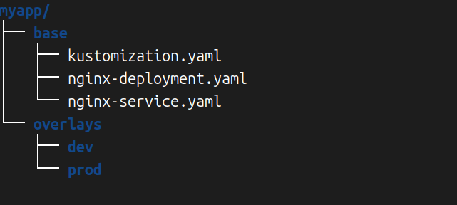
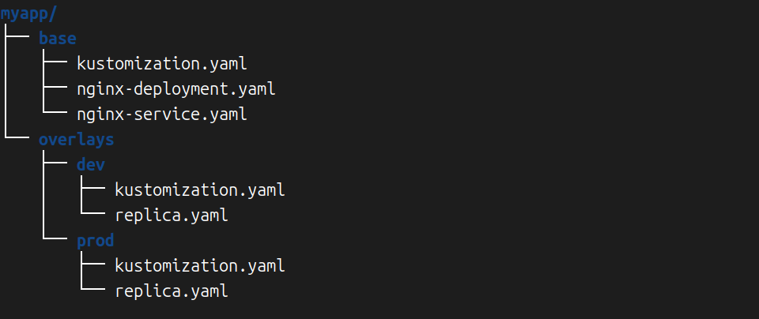

我们使用Kubebuilder生成的Operator脚手架中有很多资源配置文件，大家应该已经注意到这些<mark>资源配置文件都是使用Kustomize来管理的</mark>，所以为了完全看懂或者修改这些配置文件，有必要好好学习一下Kustomize工具的使用。

Kustomize的代码库GitHub地址是[GitHub - kubernetes-sigs/kustomize: Customization of kubernetes YAML configurations](https://github.com/kubernetes-sigs/kustomize)。Kustomize是Kubernetes原生配置管理工具，实现了类似sed的给资源配置文件“打补丁”的能力。Kubernetes 1.14.0版本已经集成到了kubectl命令中，所以也可以通过kubectl的子命令来使用Kustomize。

# 一 Kustomize的基本概念

在学习Kustomize的用法之前，先来认识几个关键术语：

- kustomization：这个词指代的是一个kustomization.yaml文件，或者更广义地理解为一个包含kustomization.yaml文件的目录以及这个kustomization.yaml文件中引用的所有其他文件。

- base：指的是被其他kustomization引用的一个kustomization。换言之，任何一个kustomization a被另一个kustomization b引用时，a是b的base，这时如果新增一个kustomization c来引用b，那么b也就是c的base。也就是说，base是一个相对的概念，而不是某种属性标识。

- overlay：与base相对应，依赖另一个kustomization的kustomization被称为overlay。也就是说，如果kustomization b引用了kustomization a，那么b是a的overlay，a是b的base。

我们再通过一个小例子来直观认识kustomization这个概念。比如现在创建一个目录myapp，然后在其中创建一个base子目录，base目录中又有如下几个文件：

- kustomization.yaml。

- nginx-deployment.yaml。

- nginx-service.yaml。

其中kustomization.yaml文件内容如下：

```yaml
resources:
  - nginx-deployment.yaml
  - nginx-service.yaml
```

这就是一个很基础的kustomization，包含一个kustomization.yaml文件，并且在kustomization.yaml中引用了两个资源文件。

然后我们继续在base同级目录下创建一个overlays目录，并且在overlays目录中放置dev和prod两个子目录，其目录结构大致如下：



这时读者可能已经猜到将在dev和prod目录下分别创建kustomization.yaml，并且以base kustomization为基础，补充“开发环境”和“生产环境”的差异化配置，形成两个overlay kustomization。

接着在dev和prod的kustomization.yaml中都放置这样的内容：

```yaml
bases:
  - ../../base
patchs:
  - replica.yaml
```

这里我们指定bases是前面的base kustomization，然后指定了一个patchs replica.yaml。接着dev和prod目录中可以放置不同的replica.yaml，其中唯一的区别就是副本数不同，开发环境指定1个Pod副本，而生产环境指定3个Pod副本。我们在这里不详细地展示replica.yaml和其他几个资源配置YAML文件的具体内容，现在的目的是希望大家对于Kustomize的作用和能力有一个初步的认识，后面会有详细的例子讲解Kustomize的各种使用细节。最后查看最新的目录结构：



简单来说，Kustomize的作用就是提供了一种机制让我们能够管理同一套应用资源配置文件在不同环境的差异化配置问题，将共性部分抽象成base，然后通过overlay的方式针对不同使用场景打补丁，从而增量得到多种“场景化”配置。

ps:如果了解docker如何存储image的，你就应该了解aufs或者overlay2这种技术，如果你不了解建议学习一下，对理解这些概念很有帮助。

# 二 使用Kustomize生成资源

我们在Kubernetes中通常使用ConfigMap和Secret来分别存储<mark>配置文件</mark>和<mark>敏感配置信息</mark>等，这些内容往往是在Kubernetes集群之外的。比如通过Secret来存储数据库连接信息，这些信息也许记录在特定机器的环境变量中，也许保存在某台机器的一个TXT文本文件中，总之这些信息和Kubernetes集群本身没有关联。但是我们的应用以Pod的方式运行在一个Kubernetes集群之内时，就需要使用ConfigMap或者Secret资源对象来获取各种配置，怎么快速创建ConfigMap和Secret呢？

## 2.1 Kustomize的安装

直接使用[Binaries | SIG CLI](https://kubectl.docs.kubernetes.io/installation/kustomize/binaries/)提供的命令下载并安装：

```shell
curl -s "https://raw.githubusercontent.com/kubernetes-sigs/kustomize/master/hack/install_kustomize.sh"  | bash
mv kustomize /usr/local/bin
kustomize version
```

## 2.2 ConfigMap生成器

我们可以通过configMapGenerator来自动管理ConfigMap资源文件的创建和引用等。下面分别通过几个实例来演示相关的用法。

### 2.2.1 从配置文件生成ConfigMap

```shell
mkdir kustomize-examples
cd kustomize-examples/

cat <<EOF >config.txt
key=value
EOF

cat <<EOF >./kustomization.yaml
configMapGenerator:
- name: app-config
  files:
  - config.txt
EOF
```

然后有两种方式来构建ConfigMap：

```shell
kustomize build .
kubectl kustomize .
```

可以看到kustomize build <kustomization_directory>和kubectl kustomize <kustomization_directory>都可以输出想要的资源配置。本节后面的示例都以kustomize build命令为例。除了可以从文本文件生成ConfigMap之外，也可以使用环境变量中的配置内容。

### 2.2.2 通过环境变量创建ConfigMap

```shell
cat <<EOF >golang_env.txt
GOVERSION=go1.22.0
GOARCH=`$(GOARCH)`
EOF


cat<<EOF >./kustomization.yaml
configMapGenerator:
- name: app-config
  envs:
  - golang_env.txt
EOF
```

接着构建ConfigMap：`GOARCH=amd64 kustomize build .`

```yaml
apiVersion: v1
data:
  GOARCH: ""
  GOVERSION: go1.22.0
kind: ConfigMap
metadata:
  name: app-config-ktdbd9c76t
```

可以看到在golang_env.txt中存放的key=value格式的GOVERSION配置以及环境变量中的GOARCH都包含在这个ConfigMap中了。

ps:GOARCH: ""为空，这种方式不行，不要试了

### 2.2.3 通过键值对字面值直接创建ConfigMap

```shell
cat <<EOF >./kustomization.yaml
configMapGenerator:
- name: app-config
  literals:
  - Hello=World
EOF
```

接着构建ConfigMap看一下效果：`kustomize build .`

```yaml
apiVersion: v1
data:
  Hello: World
kind: ConfigMap
metadata:
  name: app-config-7b4b2hf646
```

### 2.2.4 使用ConfigMap

大家可以注意到一个问题，就是通过Kustomize生成的ConfigMap的名称默认带了一串后缀，那么在Deployment中引用这个ConfigMap的时候，怎么预知这个名字呢？其实Kustomize会自动在Deployment配置中替换这个字段，我们看一下具体的例子。

配置文件config.txt的内容如下：

```shell
cat <<EOF >config.txt
key=value
EOF
```

Deployment配置文件nginx-deployment.yaml的内容如下：

```shell
cat <<EOF >nginx-deployment.yaml
apiVersion: apps/v1
kind: Deployment
metadata:
  name: nginx
  labels:
    app: nginx
spec:
  selector:
    - matchLabels:
        app: nginx
  template:
    metadata:
      labels:
        app: nginx
    spec:
      containers:
        - name: nginx
          image: nginx:1.16
          volumeMounts:
            - mountPath: /config
              name: config
      volumes:
        - name: config
          configMap:
            name: app-config
EOF
```

kustomization.yaml文件的内容如下：

```shell
cat <<EOF >./kustomization.yaml
resources:
- nginx-deployment.yaml
configMapGenerator:
- name: app-config

  files:
  - config.txt
EOF
```

最后看构建出来的资源是什么样的：`kustomize build .`

```yaml
apiVersion: v1
data:
  config.txt: |
    key=value
kind: ConfigMap
metadata:
  name: app-config-gc6cm9fg4c
---
apiVersion: apps/v1
kind: Deployment
metadata:
  labels:
    app: nginx
  name: nginx
spec:
  selector:
  - matchLabels:
      app: nginx
  template:
    metadata:
      labels:
        app: nginx
    spec:
      containers:
      - image: nginx:1.16
        name: nginx
        volumeMounts:
        - mountPath: /config
          name: config
      volumes:
      - configMap:
          name: app-config-gc6cm9fg4c
        name: config
```

可以看到生成的ConfigMap名为<u>app-config-gc6cm9fg4c</u>，同时Deployment部分的.spec.template .spec.volumes[0].configMap.name也对应配置成了<u>app-config-gc6cm9fg4c</u>。

## 2.3  Secret生成器

与ConfigMap类似，有好几种方式来生成Secret资源配置。

### 2.3.1通过配置文件生成Secret

```shell
cat <<EOF >./password.txt
username=hyj
password=hyj12138
EOF


cat <<EOF >./kustomization.yaml
secretGenerator:
- name: app-secret
  files:
  - password.txt
EOF
```

查看创建的Secret：`kustomize build .`

```yaml
apiVersion: v1
data:
  password.txt: dXNlcm5hbWU9aHlqCnBhc3N3b3JkPWh5ajEyMTM4Cg==
kind: Secret
metadata:
  name: app-secret-c8mfkbk9bg
type: Opaque
```

可以看到一个叫作app-secret-c8mfkbk9bg的Secret类型资源配置被输出了，其中的内容是一串base64编码后的字符串，我们可以解码这串字符看一下内容是否符合预期：

```shell
echo "dXNlcm5hbWU9aHlqCnBhc3N3b3JkPWh5ajEyMTM4Cg==" | base64 -d
```

### 2.3.2 通过键值对字面值创建Secret

```shell
cat <<EOF >./kustomization.yaml
secretGenerator:
- name: app-secret
  literals:
  - username=hyj
  - password=hyj12139
EOF
```

查看创建的Secret：`kustomize build .`

```yaml
apiVersion: v1
data:
  password: aHlqMTIxMzk=
  username: aHlq
kind: Secret
metadata:
  name: app-secret-ggt4fg5tdh
type: Opaque
```

同样可以用base64解码看一下内容是否正确：

```shell
echo "aHlq" | base64 -d
echo "aHlqMTIxMz" | base64 -d
```

### 2.3.3 使用Secret

与ConfigMap的用法类似，同样可以在Deployment中使用带后缀的Secret。

```shell
cat <<EOF >./password.txt
username=hyj
password=hyj12138
EOF
```

然后准备一个Deployment：

```shell
cat <<EOF >nginx-deployment.yaml
apiVersion: apps/v1
kind: Deployment
metadata:
  name: nginx
  labels:
    app: nginx
spec:
  selector:
    - matchLabels:
        app: nginx
  template:
    metadata:
      labels:
        app: nginx
    spec:
      containers:
        - name: nginx
          image: nginx:1.16
          volumeMounts:
            - mountPath: /secrets
              name: password
      volumes:
        - name: password
          secret:
            secretName: app-secret
EOF
```

最后需要一个kustomization.yaml：

```shell
cat <<EOF >./kustomization.yaml
resources:
- nginx-deployment.yaml
secretGenerator:
- name: app-secret

  files:
  - password.txt
EOF
```

查看一下成果：`kustomize build .`

```yaml
apiVersion: v1
data:
  password.txt: dXNlcm5hbWU9aHlqCnBhc3N3b3JkPWh5ajEyMTM4Cg==
kind: Secret
metadata:
  name: app-secret-c8mfkbk9bg
type: Opaque
---
apiVersion: apps/v1
kind: Deployment
metadata:
  labels:
    app: nginx
  name: nginx
spec:
  selector:
  - matchLabels:
      app: nginx
  template:
    metadata:
      labels:
        app: nginx
    spec:
      containers:
      - image: nginx:1.16
        name: nginx
        volumeMounts:
        - mountPath: /secrets
          name: password
      volumes:
      - name: password
        secret:
          secretName: app-secret-c8mfkbk9bg
```

可以看到生成的Secret名为<u>app-secret-c8mfkbk9bg</u>，同时Deployment部分的.spec.template. spec.volumes[0].secret.secretName也对应配置成<u>app-secret-c8mfkbk9bg</u>，和ConfigMap的处理方式基本一致。

## 2.4 使用generatorOptions改变默认行为

前面使用ConfigMap和Secret生成器时，大家已经注意到最终生成的资源配置名字上会有一串随机字符串，这个行为的意义是为了保证不同配置内容生成的资源名字会不一样，减少误用的概率。如果读者不喜欢或者不需要这种默认行为又怎么办呢？Kustomize其实提供了开关，可以通过generatorOptions来改变这种行为。查看下面的这个例子：

```shell
cat <<EOF >./kustomization.yaml
configMapGenerator:
- name: app-config
  literals:
  - Hello=World
generatorOptions:
  disableNameSuffixHash: true
  labels:
    type: generated
  annotations:
    note: generated  
EOF
```

看一下构建结果：`kustomize build .`

```yaml
apiVersion: v1
data:
  Hello: World
kind: ConfigMap
metadata:
  annotations:
    note: generated
  labels:
    type: generated
  name: app-config
```

可以看到这次得到的资源名字变成了没有后缀的app-config，同时这里演示了generatorOptions可以给资源统一添加labels和annotations。

# 三 使用Kustomize管理公共配置项

我们经常需要在<mark>不同的资源配置文件中配置相同的字段</mark>，比如：

- 给所有的资源配置相同的namespace。

- 给多个资源的name字段加上相同的前缀或者后缀。

- 给多个资源配置相同的labels或annotations。

- …

当我们需要修改某一项配置，比如临时改变主意，想要将资源部署在另一个namespace中，这时需要编辑几乎所有的资源配置文件。你猜得没错，Kustomize也可以解决这类问题，统一管理这种公共配置项。我们先准备一个普通的Deployment模板：

```shell
cat <<EOF >nginx-deployment.yaml
apiVersion: apps/v1
kind: Deployment
metadata:
  name: nginx
  labels:
    app: nginx
spec:
  selector:
    - matchLabels:
        app: nginx
  template:
    metadata:
      labels:
        app: nginx
    spec:
      containers:
        - name: nginx
          image: nginx:1.16
EOF
```

这个配置平淡无奇，我们给它加一些配置项：

```shell
cat <<EOF >./kustomization.yaml
namespace: user-hyj
namePrefix: app-
nameSuffix: -v1
commonLabels:
  vesion: v1
commonAnnotations:
  owner: hyj
resources:
- nginx-deployment.yaml
EOF
```

查看一下构建结果：kustomize build .

```yaml
apiVersion: apps/v1
kind: Deployment
metadata:
  annotations:
    owner: hyj
  labels:
    app: nginx
    vesion: v1
  name: app-nginx-v1
  namespace: user-hyj
spec:
  selector:
  - matchLabels:
      app: nginx
      vesion: v1
  template:
    metadata:
      annotations:
        owner: hyj
      labels:
        app: nginx
        vesion: v1
    spec:
      containers:
      - image: nginx:1.16
        name: nginx
```

可以看到定义的namespace、name前后缀、label和annotation都生效了。使用这种方式就可以将多个资源的一些公共配置抽取出来，以便于管理。

# 四 使用Kustomize组合资源

通过Kustomize可以灵活组合多个资源或者给多个资源“打补丁”从而拓展配置。本节来学习一下相关的用法。

## 4.1 多个资源的组合

很多时候在Kubernetes上部署一个应用时需要用到多个资源类型的配置，比如Deployment和Service，它们往往通过不同的文件来保存，比如nginx-deployment.yaml和nginx-service.yaml。我们看一下如何通过kustomize来组合这两种配置。

先准备一个Deployment配置：

```shell
cat <<EOF >nginx-deployment.yaml
apiVersion: apps/v1
kind: Deployment
metadata:
  name: nginx
  labels:
    app: nginx
spec:
  selector:
    - matchLabels:
        app: nginx
  replicas: 3
  template:
    metadata:
      labels:
        app: nginx
    spec:
      containers:
        - name: nginx
          image: nginx:1.16
          ports:
            - containerPort: 80
EOF
```

然后准备一个Service配置：

```shell
cat <<EOF >nginx-service.yaml
apiVersion: v1
kind: Service
metadata:
  name: nginx
spec:
  selector:
    app: nginx
  ports:
    - protocol: TCP
      port: 80
  type: NodePort
EOF
```

最后编写kustomization.yaml：

```shell
cat <<EOF >./kustomization.yaml
resources:
- nginx-deployment.yaml
- nginx-service.yaml
EOF
```

看一下构建的结果：`kustomize build .`

```yaml
apiVersion: v1
kind: Service
metadata:
  name: nginx
spec:
  ports:
  - port: 80
    protocol: TCP
  selector:
    app: nginx
  type: NodePort
---
apiVersion: apps/v1
kind: Deployment
metadata:
  labels:
    app: nginx
  name: nginx
spec:
  replicas: 3
  selector:
  - matchLabels:
      app: nginx
  template:
    metadata:
      labels:
        app: nginx
    spec:
      containers:
      - image: nginx:1.16
        name: nginx
        ports:
        - containerPort: 80
```

## 4.2 给资源配置打补丁

很多时候需要给同一个资源针对不同使用场景配置不同的配置项。比如同样一个nginx应用，可能在开发环境需要100MB的内存就足够了，但是在生产环境我们希望“大方”一些，提供1GB，这时如果分别使用两个配置文件来保存开发环境和生产环境的nginx配置，明显是不够优雅的。在理解Kustomize如何解决这类问题之前，我们先看一下可以针对一个资源做哪些“打补丁”的操作，进而通过给一个资源“打不同的补丁”来实现“多环境配置灵活管理”​。

### 4.2.1 patchesStrategicMerge方式自定义配置

同样先准备一个普通的Deployment配置文件：

```shell
cat <<EOF >nginx-deployment.yaml
apiVersion: apps/v1
kind: Deployment
metadata:
  name: nginx
  labels:
    app: nginx
spec:
  selector:
    - matchLabels:
        app: nginx
  replicas: 3
  template:
    metadata:
      labels:
        app: nginx
    spec:
      containers:
        - name: nginx
          image: nginx:1.16
          ports:
            - containerPort: 80
EOF
```

然后单独将内存配置放到一个新的文件中：

```shell
cat <<EOF >nginx-memory.yaml
apiVersion: apps/v1
kind: Deployment
metadata:
  name: nginx
  labels:
    app: nginx
spec:
  template:
    spec:
      containers:
        - name: nginx
          resources:

            limits:
              memory: "128Mi"
EOF
```

接着编写kustomization.yaml：

```shell
cat <<EOF >./kustomization.yaml
resources:
  - nginx-deployment.yaml
patchesStrategicMerge:
  - nginx-memory.yaml
EOF
```

看一下构建的结果：`kustomize build .`

```yaml
apiVersion: apps/v1
kind: Deployment
metadata:
  labels:
    app: nginx
  name: nginx
spec:
  replicas: 3
  selector:
  - matchLabels:
      app: nginx
  template:
    metadata:
      labels:
        app: nginx
    spec:
      containers:
      - image: nginx:1.16
        name: nginx
        ports:
        - containerPort: 80
        resources:
          limits:
            memory: 128Mi
```

这种方式在kustomization.yaml中的patchesStrategicMerge部分列出的是补丁文件列表。需要注意的是，这些文件中描述的是同一个资源对象才行，一般实践是每个patch都实现一个明确的小功能，比如设置资源QoS是一个单独的补丁(patch)，设置亲和性策略是一个单独的补丁，设置副本数又是一个单独的补丁，等等。

### 4.2.2 patchesJson6902方式自定义配置

同样以一个简单的Deployment配置为例，我们通过patchesJson6902的方式来patch这个Deployment的副本数。

准备一个Deployment：

```shell
cat <<EOF >nginx-deployment.yaml
apiVersion: apps/v1
kind: Deployment
metadata:
  name: nginx
  labels:
    app: nginx
spec:
  selector:
    - matchLabels:
        app: nginx
  replicas: 3
  template:
    metadata:
      labels:
        app: nginx
    spec:
      containers:
        - name: nginx
          image: nginx:1.16
          ports:
            - containerPort: 80
EOF
```

然后给出一个patch配置文件：

```shell
cat <<EOF >path.yaml
- op: replace
  path: /spec/replicas
  value: 1
EOF
```

接着编写kustomization.yaml文件：

```shell
cat <<EOF >./kustomization.yaml
resources:
  - nginx-deployment.yaml

patchesJson6902:
  - target:
      group: apps
      name: nginx
      version: v1
      kind: Deployment
    path: path.yaml
EOF
```

看一下构建的结果：`kustomize build .`

```yaml
apiVersion: apps/v1
kind: Deployment
metadata:
  labels:
    app: nginx
  name: nginx
spec:
  replicas: 1
  selector:
  - matchLabels:
      app: nginx
  template:
    metadata:
      labels:
        app: nginx
    spec:
      containers:
      - image: nginx:1.16
        name: nginx
        ports:
        - containerPort: 80
```

结果符合预期，replicas字段更新了。这种方式需要注意的是，在kustomization.yaml中需要正确指定target，也就是group、version、kind、name等字段需要和patch的资源完全匹配才行。

### 4.2.3 镜像的自定义

我们可以直接在kustomization.yaml中使用images配置来指定镜像。同样先创建一个Deployment用来测试：

```shell
cat <<EOF >nginx-deployment.yaml
apiVersion: apps/v1
kind: Deployment
metadata:
  name: nginx
  labels:
    app: nginx
spec:
  selector:
    - matchLabels:
        app: nginx
  replicas: 3
  template:
    metadata:
      labels:
        app: nginx
    spec:
      containers:
        - name: nginx
          image: nginx:1.16
          ports:
            - containerPort: 80
EOF
```

然后在kustomization.yaml中通过images配置来指定一个新镜像：

```shell
cat <<EOF >./kustomization.yaml
resources:
  - nginx-deployment.yaml
images:
  - name: nginx
    newName: nginx
    newTag: 1.16.1
EOF
```

看一下构建的结果：`kustomize build .`

```yaml
metadata:
  labels:
    app: nginx
  name: nginx
spec:
  replicas: 3
  selector:
  - matchLabels:
      app: nginx
  template:
    metadata:
      labels:
        app: nginx
    spec:
      containers:
      - image: nginx:1.16.1
        name: nginx
        ports:
        - containerPort: 80
```

可以看到和预期的一样，image相关配置已经更新了。

### 4.2.4 容器内使用其他资源对象的配置

还有一种场景是这样的，比如一个容器化应用启动时需要知道某个Service的名字，也许这个Service是该应用依赖的一个上游服务，所以拿到Service名字才能访问这个上游服务。在使用Kustomize之前，也许Service名字会通过硬编码的方式配置在YAML文件中。现在这个Service通过Kustomize来构建，它的名字也许会多出来一些前后缀，这时怎么动态获取这里的Service名字用于配置自己的Deployment呢？

查看如下的Deployment配置，注意其中的command部分相关配置：

```shell
cat <<EOF >nginx-deployment.yaml
apiVersion: apps/v1
kind: Deployment
metadata:
  name: nginx
  labels:
    app: nginx
spec:
  selector:
    - matchLabels:
        app: nginx
  replicas: 3
  template:
    metadata:
      labels:
        app: nginx
    spec:
      containers:
        - name: nginx
          image: nginx:1.16
          command:
            - "start"
            - "--host="
            - "\$(SERVICE_NAME)"
          ports:
            - containerPort: 80
EOF
```

这里需要一个SERVICE_NAME，然后看一下Service的配置文件：

```shell
cat <<EOF >nginx-service.yaml
apiVersion: v1
kind: Service
metadata:
  name: nginx
spec:
  selector:
    app: nginx
  ports:
    - protocol: TCP
      port: 80
  type: NodePort
EOF
```

默认配置下Service的名字是nginx，然后查看kustomization.yaml：

```shell
cat <<EOF >./kustomization.yaml
namePrefix: dev-

resources:
  - nginx-deployment.yaml
  - nginx-service.yaml

vars:
  - name: SERVICE_NAME
    objref:
      kind: Service
      name: nginx
      apiVersion: v1
EOF
```

这里给两个资源都加了一个dev-名字前缀，所以Service的名字就变成了dev-nginx。然后通过vars来定义SERVICE_NAME变量，该变量通过下面的objref内的几个配置项和上面的Service关联，最后看一下构建的结果：`kustomize build .`

```yaml
apiVersion: v1
kind: Service
metadata:
  name: dev-nginx
spec:
  ports:
  - port: 80
    protocol: TCP
  selector:
    app: nginx
  type: NodePort
---
apiVersion: apps/v1
kind: Deployment
metadata:
  labels:
    app: nginx
  name: dev-nginx
spec:
  replicas: 3
  selector:
  - matchLabels:
      app: nginx
  template:
    metadata:
      labels:
        app: nginx
    spec:
      containers:
      - command:
        - start
        - --host=
        - dev-nginx
        image: nginx:1.16
        name: nginx
        ports:
        - containerPort: 80
```

可以看到最后command中用到的SERVICE_NAME变量被渲染成dev-nginx了，和预期一致。

# 五 Base和Overlay

前面已经介绍过Base和Overlay的概念，这里再补充一些信息。首先Base对Overlay的存在是无感的，Overlay引用的Base也不一定是一个本地目录，远程代码库的目录也可以，一个Overlay也可以有多个Base。我们通过一个具体的例子再来看一下Base和Overlay的用法。

首先准备一个Base目录，然后在Base目录内执行如下命令创建kustomization.yaml：

```shell
cat <<EOF >./kustomization.yaml
resources:
- nginx-deployment.yaml
- nginx-service.yaml
EOF
```

接着创建这里引用的两个资源文件：

```shell
cat <<EOF >nginx-deployment.yaml
apiVersion: apps/v1
kind: Deployment
metadata:
  name: nginx
  labels:
    app: nginx
spec:
  selector:
    - matchLabels:
        app: nginx
  replicas: 3
  template:
    metadata:
      labels:
        app: nginx
    spec:
      containers:
        - name: nginx
          image: nginx:1.16
          ports:
            - containerPort: 80
EOF
```

nginx-service.yaml的文件内容如下：

```shell
cat <<EOF >nginx-service.yaml
apiVersion: v1
kind: Service
metadata:
  name: nginx
spec:
  selector:
    app: nginx
  ports:
    - protocol: TCP
      port: 80
  type: NodePort
EOF
```

至此，Base就准备好了。然后可以创建两个Overlay来引用这个Base，并且打上不一样的name前缀来得到两套配置。

```shell
mkdir dev
cat <<EOF > dev/kustomization.yaml
bases:
  - ../base
namePrefix: dev-
EOF
```

在Base同级目录下执行下面的命令：

```shell
mkdir prod
cat <<EOF > prod/kustomization.yaml
bases:
  - ../base
namePrefix: prod-
EOF
```

最后查看一下构建的效果：`kustomize build  dev`

```yaml
apiVersion: v1
kind: Service
metadata:
  name: dev-nginx
spec:
  ports:
  - port: 80
    protocol: TCP
  selector:
    app: nginx
  type: NodePort
---
apiVersion: apps/v1
kind: Deployment
metadata:
  labels:
    app: nginx
  name: dev-nginx
spec:
  replicas: 3
  selector:
  - matchLabels:
      app: nginx
  template:
    metadata:
      labels:
        app: nginx
    spec:
      containers:
      - image: nginx:1.16
        name: nginx
        ports:
        - containerPort: 80
```

最后查看一下构建的效果：`kustomize build prod`

```yaml
apiVersion: v1
kind: Service
metadata:
  name: prod-nginx
spec:
  ports:
  - port: 80
    protocol: TCP
  selector:
    app: nginx
  type: NodePort
---
apiVersion: apps/v1
kind: Deployment
metadata:
  labels:
    app: nginx
  name: prod-nginx
spec:
  replicas: 3
  selector:
  - matchLabels:
      app: nginx
  template:
    metadata:
      labels:
        app: nginx
    spec:
      containers:
      - image: nginx:1.16
        name: nginx
        ports:
        - containerPort: 80
```

由此可见，只需要给kustomize build命令传递不同的kustomization目录路径，就可以得到相对应的配置渲染输出。
