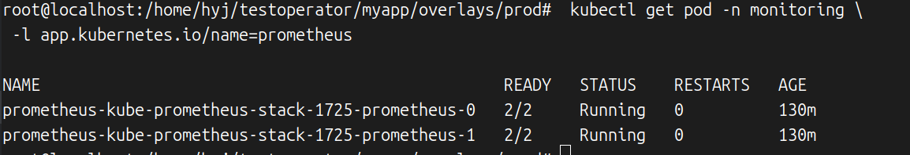
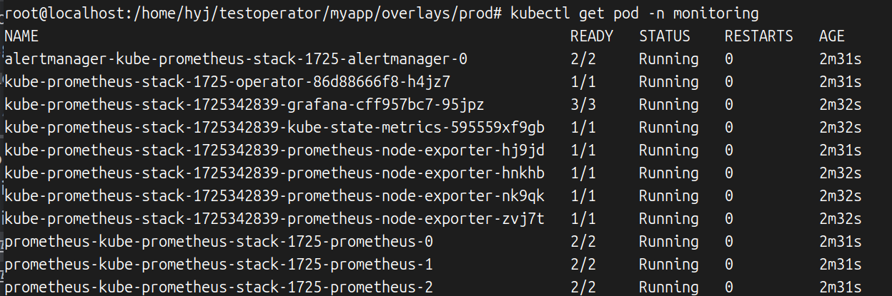

Helm是一个Kubernetes包管理工具，就像Linux系列的Yum和Apt一样，Helm通过chart的方式组织Kubernetes之上的应用资源。我们完成一个云原生应用的业务逻辑编码后，需要部署到Kubernetes集群中，<mark>繁多的YAML配置编写和维护过程是比较枯燥的，使用Helm能够很大程度上降低Kubernetes之上微服务部署的复杂度，提高工作效率。</mark>

Helm几乎是发布云原生应用绕不开的工具，当然也包括我们编写的Operator应用，所以有必要好好学习Helm这个工具。

# 一 Helm的安装

ps:和书上不一样,直接访问helm官网：`https://helm.sh/zh/docs/intro/install/`

因为我是ubuntu，所以使用Apt方式

```shell
curl https://baltocdn.com/helm/signing.asc | gpg --dearmor | sudo tee /usr/share/keyrings/helm.gpg > /dev/null
sudo apt-get install apt-transport-https --yes
echo "deb [arch=$(dpkg --print-architecture) signed-by=/usr/share/keyrings/helm.gpg] https://baltocdn.com/helm/stable/debian/ all main" | sudo tee /etc/apt/sources.list.d/helm-stable-debian.list
sudo apt-get update
sudo apt-get install helm
```

# 二  Helm的基本概念

## 2.1 Chart

一个Chart指的是一个Helm包，类似Yum的rpm包或者Apt的dpkg包，涵盖一个软件安装所需的一切“物料”​，Chart中包含的是在Kubernetes中运行的一个云原生应用方方面面的资源配置。

## 2.2.Repository

知道了Chart包的概念之后，肯定很快就能想到这些Chart应该存放到哪里。没错，用来放置和分发Chart包的地方就叫Repository，即Chart仓库的意思。

## 2.3.Release

一个Chart包可以在同一个Kubernetes集群中被多次部署，每次部署产生的实例就叫作一个Release。比如同样一个Web应用打包成Chart之后，可以在dev和test两个namespace中分别部署一份实例，出于不同的目的，这里的两个实例就是两个Release。

## 2.4 ArtifactHub

类似于DockerHub和GitHub，Helm的Chart也有一个Hub，其地址是[https://artifacthub.io]()。当然，ArtifactHub中存放的不只是Chart，还有kubectl plugins、OLM operators、Tekton tasks等，不过目前我们只关心Chart部分。

# 三 Helm的常用操作

本节学习Helm的一些常用的基础命令。

## 3.1 搜索Chart包

本小节主要用到下面几个命令：

- helm search hub [KEYWORD] [flags]​：在ArtifactHub中从所有的Repository内搜索相关Chart。

- helm repo add [NAME] [URL] [flags]​：本地添加一个Repository。

- helm repo list [flags]​：列出本地所有Repository，list可以简写为ls。

- helm search repo [keyword] [flags]​：在本地Repository搜索匹配的Chart。

安装好Helm客户端命令后，可以通过search命令来找到自己想要的Chart包。以kube-prometheus-stack为例，可以在ArtifactHub中搜索相应的Chart：

```shell
helm search hub kube-prometheus-stack
```

可以通过--max-col-width来指定输出宽度，比如把命令改成如下：

```shell
helm search hub kube-prometheus-stack --max-col-width=100
```

查看结果：


可以看到第一个URL才是Prometheus社区官方提供的链接，然后需要打开浏览器输入这个URL：[kube-prometheus-stack 62.3.1 · test-oci-helm/kube-prometheus-stack-oci](https://artifacthub.io/packages/helm/kube-prometheus-stack-oci/kube-prometheus-stack)


这里是kube-prometheus-stack的相关介绍，继续往下翻页可以找到相应Repository的地址、前置条件、安装方式和依赖的Chart等信息，

接着可以直接将这个Repository添加到本地缓存中：

```bash
helm repo add prometheus-community https://prometheus-community.github.io/helm-charts
helm repo update
```

这时可以顺便看一下Repository中有哪些Chart

```shell
helm repo list
```


## 3.2 安装Chart包

### 3.2.1 通过Helm安装一个kube-prometheus-stack实例

有了Chart包之后，下一步是安装这个包，所以本小节继续学习各种安装Chart包的方式。先用help命令查看一下install命令安装的格式 `helm help install`

```shell
 helm install [NAME] [CHART] [flags]
```

NAME指的是Instance的名字。CHART也就是要使用的Chart包地址，既可以是<u>远程仓库中的包</u>，也可以是<u>本地的Chart压缩包</u>，或者是<u>解压后的Chart包</u>，我们具体来看这几种用法。

以kube-prometheus-stack的安装为例：

```shell
helm install prometheus-community/kube-prometheus-stack -n monitoring -g
```

先看每个参数的含义：

- prometheus-community/kube-prometheus-stack：表示Chart地址，也就是在本地仓库prometheus-community中的kube-prometheus-stack。

- -n monitoring：等价于--namespace monitoring，表示这个实例将安装在monitoring命名空间下，如果这个命名空间不存在，则会被自动创建。

- -g：等价于--generate-name，表示不手动指定实例名，而是自动生成一个名字来使用。

接着查看monitoring命名空间中的Pod是否都运行起来了：

```shell
kubectl get pod -n monitoring
```

如果你和我一样用的kind，镜像是拉取不下来的，我们导入镜像

```shell
#查看什么镜像没有拉取下来
kubectl describe pod kube-prometheus-stack-1725-admission-create-t62qz -n monitoring
#拉取镜像到本地
docker pull registry.k8s.io/ingress-nginx/kube-webhook-certgen:v20221220-controller-v1.5.1-58-g787ea74b6
#导入kind
kind load docker-image registry.k8s.io/ingress-nginx/kube-webhook-certgen:v20221220-controller-v1.5.1-58-g787ea74b6 --name dev1m3s
#以此类推
docker pull quay.io/prometheus-operator/prometheus-operator:v0.76.0
kind load docker-image quay.io/prometheus-operator/prometheus-operator:v0.76.0 --name dev1m3s

docker pull quay.io/kiwigrid/k8s-sidecar:1.27.4
kind load docker-image quay.io/kiwigrid/k8s-sidecar:1.27.4 --name dev1m3s


docker pull quay.io/prometheus-operator/prometheus-config-reloader:v0.76.0
kind load docker-image quay.io/prometheus-operator/prometheus-config-reloader:v0.76.0 --name dev1m3s

docker pull quay.io/prometheus/alertmanager:v0.27.0
kind load docker-image quay.io/prometheus/alertmanager:v0.27.0 --name dev1m3s

docker pull docker.io/grafana/grafana:11.1.5
kind load docker-image docker.io/grafana/grafana:11.1.5 --name dev1m3s

docker pull registry.k8s.io/kube-state-metrics/kube-state-metrics:v2.13.0
kind load docker-image registry.k8s.io/kube-state-metrics/kube-state-metrics:v2.13.0 --name dev1m3s

docker pull quay.io/prometheus/node-exporter:v1.8.2
kind load docker-image quay.io/prometheus/node-exporter:v1.8.2 --name dev1m3s


docker pull quay.io/prometheus/prometheus:v2.54.1
kind load docker-image quay.io/prometheus/prometheus:v2.54.1 --name dev1m3s
```

接着查看monitoring命名空间中的Pod是否都运行起来了：`kubectl get pod -n monitoring`


可以看到prometheus、prometheus-operator、alertmanager、grafana、kube-state-metrics和node-exporter等Pod都已经运行起来了。这里除了Pod外，还有相应的Deployment、DaemonSet、StatefulSet、Service以及各种CRDs被创建出来。想象一下如果不使用Helm Chart的方式来组织这些资源文件，将要花费多少力气去寻找和梳理这么多的资源配置。

Helm默认不会等待所有Pod都运行起来，因为很多应用的镜像拉取会比较耗时，甚至超时失败。在使用helm install命令退出后，还可以通过helm ls来列出所有已经安装的Chart，也可以通过helm status来查看某个Chart实例的状态。

使用`helm ls -n monitoring`命令找到刚才部署的实例名：


使用`helm status kube-prometheus-stack-1725326869 -n monitoring`命令查看某个实例的状态：


### 3.2.2 Helm安装资源的顺序

Helm安装各种Kubernetes资源是遵循一定顺序的，比如Namespace和Deployment都需要创建时，先创建后者肯定就走不通了。这个顺序是：

1. Namespace

2. NetworkPolicy

3. ResourceQuota

4. LimitRange

5. PodSecurityPolicy

6. PodDisruptionBudget

7. ServiceAccount

8. Secret

9. SecretList

10. ConfigMap

11. StorageClass

12. PersistentVolume

13. PersistentVolumeClaim

14. CustomResourceDefinition

15. ClusterRole

16. ClusterRoleList

17. ClusterRoleBinding

18. ClusterRoleBindingList

19. Role

20. RoleList

21. RoleBinding

22. RoleBindingList

23. Service

24. DaemonSet

25. Pod

26. ReplicationController

27. ReplicaSet

28. Deployment

29. HorizontalPodAutoscaler

30. StatefulSet

31. Job

32. CronJob

33. Ingress

34. APIService

### 3.2.3其他安装方法

除了直接使用本地Repository中的Chart索引来安装一个实例外，我们还有其他3种方法来完成安装过程。

这4种方法分别是：

1. helm install chartrepo/chartname：直接从Repository安装。

2. helm install ./chartname-1.2.3.tgz：通过helm pull下载。

3. helm install ./chartname：解压这个压缩包。

4. helm[ installhttps://chartrepo.com/charts/chartname-1.2.3.tgz]()：从一个远程地址安装。

## 3.3 自定义Chart配置

前面通过helm install命令部署了一个kube-prometheus-stack实例，大家可能已经注意到没有对这个实例进行任何配置。大多数情况下，需要知道自己部署的应用支持哪些配置项，然后根据具体的应用场景去调整相应的配置，比如部署到开发环境时分配更小的内存和实例数，部署到生产环境需要更大的内存和实例数分配。

### 3.3.1 helm show values

怎么查看一个Chart的配置呢？首先可以通过helm show values命令：

`helm show values prometheus-community/kube-prometheus-stack`

这个values配置多达近3000行。所以helm show values更加适用于配置比较简单的Chart。

### 3.3.2 helm pull

为了看清一个配置复杂的Chart包的全貌，需要将这个Chart下载下来，然后解压缩包中的配置文件：`helm pull prometheus-community/kube-prometheus-stack`，这个Chart包下载下来后的名字是kube-prometheus-stack-62.3.1.tgz，解压后得到一个kube-prometheus-stack目录，这个目录内有如下的文件/目录：`ll kube-prometheus-stack`


打开values.yaml，可以看到其中有一个prometheus.prometheusSpec.replicas配置项，我们以这个配置为例，学习如何在部署时自定义配置。

### 3.3.3自定义配置内容

具体操作之前，为了排除干扰，下面每次部署执行前大家记得清理已经部署好的Chart实例，可以用`helm ls -n monitoring`命令查看实例名，然后通过helm uninstall -n monitoring [Release Name]来卸载。

**方法一**：直接将需要自定义的配置写入新文件。

```shell
cat <<EOF >values-replicas.yaml
prometheus:
  prometheusSpec:
    replicas: 2

EOF


helm install prometheus-community/kube-prometheus-stack -n monitoring -g -f values-replicas.yaml
```

在安装时通过-f参数指定一个新的values-replicas.yaml文件来自定义配置内容，查看一下效果`kubectl get pod -n monitoring -l app.kubernetes.io/name=prometheus`



Prometheus的副本数确实变成2了。

**方法二**：通过--set来指定自定义配置项。

`helm install prometheus-community/kube-prometheus-stack -n monitoring -g --set prometheus.prometheusSpec.replicas=2`

这时Prometheus的副本数也会被成功改为2。`kubectl get pod -n monitoring -l app.kubernetes.io/name=prometheus`


在需要自定义的配置项不太多的时候，--set是简洁高效的，反之一定需要准备一个values.yaml文件。

--set格式和YAML配置的对应关系大致如表

| -set 格式                     | YAML配置                        |
| --------------------------- |:----------------------------- |
| -set key=value              | key: value                    |
| -set key=value, key1=valuel | key: value <br/> key1: valuel |
| -set outer.inner=xxx        | outer: <br/>inner: xxx        |
| -set key={a, b, c}          | key:<br/>-a <br/>-b<br/>-c    |
| -set key[0].a=123           | key:<br/>-a:123               |
| -set key=value1\,value2     | key:"value1,value2"           |
| -set a\.b=xxx               | a.b: xxx                      |

## 3.4 Release升级与回滚

当一个Chart发布了新版本，或者想要更新同一个版本Chart包的一个实例时，可以通过helm upgrade命令来完成。如果更新之后需要回滚，则可以对应使用helm rollback命令。不知道想要回滚到哪个版本，就使用helm history命令。本小节涉及的一些新命令具体格式如下：

- helm upgrade [RELEASE] [CHART] [flags]​：更新一个Chart实例。

- helm history RELEASE_NAME [flags]​：打印一个Release的所有历史修订版本(Revisions)。

- helm rollback<RELEASE>[REVISION] [flags]​：回滚一个Release到指定版本。

### 3.4.1 升级

以3.3节自定义Chart配置时使用的2个副本Prometheus的kube-prometheus-stack为例，通过helm upgrade来将其更新为3个副本。

先部署好2个副本Prometheus的kube-prometheus-stack，具体配置参见3.3节方法一,然后修改配置如下：

```shell
cat <<EOF >values-replicas.yaml
prometheus:
  prometheusSpec:
    replicas: 3

EOF


helm upgrade kube-prometheus-stack-1725342839 ./kube-prometheus-stack -n monitoring -f values-replicas.yaml
```


可以看到这时REVISION更新成2。我们继续查看Release列表：`helm ls -n morning`


也可以通过helm history命令查看历史Release信息：`helm history kube-prometheus-stack-1725342839 -n monitoring`


最后看Pod是否真的更新了：`kubectl get pod -n monitoring`


从这里大家或许注意到一个细节，就是新增的Pod单独被创建出来了，其他资源没有发生变化。也就是说，helm upgrade的过程其实是最小化变更发生了变化的资源，而不是推翻重建所有资源对象实例。接着看如何回滚到上一个版本。

### 3.4.2 回滚

刚才通过helm history命令看到当前kube-prometheus-stack-1725342839实例有两个Revision，我们尝试将其回滚到Revision 1：`helm rollback kube-prometheus-stack-1725342839 1 -n monitoring`


这里没有太多的日志输出，我们查看现在helm history命令会带来哪些信息：`helm history kube-prometheus-stack-1725342839 -n monitoring`


可以看到这时多了第3个Revision，描述信息是“Rollback to 1”​，也就是说Helm并没有直接抛弃2版本，直接回滚到1版本，而是新增了一个3版本，只是配置和1版本完全一致。这也非常合理，不然怎么回滚到2版本呢？

这时查看Pod列表，也可以很和谐地看到新增的那个Pod被删除了：`kubectl get pod -n monitoring`


## 3.5 Release卸载

前面其实已经用过helm uninstall命令了，不过没有太详细介绍，本小节再仔细学习helm uninstall的用法。

`helm uninstall RELEASE_NAME [...] [flags]`

毫无疑问，如果执行`helm uninstall kube-prometheus-stack-1725342839`，则会把kube-prometheus-stack-1725342839这个实例卸载。下面介绍另一种卸载方式：`helm uninstall kube-prometheus-stack-1725342839 -n monitoring --keep-history`


当然，kube-prometheus-stack-1725342839这个实例也被成功卸载了，但是我们仍然可以通过helm history命令看到历史版本记录：`helm history kube-prometheus-stack-1725342839 -n monitoring`


看到这里也许已经想到，如果我们执行helm rollback命令，是否能够让这个实例“起死回生”呢？试一下吧：

```shell
helm rollback kube-prometheus-stack-1725342839 2 -n monitoring
helm history kube-prometheus-stack-1725342839 -n monitoring
```


helm rollback执行成功了，history记录中也多了4版本，看起来没有任何问题，这个实例成功恢复了。

这时查看一下Pod列表，可以看到新创建的Pod都运行起来了：kubectl get pod -n monitoring



## 3.6 Helm命令的常用参数

Helm的install/upgrade/rollback等子命令都有几个很有用的参数，本小节将介绍其中的两个参数。

- --timeout：等待Kubernetes命令执行完成的超时时间，默认是50毫秒，这里的值是一个Golang的Duration。

- --wait：等待所有的Pod变成准备(ready)状态，PVC完成绑定，deployments至少有（Desired Pods减去maxUnavailable Pods）数量处于准备状态，Service都有IP成功绑定。如果到了--timeout指定的超时时间，那么这个Release就会被标记为FAILED状态。

# 四 封装自己的Chart包

Helm将描述一个应用如何将Kubernetes之上部署的各种相关资源文件打包在一起，这个打包格式或者这个包叫作Chart。Chart就是一个包含很多文件的目录，这个目录可以被打成一个有版本的压缩包，也可以被部署。本节详细学习Chart的格式，以及如何封装自己的Chart包。

## 4.1 Chart的目录结构

还是以kube-prometheus-stack为例，通过helm pull命令下载这个Chart包，然后解压缩，看其中的目录结构。详见3.3.2。

解压缩后会得到一个kube-prometheus-stack目录，也就是这个Chart的根目录，与Chart的名字相同，但是没有版本号信息。

- Chart.yaml：包含Chart基本信息的YAML文件。

- README.md：可选的readme文件。

- CONTRIBUTING.md：可选的贡献者指引文件。

- Chart.lock：当前Chart的依赖锁定文件。

- values.yaml：当前Chart的默认配置文件。

- charts/：这个目录中放置的是当前Chart依赖的所有Chart。

- crds/：自定义资源配置存放目录，也就是当前Chart相关的所有CRD资源。

- templates/：存放模板文件的目录，模板与values配置加在一起可以渲染成完整的Kubernetes配置文件。

- templates/NOTES.txt：可选的纯文本使用帮助信息，也就是完成安装操作后控制台输出的帮助信息文本。

## 4.2 Chart.yaml文件

Chart.yaml是一个必选文件，其中存放的是一个Chart的基本描述信息，格式如下：

```yaml
apiVersion: v2 #Chart的API版本（必选）
name: kube-prometheus-stack #chart的名字（必选）
version: 62.3.1 #一个SemVer 2格式的版本信息（必选）
kubeVersion: '>=1.19.0-0' #一个用来描述兼容性的kubeenetes版本的SemVer格式范围信息（必选）
description: kube-prometheus-stack collects Kubernetes manifests, Grafana dashboards,
  and Prometheus rules combined with documentation and scripts to provide easy to
  operate end-to-end Kubernetes cluster monitoring with Prometheus using the Prometheus
  Operator. #当前项目的描述（可选）
type: application #当前chart的类型（可选）
keywords: #当前项目的一些关键字（可选）
  - operator
  - prometheus
  - kube-prometheus
home: https://github.com/prometheus-operator/kube-prometheus #当前项目的主页URL（可选）
sources: #当前项目的源码URL列表（可选）
  - https://github.com/prometheus-community/helm-charts
  - https://github.com/prometheus-operator/kube-prometheus
dependencies: #当前项目的依赖列表（可选）
  - condition: crds.enabled #一饿个可选的YAML配置路径，需要bool值，用来标是当前Chart是否启用，比如kube-prometheus-stack中的grafana.enabled p配置（可选）
    name: crds #依赖Chart的名字
    repository: "" #依赖的Chart的代码库的URL，比如https://example.com/charts或者"@repo-name"这种简写格式
    version: 0.0.0 #依赖Chart的版本
    tags: #可选的tag配置
      -  #tag的作用是可以将这些以来Chart分组，用于实现批量启用/禁用
    import-values: #可选
    alias: #当前Chart的别名，主要用在一个Charts需要被多次添加的时候
  - condition: kubeStateMetrics.enabled
    name: kube-state-metrics
    repository: https://prometheus-community.github.io/helm-charts
    version: 5.25.*
  - condition: nodeExporter.enabled
    name: prometheus-node-exporter
    repository: https://prometheus-community.github.io/helm-charts
    version: 4.39.*
  - condition: grafana.enabled
    name: grafana
    repository: https://grafana.github.io/helm-charts
    version: 8.4.*
  - condition: windowsMonitoring.enabled
    name: prometheus-windows-exporter
    repository: https://prometheus-community.github.io/helm-charts
    version: 0.5.*
maintainers: #可选
  - email: andrew@quadcorps.co.uk #维护者电子邮箱
    name: andrewgkew #维护者姓名
    url: #维护者个人站点URL
  - email: gianrubio@gmail.com
    name: gianrubio
  - email: github.gkarthiks@gmail.com
    name: gkarthiks
  - email: kube-prometheus-stack@sisti.pt
    name: GMartinez-Sisti
  - email: github@jkroepke.de
    name: jkroepke
  - email: scott@r6by.com
    name: scottrigby
  - email: miroslav.hadzhiev@gmail.com
    name: Xtigyro
  - email: quentin.bisson@gmail.com
    name: QuentinBisson
icon: https://raw.githubusercontent.com/prometheus/prometheus.github.io/master/assets/prometheus_logo-cb55bb5c346.png  #一个SVG或者PNG格式的图标图片URL（可选）
appVersion: v0.76.0 # 可选的应用版本信息，不必是SemVer格式（可选）
deprecated: #标记当前Chart是否废弃，用bool值（可选）
annotations: #目前Helm已经不允许在Chart.yaml中添加额外的配置项，如果需要额外的自定义配置，只能添加在注解中
  example: #注解列表（可选）
```

每个Chart需要有明确的版本信息，Version在kube-prometheus-stack中的当前值是62.3.1，对应压缩包名字是kube-prometheus-stack-62.3.1.tgz，也就是Chart.yaml中的Version字段会被用在Chart包的名字中。这个Version的格式是SemVer 2，SemVer的具体定义可以在https://semver.org/spec/v2.0.0.html中查阅。SemVer也就是Semantic Versioning的简写，翻译过来就是“语义版本”的意思。我们平时经常看到的x.y.z格式的版本号，也就是MAJOR.MINOR.PATCH（主版本号.小版本号.补丁版本号）格式，就是SemVer版本格式。

apiVersion字段目前都是配置成v2版本，在以前也用过v1版本，虽然Helm3目前也能识别v1版本，但是除非有不好绕过的历史兼容性负担，否则我们都使用v2版本。

另外，appVersion和Version看着容易混淆。appVersion描述的是应用本身的版本，比如我们用的kube-prometheus-stack-62.3.1.tgz的appVersion是v0.76.0。appVersion更多的是进行“信息记录”​，不会影响这个Chart本身的版本计算，也就是说假如你写错了，只是容易误导人，并不太会影响Chart成功部署。

type表示这个Chart的类型，这里的类型默认是application，另一个可选值是library。

kubeVersion字段用来描述兼容的Kubernetes版本信息，这个字段会被Helm识别，并且在部署时进行兼容性校验。这里有一些规则需要了解：

- \>=1.10.0 <1.23.0：这种记录会被解析成Kubernetes版本，需要不小于1.10.0且小于1.23.0。

- \>=1.10.0 <1.20.0 ||>=1.20.1 <=1.23.0：​“或”的含义，可以通过“||”操作符来描述，这种写法表示Kubernetes版本在除了1.20.0之外的[1.10.0,1.23.0]之间。

- \>=1.10.0 <=1.23.0 !=1.20.0：上面这种排除1.20.0版本的方式可以用更简单的方式来描述，就是这里的!=。

- =、!=、<、>、<=、>=：这些操作符都可以用。

- ～1.2.3：表示补丁版本可以随意选择，也就是>=1.2.3<=1.3.0的意思。

- ^1.2.3：表示小版本号可以随意选择，也就是>=1.2.3<=2.0.0的意思。

## 4.3 Chart依赖管理

一个Chart和一个普通的Go语言项目一样，绕不开依赖管理的问题。一个Chart可以依赖N个其他Chart，这些依赖Chart可以动态链接到当前Chart中，通过定义在Chart.yaml中的dependencies字段。另外，也可以直接将依赖的Chart直接放置到chart/目录下，静态管理这些依赖Chart。

前面介绍Chart.yaml文件时已经提到过dependencies字段了，大致含义是这样的：

这里的repository是一个依赖Chart的代码库URL，这个URL也是需要通过helm repo add命令添加到本地Repository列表中的，这时同样可以通过helm repo add命令使用的NAME来替换URL填入dependencies[x].repository中。

当Chart.yaml中定义好dependencies之后，就可以通过helm dependency update命令将所有的依赖Chart下载到本地的chart/目录下。

```yaml
dependencies: #当前项目的依赖列表（可选）
  - condition: crds.enabled #一饿个可选的YAML配置路径，需要bool值，用来标是当前Chart是否启用，比如kube-prometheus-stack中的grafana.enabled p配置（可选）
    name: crds #依赖Chart的名字
    repository: "" #依赖的Chart的代码库的URL，比如https://example.com/charts或者"@repo-name"这种简写格式
    version: 0.0.0 #依赖Chart的版本
    tags: #可选的tag配置
      -  #tag的作用是可以将这些以来Chart分组，用于实现批量启用/禁用
    import-values: #可选
    alias: #当前Chart的别名，主要用在一个Charts需要被多次添加的时候
```

- helm dependency update CHART [flags]​：根据Chart.yaml文件中的依赖定义更新本地依赖。

- helm dependency list CHART [flags]​：列出当前Chart的所有依赖。

- helm dependency build CHART [flags]​：从Chart.lock重建本地charts/下的本地依赖。

另外，dependency子命令有点长，其实可以简写为dep，update可以简写为up，list可以简写为ls。


